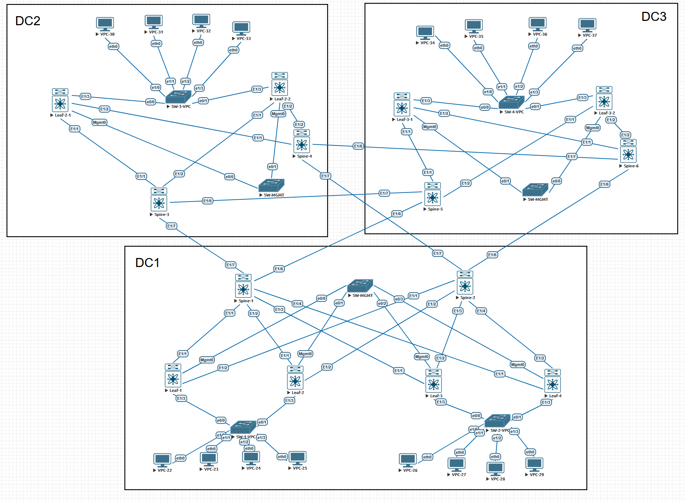
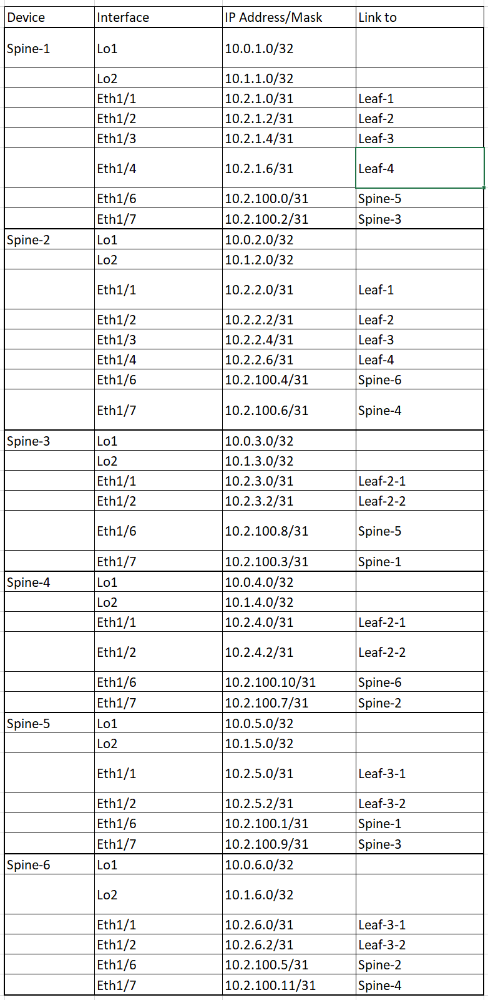
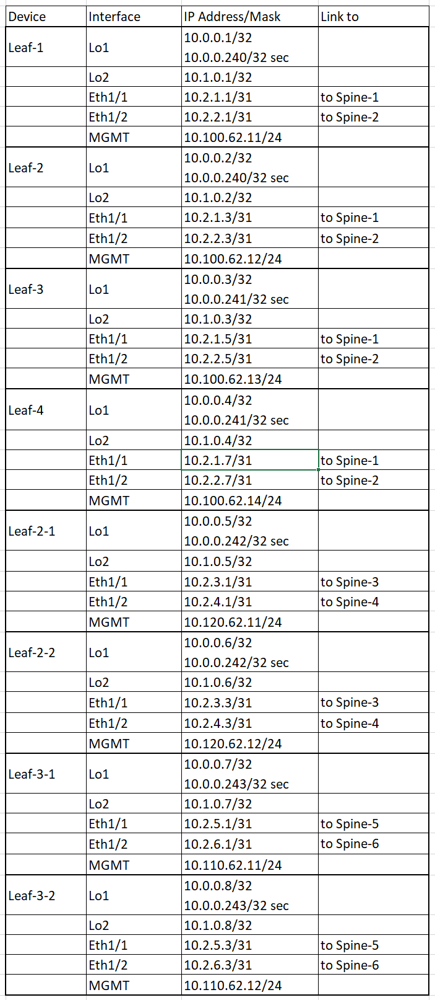
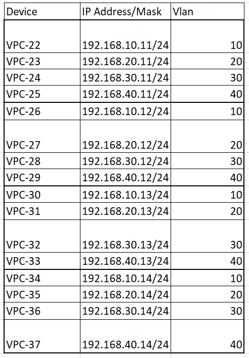

# Проектная работа. 
## Построение гео-распределённой сети ЦОД на базе EVPN\VXLAN с использованием подхода MultiPod

### Схема сети

### Цели:
- Обеспечение территориально распределенной сетевой инфраструктуры 
- Обеспечение географического резервирования вычислительных мощностей.
- Обеспечение возможности миграции серверов как внутри, так и между локациями, без необходимости переконфигурирования сетевого стека.
- Обеспечение горизонтального масштабирования сетевой инфраструктуры для подключения нового оборудования, без влияния на уже работающие сервисы
- Обеспечение отказоустойчивых подключений серверов критической инфраструктуры к оборудованию сетевой инфраструктуры

### Описание:
  #### В ходе работы мы:
  1. Соберем схему
  2. Распределим адресное пространство
  3. Разберемся с feature и включим необходимые
  4. Резберемся с TCAM и перераспределим для наших задач
  5. Настроим OSPF-Underlay
  6. Настроим VPC
  7. Настроим iBGP для Overlay
  8. Настроим L2 и L3 Vxlan

## Работа:

  
<b>Оборудование и технологии:</b>

  

- Eve-ng эмулятор
- Cisco Nexus 9k
- OSPF
- BGP
- EVPN\VxLan
- VPC
- SVI

  

  
<b>Решения для построения отказоустойчивой и масштабируемой сетевой инфраструктуры</b>

  

    
1. CLOS топология дает возможности простого масштабирования ёмкости и производительности сети
2. Технология VXLAN Anycast Gateway позволяет обеспечивать миграцию подключений клиентов внутри сетевой инфраструктуры, с сохранением настроек сетевого стека
3. Имеется поддержка организации как L2 так и L3 сервисов. Ёмкость идентификатора VNI снимает ограничение по кол-ву клиентских сервисов
4. Технология VPC обеспечивает отказоустойчивое подключение клиентов
5. Технология DCI (Data Center Interconnect) обеспечивает бесшовное географическое распределение POD-ов
  

#### Адресное пространство:

  
<b>Spine</b>

  

     

  

  
<b>Leaf</b>

  

     

  

  
<b>PC</b>

  

     

  

