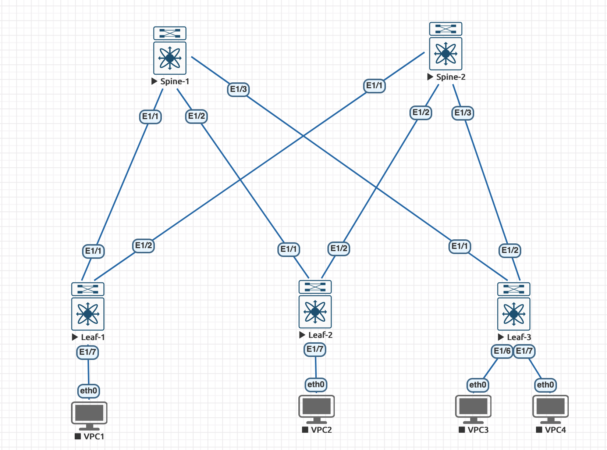

### Домашние задание 1
# Проектирование адресного пространства

### Схема сети

### План алресации

|Devicce|Interface|IP Address/Mask|Link to|
|---|---|---|---|
Spine-1|Lo1|10.0.1.0/32|-
Spine-1|Lo2|10.1.1.0/32|-
Spine-1|E1/1|10.2.1.0/31|Leaf-1
Spine-1|E1/2|10.2.1.2/31|Leaf-2
Spine-1|E1/3|10.2.1.4/31|Leaf-3
 | | | 
Spine-2|Lo1|10.0.2.0/32|-
Spine-2|Lo2|10.1.2.0/32|-
Spine-2|E1/1|10.2.2.0/31|Leaf-1
Spine-2|E1/2|10.2.2.2/31|Leaf-2
Spine-2|E1/3|10.2.2.4/31|Leaf-3
 | | | 
Leaf-1|Lo1|10.0.0.1/32|-
Leaf-1|Lo2|10.1.0.2/32|-
Leaf-1|E1/1|10.2.1.1/31|Spine-1
Leaf-1|E1/2|10.2.2.1/31|Spine-2
 | | | 
Leaf-2|Lo1|10.0.0.2/32|-
Leaf-2|Lo2|10.1.0.2/32|-
Leaf-2|E1/1|10.2.1.3/31|Spine-1
Leaf-2|E1/2|10.2.2.3/31|Spine-2
 | | | 
Leaf-3|Lo1|10.0.0.3/32|-
Leaf-3|Lo2|10.1.0.3/32|-
Leaf-3|E1/1|10.2.1.5/31|Spine-1
Leaf-3|E1/2|10.2.2.5/31|Spine-2
