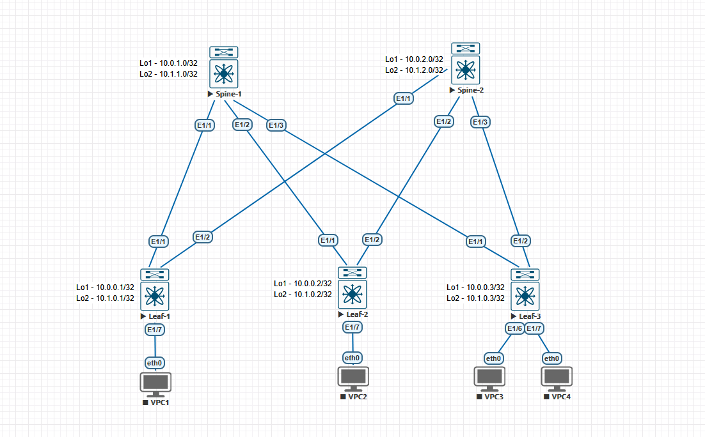

# Домашние задание 3
## Построение Underlay сети(BGP)

### Схема сети



### AS выбран по принципу:
   - 65000 - спайны
   - 65501-65599 - лифы

## Конфигурация и таблица маршрутизации

<details>
  <summary><b> Spine-1 </b></summary>
  <p> 

```
feature isis

interface Ethernet1/1
  description to leaf-1
  no switchport
  mtu 9000
  no ip redirects
  ip address 10.2.1.0/31
  ip router isis UNDERLAY
  no shutdown

interface Ethernet1/2
  description to leaf-2
  no switchport
  mtu 9000
  no ip redirects
  ip address 10.2.1.2/31
  ip router isis UNDERLAY
  no shutdown

interface Ethernet1/3
  no switchport
  mtu 9000
  no ip redirects
  ip address 10.2.1.4/31
  ip router isis UNDERLAY
  no shutdown

interface loopback1
  ip address 10.0.1.0/32
  ip router isis UNDERLAY

interface loopback2
  ip address 10.1.1.0/32

router isis UNDERLAY
  net 49.0001.0000.0001.0001.00
  is-type level-1
  set-overload-bit on-startup 60
```
### Вывод маршрутной информации
```
Spine-1# sh ip route
IP Route Table for VRF "default"
'*' denotes best ucast next-hop
'**' denotes best mcast next-hop
'[x/y]' denotes [preference/metric]
'%<string>' in via output denotes VRF <string>

10.0.0.1/32, ubest/mbest: 1/0
    *via 10.2.1.1, [20/0], 00:11:13, bgp-65000, external, tag 65501
10.0.0.2/32, ubest/mbest: 1/0
    *via 10.2.1.3, [20/0], 00:08:56, bgp-65000, external, tag 65502
10.0.0.3/32, ubest/mbest: 1/0
    *via 10.2.1.5, [20/0], 00:08:28, bgp-65000, external, tag 65503
10.0.1.0/32, ubest/mbest: 2/0, attached
    *via 10.0.1.0, Lo1, [0/0], 00:32:49, local
    *via 10.0.1.0, Lo1, [0/0], 00:32:49, direct
10.1.0.1/32, ubest/mbest: 1/0
    *via 10.2.1.1, [20/0], 00:03:23, bgp-65000, external, tag 65501
10.1.0.2/32, ubest/mbest: 1/0
    *via 10.2.1.3, [20/0], 00:01:49, bgp-65000, external, tag 65502
10.1.0.3/32, ubest/mbest: 1/0
    *via 10.2.1.5, [20/0], 00:01:37, bgp-65000, external, tag 65503
10.1.1.0/32, ubest/mbest: 2/0, attached
    *via 10.1.1.0, Lo2, [0/0], 00:32:49, local
    *via 10.1.1.0, Lo2, [0/0], 00:32:49, direct
10.2.1.0/31, ubest/mbest: 1/0, attached
    *via 10.2.1.0, Eth1/1, [0/0], 00:32:51, direct
10.2.1.0/32, ubest/mbest: 1/0, attached
    *via 10.2.1.0, Eth1/1, [0/0], 00:32:51, local
10.2.1.2/31, ubest/mbest: 1/0, attached
    *via 10.2.1.2, Eth1/2, [0/0], 00:32:51, direct
10.2.1.2/32, ubest/mbest: 1/0, attached
    *via 10.2.1.2, Eth1/2, [0/0], 00:32:51, local
10.2.1.4/31, ubest/mbest: 1/0, attached
    *via 10.2.1.4, Eth1/3, [0/0], 00:32:50, direct
10.2.1.4/32, ubest/mbest: 1/0, attached
    *via 10.2.1.4, Eth1/3, [0/0], 00:32:50, local
```

</p>
</details>

<details>
  <summary><b> Spine-2 </b></summary>
  <p> 

```
feature isis

interface Ethernet1/1
  description to leaf-1
  no switchport
  mtu 9000
  no ip redirects
  ip address 10.2.2.0/31
  ip router isis UNDERLAY
  no shutdown

interface Ethernet1/2
  description to leaf-2
  no switchport
  mtu 9000
  no ip redirects
  ip address 10.2.2.2/31
  ip router isis UNDERLAY
  no shutdown

interface Ethernet1/3
  no switchport
  mtu 9000
  no ip redirects
  ip address 10.2.2.4/31
  ip router isis UNDERLAY
  no shutdown

interface loopback1
  ip address 10.0.2.0/32
  ip router isis UNDERLAY

interface loopback2
  ip address 10.1.2.0/32

router isis UNDERLAY
  net 49.0001.0000.0001.0002.00
  is-type level-1
  set-overload-bit on-startup 60
```
### Вывод маршрутной информации
```
Spine-2# sh ip route
IP Route Table for VRF "default"
'*' denotes best ucast next-hop
'**' denotes best mcast next-hop
'[x/y]' denotes [preference/metric]
'%<string>' in via output denotes VRF <string>

10.0.0.1/32, ubest/mbest: 1/0
    *via 10.2.2.1, [20/0], 00:11:13, bgp-65000, external, tag 65501
10.0.0.2/32, ubest/mbest: 1/0
    *via 10.2.2.3, [20/0], 00:08:56, bgp-65000, external, tag 65502
10.0.0.3/32, ubest/mbest: 1/0
    *via 10.2.2.5, [20/0], 00:08:28, bgp-65000, external, tag 65503
10.0.2.0/32, ubest/mbest: 2/0, attached
    *via 10.0.2.0, Lo1, [0/0], 00:32:55, local
    *via 10.0.2.0, Lo1, [0/0], 00:32:55, direct
10.1.0.1/32, ubest/mbest: 1/0
    *via 10.2.2.1, [20/0], 00:03:23, bgp-65000, external, tag 65501
10.1.0.2/32, ubest/mbest: 1/0
    *via 10.2.2.3, [20/0], 00:01:49, bgp-65000, external, tag 65502
10.1.0.3/32, ubest/mbest: 1/0
    *via 10.2.2.5, [20/0], 00:01:37, bgp-65000, external, tag 65503
10.1.2.0/32, ubest/mbest: 2/0, attached
    *via 10.1.2.0, Lo2, [0/0], 00:32:55, local
    *via 10.1.2.0, Lo2, [0/0], 00:32:55, direct
10.2.2.0/31, ubest/mbest: 1/0, attached
    *via 10.2.2.0, Eth1/1, [0/0], 00:32:57, direct
10.2.2.0/32, ubest/mbest: 1/0, attached
    *via 10.2.2.0, Eth1/1, [0/0], 00:32:57, local
10.2.2.2/31, ubest/mbest: 1/0, attached
    *via 10.2.2.2, Eth1/2, [0/0], 00:32:56, direct
10.2.2.2/32, ubest/mbest: 1/0, attached
    *via 10.2.2.2, Eth1/2, [0/0], 00:32:56, local
10.2.2.4/31, ubest/mbest: 1/0, attached
    *via 10.2.2.4, Eth1/3, [0/0], 00:32:56, direct
10.2.2.4/32, ubest/mbest: 1/0, attached
    *via 10.2.2.4, Eth1/3, [0/0], 00:32:56, local
```

</p>
</details>

<details>
  <summary><b> Leaf-1</b></summary>
  <p>
 
```
feature isis


interface Ethernet1/1
  description to Spine-1
  no switchport
  mtu 9000
  no ip redirects
  ip address 10.2.1.1/31
  ip router isis UNDERLAY
  no shutdown

interface Ethernet1/2
  description to Spine-2
  no switchport
  mtu 9000
  no ip redirects
  ip address 10.2.2.1/31
  ip router isis UNDERLAY
  no shutdown


interface loopback1
  ip address 10.0.0.1/32
  ip router isis UNDERLAY

interface loopback2
  ip address 10.1.0.1/32

router isis UNDERLAY
  net 49.0001.0000.0000.1001.00
  is-type level-1
  set-overload-bit on-startup 60
```
### Вывод маршрутной информации
```
Leaf-1# sh ip route
IP Route Table for VRF "default"
'*' denotes best ucast next-hop
'**' denotes best mcast next-hop
'[x/y]' denotes [preference/metric]
'%<string>' in via output denotes VRF <string>

10.0.0.1/32, ubest/mbest: 2/0, attached
    *via 10.0.0.1, Lo1, [0/0], 00:32:53, local
    *via 10.0.0.1, Lo1, [0/0], 00:32:53, direct
10.0.0.2/32, ubest/mbest: 2/0
    *via 10.2.1.0, [20/0], 00:08:55, bgp-65501, external, tag 65000
    *via 10.2.2.0, [20/0], 00:08:55, bgp-65501, external, tag 65000
10.0.0.3/32, ubest/mbest: 2/0
    *via 10.2.1.0, [20/0], 00:08:27, bgp-65501, external, tag 65000
    *via 10.2.2.0, [20/0], 00:08:27, bgp-65501, external, tag 65000
10.1.0.1/32, ubest/mbest: 2/0, attached
    *via 10.1.0.1, Lo2, [0/0], 00:32:53, local
    *via 10.1.0.1, Lo2, [0/0], 00:32:53, direct
10.1.0.2/32, ubest/mbest: 2/0
    *via 10.2.1.0, [20/0], 00:01:48, bgp-65501, external, tag 65000
    *via 10.2.2.0, [20/0], 00:01:48, bgp-65501, external, tag 65000
10.1.0.3/32, ubest/mbest: 2/0
    *via 10.2.1.0, [20/0], 00:01:36, bgp-65501, external, tag 65000
    *via 10.2.2.0, [20/0], 00:01:36, bgp-65501, external, tag 65000
10.2.1.0/31, ubest/mbest: 1/0, attached
    *via 10.2.1.1, Eth1/1, [0/0], 00:32:55, direct
10.2.1.1/32, ubest/mbest: 1/0, attached
    *via 10.2.1.1, Eth1/1, [0/0], 00:32:55, local
10.2.2.0/31, ubest/mbest: 1/0, attached
    *via 10.2.2.1, Eth1/2, [0/0], 00:32:54, direct
10.2.2.1/32, ubest/mbest: 1/0, attached
    *via 10.2.2.1, Eth1/2, [0/0], 00:32:54, local

```  
  </p>
</details>

<details>
  <summary><b> Leaf-2</b></summary>
  <p>
 
```
feature isis

interface Ethernet1/1
  description to Spine-1
  no switchport
  mtu 9000
  no ip redirects
  ip address 10.2.1.3/31
  ip router isis UNDERLAY
  no shutdown

interface Ethernet1/2
  description to Spine-2
  no switchport
  mtu 9000
  no ip redirects
  ip address 10.2.2.3/31
  ip router isis UNDERLAY
  no shutdown

interface loopback1
  ip address 10.0.0.2/32
  ip router isis UNDERLAY

interface loopback2
  ip address 10.1.0.2/32

router isis UNDERLAY
  net 49.0001.0000.0000.1002.00
  is-type level-1
  set-overload-bit on-startup 60

```
### Вывод маршрутной информации
```
Leaf-2# sh ip route
IP Route Table for VRF "default"
'*' denotes best ucast next-hop
'**' denotes best mcast next-hop
'[x/y]' denotes [preference/metric]
'%<string>' in via output denotes VRF <string>

10.0.0.1/32, ubest/mbest: 2/0
    *via 10.2.1.2, [20/0], 00:08:57, bgp-65502, external, tag 65000
    *via 10.2.2.2, [20/0], 00:08:56, bgp-65502, external, tag 65000
10.0.0.2/32, ubest/mbest: 2/0, attached
    *via 10.0.0.2, Lo1, [0/0], 00:32:58, local
    *via 10.0.0.2, Lo1, [0/0], 00:32:58, direct
10.0.0.3/32, ubest/mbest: 2/0
    *via 10.2.1.2, [20/0], 00:08:27, bgp-65502, external, tag 65000
    *via 10.2.2.2, [20/0], 00:08:27, bgp-65502, external, tag 65000
10.1.0.1/32, ubest/mbest: 2/0
    *via 10.2.1.2, [20/0], 00:03:23, bgp-65502, external, tag 65000
    *via 10.2.2.2, [20/0], 00:03:23, bgp-65502, external, tag 65000
10.1.0.2/32, ubest/mbest: 2/0, attached
    *via 10.1.0.2, Lo2, [0/0], 00:32:58, local
    *via 10.1.0.2, Lo2, [0/0], 00:32:58, direct
10.1.0.3/32, ubest/mbest: 2/0
    *via 10.2.1.2, [20/0], 00:01:37, bgp-65502, external, tag 65000
    *via 10.2.2.2, [20/0], 00:01:37, bgp-65502, external, tag 65000
10.2.1.2/31, ubest/mbest: 1/0, attached
    *via 10.2.1.3, Eth1/1, [0/0], 00:33:00, direct
10.2.1.3/32, ubest/mbest: 1/0, attached
    *via 10.2.1.3, Eth1/1, [0/0], 00:33:00, local
10.2.2.2/31, ubest/mbest: 1/0, attached
    *via 10.2.2.3, Eth1/2, [0/0], 00:32:59, direct
10.2.2.3/32, ubest/mbest: 1/0, attached
    *via 10.2.2.3, Eth1/2, [0/0], 00:32:59, local
```  
  </p>
</details>

<details>
  <summary><b> Leaf-3</b></summary>
  <p>
 
```
feature isis

interface Ethernet1/1
  description to Spine-1
  no switchport
  mtu 9000
  no ip redirects
  ip address 10.2.1.5/31
  ip router isis UNDERLAY
  no shutdown

interface Ethernet1/2
  description to Spine-2
  no switchport
  mtu 9000
  no ip redirects
  ip address 10.2.2.5/31
  ip router isis UNDERLAY
  no shutdown

interface loopback1
  ip address 10.0.0.3/32
  ip router isis UNDERLAY

interface loopback2
  ip address 10.1.0.3/32

router isis UNDERLAY
  net 49.0001.0000.0000.1003.00
  is-type level-1
  set-overload-bit on-startup 60
```
### Вывод маршрутной информации
```
Leaf-3# sh ip route
IP Route Table for VRF "default"
'*' denotes best ucast next-hop
'**' denotes best mcast next-hop
'[x/y]' denotes [preference/metric]
'%<string>' in via output denotes VRF <string>

10.0.0.1/32, ubest/mbest: 2/0
    *via 10.2.1.4, [20/0], 00:08:27, bgp-65503, external, tag 65000
    *via 10.2.2.4, [20/0], 00:08:28, bgp-65503, external, tag 65000
10.0.0.2/32, ubest/mbest: 2/0
    *via 10.2.1.4, [20/0], 00:08:27, bgp-65503, external, tag 65000
    *via 10.2.2.4, [20/0], 00:08:28, bgp-65503, external, tag 65000
10.0.0.3/32, ubest/mbest: 2/0, attached
    *via 10.0.0.3, Lo1, [0/0], 00:32:57, local
    *via 10.0.0.3, Lo1, [0/0], 00:32:57, direct
10.1.0.1/32, ubest/mbest: 2/0
    *via 10.2.1.4, [20/0], 00:03:23, bgp-65503, external, tag 65000
    *via 10.2.2.4, [20/0], 00:03:23, bgp-65503, external, tag 65000
10.1.0.2/32, ubest/mbest: 2/0
    *via 10.2.1.4, [20/0], 00:01:49, bgp-65503, external, tag 65000
    *via 10.2.2.4, [20/0], 00:01:49, bgp-65503, external, tag 65000
10.1.0.3/32, ubest/mbest: 2/0, attached
    *via 10.1.0.3, Lo2, [0/0], 00:32:57, local
    *via 10.1.0.3, Lo2, [0/0], 00:32:57, direct
10.2.1.4/31, ubest/mbest: 1/0, attached
    *via 10.2.1.5, Eth1/1, [0/0], 00:32:58, direct
10.2.1.5/32, ubest/mbest: 1/0, attached
    *via 10.2.1.5, Eth1/1, [0/0], 00:32:58, local
10.2.2.4/31, ubest/mbest: 1/0, attached
    *via 10.2.2.5, Eth1/2, [0/0], 00:32:58, direct
10.2.2.5/32, ubest/mbest: 1/0, attached
    *via 10.2.2.5, Eth1/2, [0/0], 00:32:58, local
```  
  </p>
</details>

