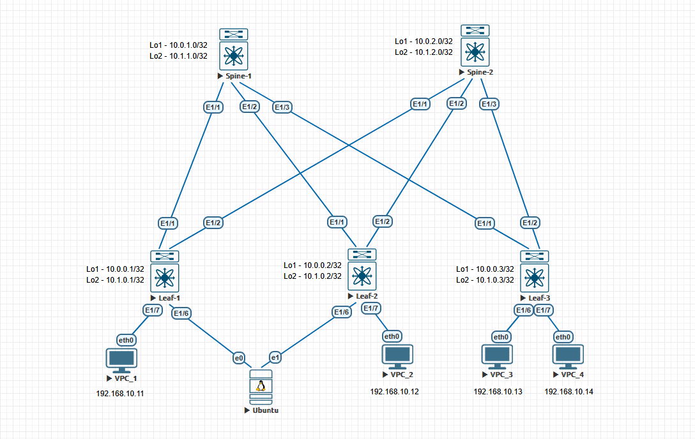

# Домашние задание 5
## VxLAN. EVPN L2

### Схема сети



### AS выбран по принципу:
   - 65000 - спайны
   - 65501-65536 - лифы

## Конфигурация и таблица маршрутизации

<details>
  <summary><b> Spine-1 </b></summary>
  <p> 

```
nv overlay evpn
feature bgp

route-map NH_UNCHANGED permit 10
  set ip next-hop unchanged
route-map REDISTRIBUTE_CONNECTED permit 10
  match interface loopback1 loopback2 
route-map RM_Leaves_BGP permit 10
  match as-number 65501-65599


interface Ethernet1/1
  description to leaf-1
  no switchport
  mtu 9000
  no ip redirects
  ip address 10.2.1.0/31
  no shutdown

interface Ethernet1/2
  description to leaf-2
  no switchport
  mtu 9000
  no ip redirects
  ip address 10.2.1.2/31
  no shutdown

interface Ethernet1/3
  no switchport
  mtu 9000
  no ip redirects
  ip address 10.2.1.4/31
  no shutdown

interface loopback1
  ip address 10.0.1.0/32

interface loopback2
  ip address 10.1.1.0/32

router bgp 65000
  router-id 10.0.1.0
  timers bgp 3 9
  reconnect-interval 12
  log-neighbor-changes
  address-family ipv4 unicast
    redistribute direct route-map REDISTRIBUTE_CONNECTED
    maximum-paths 10
  address-family l2vpn evpn
    maximum-paths 10
    retain route-target all
  neighbor 10.0.0.0/24 remote-as route-map RM_Leaves_BGP
    remote-as external
    update-source loopback1
    ebgp-multihop 5
    address-family l2vpn evpn
      send-community
      send-community extended
      route-map NH_UNCHANGED out
      rewrite-evpn-rt-asn
  neighbor 10.2.1.0/24 remote-as route-map RM_Leaves_BGP
    address-family ipv4 unicast
```
### Вывод маршрутной информации
```
Spine-1# sh ip ro
IP Route Table for VRF "default"
'*' denotes best ucast next-hop
'**' denotes best mcast next-hop
'[x/y]' denotes [preference/metric]
'%<string>' in via output denotes VRF <string>

10.0.0.1/32, ubest/mbest: 1/0
    *via 10.2.1.1, [20/0], 00:27:33, bgp-65000, external, tag 65501
10.0.0.2/32, ubest/mbest: 1/0
    *via 10.2.1.3, [20/0], 00:27:33, bgp-65000, external, tag 65502
10.0.0.3/32, ubest/mbest: 1/0
    *via 10.2.1.5, [20/0], 00:27:34, bgp-65000, external, tag 65503
10.0.1.0/32, ubest/mbest: 2/0, attached
    *via 10.0.1.0, Lo1, [0/0], 00:29:04, local
    *via 10.0.1.0, Lo1, [0/0], 00:29:04, direct
10.1.0.1/32, ubest/mbest: 1/0
    *via 10.2.1.1, [20/0], 00:27:33, bgp-65000, external, tag 65501
10.1.0.2/32, ubest/mbest: 1/0
    *via 10.2.1.3, [20/0], 00:27:33, bgp-65000, external, tag 65502
10.1.0.3/32, ubest/mbest: 1/0
    *via 10.2.1.5, [20/0], 00:27:34, bgp-65000, external, tag 65503
10.1.1.0/32, ubest/mbest: 2/0, attached
    *via 10.1.1.0, Lo2, [0/0], 00:29:04, local
    *via 10.1.1.0, Lo2, [0/0], 00:29:04, direct
10.2.1.0/31, ubest/mbest: 1/0, attached
    *via 10.2.1.0, Eth1/1, [0/0], 00:27:52, direct
10.2.1.0/32, ubest/mbest: 1/0, attached
    *via 10.2.1.0, Eth1/1, [0/0], 00:27:52, local
10.2.1.2/31, ubest/mbest: 1/0, attached
    *via 10.2.1.2, Eth1/2, [0/0], 00:27:52, direct
10.2.1.2/32, ubest/mbest: 1/0, attached
    *via 10.2.1.2, Eth1/2, [0/0], 00:27:52, local
10.2.1.4/31, ubest/mbest: 1/0, attached
    *via 10.2.1.4, Eth1/3, [0/0], 00:27:52, direct
10.2.1.4/32, ubest/mbest: 1/0, attached
    *via 10.2.1.4, Eth1/3, [0/0], 00:27:52, local
```
### Вывод l2vpn evpn
```
Spine-1# sh bgp l2vpn evpn
BGP routing table information for VRF default, address family L2VPN EVPN
BGP table version is 14, Local Router ID is 10.0.1.0
Status: s-suppressed, x-deleted, S-stale, d-dampened, h-history, *-valid, >-best
Path type: i-internal, e-external, c-confed, l-local, a-aggregate, r-redist, I-i
njected
Origin codes: i - IGP, e - EGP, ? - incomplete, | - multipath, & - backup, 2 - b
est2

   Network            Next Hop            Metric     LocPrf     Weight Path
Route Distinguisher: 10.0.0.1:32777
*>e[2]:[0]:[0]:[48]:[0050.0000.0a00]:[0]:[0.0.0.0]/216
                      10.0.0.1                                       0 65501 i
*>e[2]:[0]:[0]:[48]:[0050.7966.6801]:[0]:[0.0.0.0]/216
                      10.0.0.1                                       0 65501 i
*>e[3]:[0]:[32]:[10.0.0.1]/88
                      10.0.0.1                                       0 65501 i

Route Distinguisher: 10.0.0.2:32777
*>e[2]:[0]:[0]:[48]:[0050.0000.0a01]:[0]:[0.0.0.0]/216
                      10.0.0.2                                       0 65502 i
*>e[2]:[0]:[0]:[48]:[0050.7966.6807]:[0]:[0.0.0.0]/216
                      10.0.0.2                                       0 65502 i
*>e[3]:[0]:[32]:[10.0.0.2]/88
                      10.0.0.2                                       0 65502 i

Route Distinguisher: 10.0.0.3:32777
*>e[2]:[0]:[0]:[48]:[0050.7966.6808]:[0]:[0.0.0.0]/216
                      10.0.0.3                                       0 65503 i
*>e[2]:[0]:[0]:[48]:[0050.7966.6809]:[0]:[0.0.0.0]/216
                      10.0.0.3                                       0 65503 i
*>e[3]:[0]:[32]:[10.0.0.3]/88
                      10.0.0.3                                       0 65503 i

```

</p>
</details>

<details>
  <summary><b> Spine-2 </b></summary>
  <p> 

```
feature bgp

route-map RM_Leaves_BGP permit 10
  match as-number 65501-65599

interface Ethernet1/1
  description to leaf-1
  no switchport
  mtu 9000
  no ip redirects
  ip address 10.2.2.0/31
  no shutdown

interface Ethernet1/2
  description to leaf-2
  no switchport
  mtu 9000
  no ip redirects
  ip address 10.2.2.2/31
  no shutdown

interface Ethernet1/3
  no switchport
  mtu 9000
  no ip redirects
  ip address 10.2.2.4/31
  no shutdown

interface loopback1
  ip address 10.0.2.0/32


interface loopback2
  ip address 10.1.2.0/32

router bgp 65000
  router-id 10.0.2.0
  reconnect-interval 12
  log-neighbor-changes
  address-family ipv4 unicast
    maximum-paths 10
  neighbor 10.2.2.0/24 remote-as route-map RM_Leaves_BGP
    address-family ipv4 unicast
```
### Вывод маршрутной информации
```
Spine-2# sh ip route
IP Route Table for VRF "default"
'*' denotes best ucast next-hop
'**' denotes best mcast next-hop
'[x/y]' denotes [preference/metric]
'%<string>' in via output denotes VRF <string>

10.0.0.1/32, ubest/mbest: 1/0
    *via 10.2.2.1, [20/0], 00:11:13, bgp-65000, external, tag 65501
10.0.0.2/32, ubest/mbest: 1/0
    *via 10.2.2.3, [20/0], 00:08:56, bgp-65000, external, tag 65502
10.0.0.3/32, ubest/mbest: 1/0
    *via 10.2.2.5, [20/0], 00:08:28, bgp-65000, external, tag 65503
10.0.2.0/32, ubest/mbest: 2/0, attached
    *via 10.0.2.0, Lo1, [0/0], 00:32:55, local
    *via 10.0.2.0, Lo1, [0/0], 00:32:55, direct
10.1.0.1/32, ubest/mbest: 1/0
    *via 10.2.2.1, [20/0], 00:03:23, bgp-65000, external, tag 65501
10.1.0.2/32, ubest/mbest: 1/0
    *via 10.2.2.3, [20/0], 00:01:49, bgp-65000, external, tag 65502
10.1.0.3/32, ubest/mbest: 1/0
    *via 10.2.2.5, [20/0], 00:01:37, bgp-65000, external, tag 65503
10.1.2.0/32, ubest/mbest: 2/0, attached
    *via 10.1.2.0, Lo2, [0/0], 00:32:55, local
    *via 10.1.2.0, Lo2, [0/0], 00:32:55, direct
10.2.2.0/31, ubest/mbest: 1/0, attached
    *via 10.2.2.0, Eth1/1, [0/0], 00:32:57, direct
10.2.2.0/32, ubest/mbest: 1/0, attached
    *via 10.2.2.0, Eth1/1, [0/0], 00:32:57, local
10.2.2.2/31, ubest/mbest: 1/0, attached
    *via 10.2.2.2, Eth1/2, [0/0], 00:32:56, direct
10.2.2.2/32, ubest/mbest: 1/0, attached
    *via 10.2.2.2, Eth1/2, [0/0], 00:32:56, local
10.2.2.4/31, ubest/mbest: 1/0, attached
    *via 10.2.2.4, Eth1/3, [0/0], 00:32:56, direct
10.2.2.4/32, ubest/mbest: 1/0, attached
    *via 10.2.2.4, Eth1/3, [0/0], 00:32:56, local
```

</p>
</details>

<details>
  <summary><b> Leaf-1</b></summary>
  <p>
 
```
feature bgp

route-map REDISTRIBUTE_CONNECTED permit 10
  match interface loopback1 loopback2

interface Ethernet1/1
  description to Spine-1
  no switchport
  mtu 9000
  no ip redirects
  ip address 10.2.1.1/31
  no shutdown

interface Ethernet1/2
  description to Spine-2
  no switchport
  mtu 9000
  no ip redirects
  ip address 10.2.2.1/31
  no shutdown

interface loopback1
  ip address 10.0.0.1/32

interface loopback2
  ip address 10.1.0.1/32

router bgp 65501
  router-id 10.0.0.1
  reconnect-interval 12
  log-neighbor-changes
  address-family ipv4 unicast
    redistribute direct route-map REDISTRIBUTE_CONNECTED
    maximum-paths 10
  template peer SPINES
    remote-as 65000
    timers 3 9
    address-family ipv4 unicast
  neighbor 10.2.1.0
    inherit peer SPINES
  neighbor 10.2.2.0
    inherit peer SPINES
```
### Вывод маршрутной информации
```
Leaf-1# sh ip route
IP Route Table for VRF "default"
'*' denotes best ucast next-hop
'**' denotes best mcast next-hop
'[x/y]' denotes [preference/metric]
'%<string>' in via output denotes VRF <string>

10.0.0.1/32, ubest/mbest: 2/0, attached
    *via 10.0.0.1, Lo1, [0/0], 00:32:53, local
    *via 10.0.0.1, Lo1, [0/0], 00:32:53, direct
10.0.0.2/32, ubest/mbest: 2/0
    *via 10.2.1.0, [20/0], 00:08:55, bgp-65501, external, tag 65000
    *via 10.2.2.0, [20/0], 00:08:55, bgp-65501, external, tag 65000
10.0.0.3/32, ubest/mbest: 2/0
    *via 10.2.1.0, [20/0], 00:08:27, bgp-65501, external, tag 65000
    *via 10.2.2.0, [20/0], 00:08:27, bgp-65501, external, tag 65000
10.1.0.1/32, ubest/mbest: 2/0, attached
    *via 10.1.0.1, Lo2, [0/0], 00:32:53, local
    *via 10.1.0.1, Lo2, [0/0], 00:32:53, direct
10.1.0.2/32, ubest/mbest: 2/0
    *via 10.2.1.0, [20/0], 00:01:48, bgp-65501, external, tag 65000
    *via 10.2.2.0, [20/0], 00:01:48, bgp-65501, external, tag 65000
10.1.0.3/32, ubest/mbest: 2/0
    *via 10.2.1.0, [20/0], 00:01:36, bgp-65501, external, tag 65000
    *via 10.2.2.0, [20/0], 00:01:36, bgp-65501, external, tag 65000
10.2.1.0/31, ubest/mbest: 1/0, attached
    *via 10.2.1.1, Eth1/1, [0/0], 00:32:55, direct
10.2.1.1/32, ubest/mbest: 1/0, attached
    *via 10.2.1.1, Eth1/1, [0/0], 00:32:55, local
10.2.2.0/31, ubest/mbest: 1/0, attached
    *via 10.2.2.1, Eth1/2, [0/0], 00:32:54, direct
10.2.2.1/32, ubest/mbest: 1/0, attached
    *via 10.2.2.1, Eth1/2, [0/0], 00:32:54, local

```
### Ping
```
Leaf-1# ping 10.0.0.1 source-interface loopback1
PING 10.0.0.1 (10.0.0.1): 56 data bytes
64 bytes from 10.0.0.1: icmp_seq=0 ttl=255 time=1.176 ms
64 bytes from 10.0.0.1: icmp_seq=1 ttl=255 time=0.07 ms
64 bytes from 10.0.0.1: icmp_seq=2 ttl=255 time=0.048 ms
64 bytes from 10.0.0.1: icmp_seq=3 ttl=255 time=0.086 ms
64 bytes from 10.0.0.1: icmp_seq=4 ttl=255 time=0.047 ms

--- 10.0.0.1 ping statistics ---
5 packets transmitted, 5 packets received, 0.00% packet loss
round-trip min/avg/max = 0.047/0.285/1.176 ms
Leaf-1# ping 10.0.0.2 source-interface loopback1
PING 10.0.0.2 (10.0.0.2): 56 data bytes
64 bytes from 10.0.0.2: icmp_seq=0 ttl=253 time=9.106 ms
64 bytes from 10.0.0.2: icmp_seq=1 ttl=253 time=7.668 ms
64 bytes from 10.0.0.2: icmp_seq=2 ttl=253 time=4.626 ms
64 bytes from 10.0.0.2: icmp_seq=3 ttl=253 time=3.783 ms
64 bytes from 10.0.0.2: icmp_seq=4 ttl=253 time=2.48 ms

--- 10.0.0.2 ping statistics ---
5 packets transmitted, 5 packets received, 0.00% packet loss
round-trip min/avg/max = 2.48/5.532/9.106 ms
Leaf-1# ping 10.0.0.3 source-interface loopback1
PING 10.0.0.3 (10.0.0.3): 56 data bytes
64 bytes from 10.0.0.3: icmp_seq=0 ttl=253 time=4.403 ms
64 bytes from 10.0.0.3: icmp_seq=1 ttl=253 time=7.93 ms
64 bytes from 10.0.0.3: icmp_seq=2 ttl=253 time=4.84 ms
64 bytes from 10.0.0.3: icmp_seq=3 ttl=253 time=5.432 ms
64 bytes from 10.0.0.3: icmp_seq=4 ttl=253 time=3.702 ms

--- 10.0.0.3 ping statistics ---
5 packets transmitted, 5 packets received, 0.00% packet loss
round-trip min/avg/max = 3.702/5.261/7.93 ms
```
  </p>
</details>

<details>
  <summary><b> Leaf-2</b></summary>
  <p>
 
```
feature bgp

route-map REDISTRIBUTE_CONNECTED permit 10
  match interface loopback1 loopback2

interface Ethernet1/1
  description to Spine-1
  no switchport
  mtu 9000
  no ip redirects
  ip address 10.2.1.3/31
  no shutdown

interface Ethernet1/2
  description to Spine-2
  no switchport
  mtu 9000
  no ip redirects
  ip address 10.2.2.3/31
  no shutdown

interface loopback1
  ip address 10.0.0.2/32

interface loopback2
  ip address 10.1.0.2/32

router bgp 65502
  router-id 10.0.0.2
  reconnect-interval 12
  log-neighbor-changes
  address-family ipv4 unicast
    redistribute direct route-map REDISTRIBUTE_CONNECTED
    maximum-paths 10
  template peer SPINES
    remote-as 65000
    timers 3 9
    address-family ipv4 unicast
  neighbor 10.2.1.2
    inherit peer SPINES
  neighbor 10.2.2.2
    inherit peer SPINES
```
### Вывод маршрутной информации
```
Leaf-2# sh ip route
IP Route Table for VRF "default"
'*' denotes best ucast next-hop
'**' denotes best mcast next-hop
'[x/y]' denotes [preference/metric]
'%<string>' in via output denotes VRF <string>

10.0.0.1/32, ubest/mbest: 2/0
    *via 10.2.1.2, [20/0], 00:08:57, bgp-65502, external, tag 65000
    *via 10.2.2.2, [20/0], 00:08:56, bgp-65502, external, tag 65000
10.0.0.2/32, ubest/mbest: 2/0, attached
    *via 10.0.0.2, Lo1, [0/0], 00:32:58, local
    *via 10.0.0.2, Lo1, [0/0], 00:32:58, direct
10.0.0.3/32, ubest/mbest: 2/0
    *via 10.2.1.2, [20/0], 00:08:27, bgp-65502, external, tag 65000
    *via 10.2.2.2, [20/0], 00:08:27, bgp-65502, external, tag 65000
10.1.0.1/32, ubest/mbest: 2/0
    *via 10.2.1.2, [20/0], 00:03:23, bgp-65502, external, tag 65000
    *via 10.2.2.2, [20/0], 00:03:23, bgp-65502, external, tag 65000
10.1.0.2/32, ubest/mbest: 2/0, attached
    *via 10.1.0.2, Lo2, [0/0], 00:32:58, local
    *via 10.1.0.2, Lo2, [0/0], 00:32:58, direct
10.1.0.3/32, ubest/mbest: 2/0
    *via 10.2.1.2, [20/0], 00:01:37, bgp-65502, external, tag 65000
    *via 10.2.2.2, [20/0], 00:01:37, bgp-65502, external, tag 65000
10.2.1.2/31, ubest/mbest: 1/0, attached
    *via 10.2.1.3, Eth1/1, [0/0], 00:33:00, direct
10.2.1.3/32, ubest/mbest: 1/0, attached
    *via 10.2.1.3, Eth1/1, [0/0], 00:33:00, local
10.2.2.2/31, ubest/mbest: 1/0, attached
    *via 10.2.2.3, Eth1/2, [0/0], 00:32:59, direct
10.2.2.3/32, ubest/mbest: 1/0, attached
    *via 10.2.2.3, Eth1/2, [0/0], 00:32:59, local
```
### Ping
```
Leaf-2# ping 10.0.0.1 source-interface loopback1
PING 10.0.0.1 (10.0.0.1): 56 data bytes
64 bytes from 10.0.0.1: icmp_seq=0 ttl=253 time=7.303 ms
64 bytes from 10.0.0.1: icmp_seq=1 ttl=253 time=8.946 ms
64 bytes from 10.0.0.1: icmp_seq=2 ttl=253 time=6.068 ms
64 bytes from 10.0.0.1: icmp_seq=3 ttl=253 time=3.835 ms
64 bytes from 10.0.0.1: icmp_seq=4 ttl=253 time=3.318 ms

--- 10.0.0.1 ping statistics ---
5 packets transmitted, 5 packets received, 0.00% packet loss
round-trip min/avg/max = 3.318/5.894/8.946 ms
Leaf-2# ping 10.0.0.2 source-interface loopback1
PING 10.0.0.2 (10.0.0.2): 56 data bytes
64 bytes from 10.0.0.2: icmp_seq=0 ttl=255 time=1.017 ms
64 bytes from 10.0.0.2: icmp_seq=1 ttl=255 time=1.112 ms
64 bytes from 10.0.0.2: icmp_seq=2 ttl=255 time=1.069 ms
64 bytes from 10.0.0.2: icmp_seq=3 ttl=255 time=1.233 ms
64 bytes from 10.0.0.2: icmp_seq=4 ttl=255 time=0.151 ms

--- 10.0.0.2 ping statistics ---
5 packets transmitted, 5 packets received, 0.00% packet loss
round-trip min/avg/max = 0.151/0.916/1.233 ms
Leaf-2# ping 10.0.0.3 source-interface loopback1
PING 10.0.0.3 (10.0.0.3): 56 data bytes
64 bytes from 10.0.0.3: icmp_seq=0 ttl=253 time=8.513 ms
64 bytes from 10.0.0.3: icmp_seq=1 ttl=253 time=6.757 ms
64 bytes from 10.0.0.3: icmp_seq=2 ttl=253 time=5.304 ms
64 bytes from 10.0.0.3: icmp_seq=3 ttl=253 time=3.947 ms
64 bytes from 10.0.0.3: icmp_seq=4 ttl=253 time=3.481 ms

--- 10.0.0.3 ping statistics ---
5 packets transmitted, 5 packets received, 0.00% packet loss
round-trip min/avg/max = 3.481/5.6/8.513 ms
```
  </p>
</details>

<details>
  <summary><b> Leaf-3</b></summary>
  <p>
 
```
feature bgp

route-map REDISTRIBUTE_CONNECTED permit 10
  match interface loopback1 loopback2

interface Ethernet1/1
  description to Spine-1
  no switchport
  mtu 9000
  no ip redirects
  ip address 10.2.1.5/31
  no shutdown

interface Ethernet1/2
  description to Spine-2
  no switchport
  mtu 9000
  no ip redirects
  ip address 10.2.2.5/31
  no shutdown

interface loopback1
  ip address 10.0.0.3/32

interface loopback2
  ip address 10.1.0.3/32

router bgp 65503
  router-id 10.0.0.3
  reconnect-interval 12
  log-neighbor-changes
  address-family ipv4 unicast
    redistribute direct route-map REDISTRIBUTE_CONNECTED
    maximum-paths 10
  template peer SPINES
    remote-as 65000
    timers 3 9
    address-family ipv4 unicast
  neighbor 10.2.1.4
    inherit peer SPINES
  neighbor 10.2.2.4
    inherit peer SPINES
```
### Вывод маршрутной информации
```
Leaf-3# sh ip route
IP Route Table for VRF "default"
'*' denotes best ucast next-hop
'**' denotes best mcast next-hop
'[x/y]' denotes [preference/metric]
'%<string>' in via output denotes VRF <string>

10.0.0.1/32, ubest/mbest: 2/0
    *via 10.2.1.4, [20/0], 00:08:27, bgp-65503, external, tag 65000
    *via 10.2.2.4, [20/0], 00:08:28, bgp-65503, external, tag 65000
10.0.0.2/32, ubest/mbest: 2/0
    *via 10.2.1.4, [20/0], 00:08:27, bgp-65503, external, tag 65000
    *via 10.2.2.4, [20/0], 00:08:28, bgp-65503, external, tag 65000
10.0.0.3/32, ubest/mbest: 2/0, attached
    *via 10.0.0.3, Lo1, [0/0], 00:32:57, local
    *via 10.0.0.3, Lo1, [0/0], 00:32:57, direct
10.1.0.1/32, ubest/mbest: 2/0
    *via 10.2.1.4, [20/0], 00:03:23, bgp-65503, external, tag 65000
    *via 10.2.2.4, [20/0], 00:03:23, bgp-65503, external, tag 65000
10.1.0.2/32, ubest/mbest: 2/0
    *via 10.2.1.4, [20/0], 00:01:49, bgp-65503, external, tag 65000
    *via 10.2.2.4, [20/0], 00:01:49, bgp-65503, external, tag 65000
10.1.0.3/32, ubest/mbest: 2/0, attached
    *via 10.1.0.3, Lo2, [0/0], 00:32:57, local
    *via 10.1.0.3, Lo2, [0/0], 00:32:57, direct
10.2.1.4/31, ubest/mbest: 1/0, attached
    *via 10.2.1.5, Eth1/1, [0/0], 00:32:58, direct
10.2.1.5/32, ubest/mbest: 1/0, attached
    *via 10.2.1.5, Eth1/1, [0/0], 00:32:58, local
10.2.2.4/31, ubest/mbest: 1/0, attached
    *via 10.2.2.5, Eth1/2, [0/0], 00:32:58, direct
10.2.2.5/32, ubest/mbest: 1/0, attached
    *via 10.2.2.5, Eth1/2, [0/0], 00:32:58, local
```
### Ping
```
Leaf-3# ping 10.0.0.1 source-interface loopback1
PING 10.0.0.1 (10.0.0.1): 56 data bytes
64 bytes from 10.0.0.1: icmp_seq=0 ttl=253 time=5.874 ms
64 bytes from 10.0.0.1: icmp_seq=1 ttl=253 time=3.76 ms
64 bytes from 10.0.0.1: icmp_seq=2 ttl=253 time=2.77 ms
64 bytes from 10.0.0.1: icmp_seq=3 ttl=253 time=2.86 ms
64 bytes from 10.0.0.1: icmp_seq=4 ttl=253 time=2.479 ms

--- 10.0.0.1 ping statistics ---
5 packets transmitted, 5 packets received, 0.00% packet loss
round-trip min/avg/max = 2.479/3.548/5.874 ms
Leaf-3# ping 10.0.0.2 source-interface loopback1
PING 10.0.0.2 (10.0.0.2): 56 data bytes
64 bytes from 10.0.0.2: icmp_seq=0 ttl=253 time=4.861 ms
64 bytes from 10.0.0.2: icmp_seq=1 ttl=253 time=6.347 ms
64 bytes from 10.0.0.2: icmp_seq=2 ttl=253 time=6.112 ms
64 bytes from 10.0.0.2: icmp_seq=3 ttl=253 time=2.705 ms
64 bytes from 10.0.0.2: icmp_seq=4 ttl=253 time=4.089 ms

--- 10.0.0.2 ping statistics ---
5 packets transmitted, 5 packets received, 0.00% packet loss
round-trip min/avg/max = 2.705/4.822/6.347 ms
Leaf-3# ping 10.0.0.3 source-interface loopback1
PING 10.0.0.3 (10.0.0.3): 56 data bytes
64 bytes from 10.0.0.3: icmp_seq=0 ttl=255 time=0.136 ms
64 bytes from 10.0.0.3: icmp_seq=1 ttl=255 time=0.097 ms
64 bytes from 10.0.0.3: icmp_seq=2 ttl=255 time=0.077 ms
64 bytes from 10.0.0.3: icmp_seq=3 ttl=255 time=0.074 ms

--- 10.0.0.3 ping statistics ---
5 packets transmitted, 4 packets received, 20.00% packet loss
round-trip min/avg/max = 0.074/0.096/0.136 ms
```
  </p>
</details>

