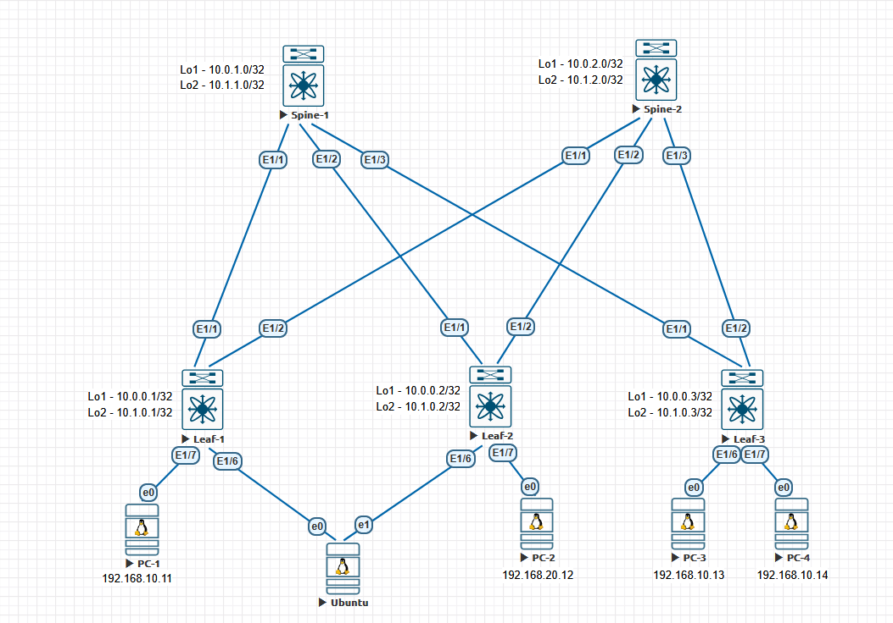
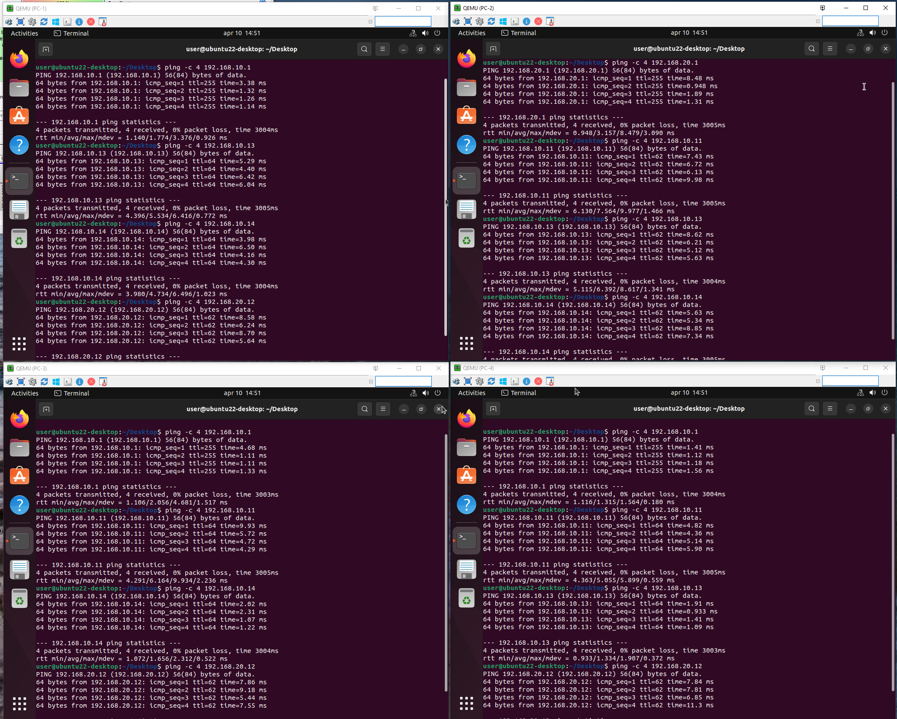

# Домашние задание 6
## VxLAN. EVPN L3

### Схема сети



### AS выбран по принципу:
   - 65000 - спайны
   - 65501-65536 - лифы

## Конфигурация и таблица маршрутизации

<details>
  <summary><b> Spine-1 </b></summary>
  <p> 

```
nv overlay evpn
feature bgp

route-map NH_UNCHANGED permit 10
  set ip next-hop unchanged
route-map REDISTRIBUTE_CONNECTED permit 10
  match interface loopback1 loopback2 
route-map RM_Leaves_BGP permit 10
  match as-number 65501-65599


interface Ethernet1/1
  description to leaf-1
  no switchport
  mtu 9000
  no ip redirects
  ip address 10.2.1.0/31
  no shutdown

interface Ethernet1/2
  description to leaf-2
  no switchport
  mtu 9000
  no ip redirects
  ip address 10.2.1.2/31
  no shutdown

interface Ethernet1/3
  no switchport
  mtu 9000
  no ip redirects
  ip address 10.2.1.4/31
  no shutdown

interface loopback1
  ip address 10.0.1.0/32

interface loopback2
  ip address 10.1.1.0/32

router bgp 65000
  router-id 10.0.1.0
  timers bgp 3 9
  reconnect-interval 12
  log-neighbor-changes
  address-family ipv4 unicast
    redistribute direct route-map REDISTRIBUTE_CONNECTED
    maximum-paths 10
  address-family l2vpn evpn
    maximum-paths 10
    retain route-target all
  neighbor 10.0.0.0/24 remote-as route-map RM_Leaves_BGP
    remote-as external
    update-source loopback1
    ebgp-multihop 5
    address-family l2vpn evpn
      send-community
      send-community extended
      route-map NH_UNCHANGED out
      rewrite-evpn-rt-asn
  neighbor 10.2.1.0/24 remote-as route-map RM_Leaves_BGP
    address-family ipv4 unicast
```
### Вывод маршрутной информации
```
Spine-1# sh ip ro
IP Route Table for VRF "default"
'*' denotes best ucast next-hop
'**' denotes best mcast next-hop
'[x/y]' denotes [preference/metric]
'%<string>' in via output denotes VRF <string>

10.0.0.1/32, ubest/mbest: 1/0
    *via 10.2.1.1, [20/0], 00:27:33, bgp-65000, external, tag 65501
10.0.0.2/32, ubest/mbest: 1/0
    *via 10.2.1.3, [20/0], 00:27:33, bgp-65000, external, tag 65502
10.0.0.3/32, ubest/mbest: 1/0
    *via 10.2.1.5, [20/0], 00:27:34, bgp-65000, external, tag 65503
10.0.1.0/32, ubest/mbest: 2/0, attached
    *via 10.0.1.0, Lo1, [0/0], 00:29:04, local
    *via 10.0.1.0, Lo1, [0/0], 00:29:04, direct
10.1.0.1/32, ubest/mbest: 1/0
    *via 10.2.1.1, [20/0], 00:27:33, bgp-65000, external, tag 65501
10.1.0.2/32, ubest/mbest: 1/0
    *via 10.2.1.3, [20/0], 00:27:33, bgp-65000, external, tag 65502
10.1.0.3/32, ubest/mbest: 1/0
    *via 10.2.1.5, [20/0], 00:27:34, bgp-65000, external, tag 65503
10.1.1.0/32, ubest/mbest: 2/0, attached
    *via 10.1.1.0, Lo2, [0/0], 00:29:04, local
    *via 10.1.1.0, Lo2, [0/0], 00:29:04, direct
10.2.1.0/31, ubest/mbest: 1/0, attached
    *via 10.2.1.0, Eth1/1, [0/0], 00:27:52, direct
10.2.1.0/32, ubest/mbest: 1/0, attached
    *via 10.2.1.0, Eth1/1, [0/0], 00:27:52, local
10.2.1.2/31, ubest/mbest: 1/0, attached
    *via 10.2.1.2, Eth1/2, [0/0], 00:27:52, direct
10.2.1.2/32, ubest/mbest: 1/0, attached
    *via 10.2.1.2, Eth1/2, [0/0], 00:27:52, local
10.2.1.4/31, ubest/mbest: 1/0, attached
    *via 10.2.1.4, Eth1/3, [0/0], 00:27:52, direct
10.2.1.4/32, ubest/mbest: 1/0, attached
    *via 10.2.1.4, Eth1/3, [0/0], 00:27:52, local
```
### Вывод l2vpn evpn
```
Spine-1# sh bgp l2vpn evpn
BGP routing table information for VRF default, address family L2VPN EVPN
BGP table version is 14, Local Router ID is 10.0.1.0
Status: s-suppressed, x-deleted, S-stale, d-dampened, h-history, *-valid, >-best
Path type: i-internal, e-external, c-confed, l-local, a-aggregate, r-redist, I-i
njected
Origin codes: i - IGP, e - EGP, ? - incomplete, | - multipath, & - backup, 2 - b
est2

   Network            Next Hop            Metric     LocPrf     Weight Path
Route Distinguisher: 10.0.0.1:32777
*>e[2]:[0]:[0]:[48]:[0050.0000.0a00]:[0]:[0.0.0.0]/216
                      10.0.0.1                                       0 65501 i
*>e[2]:[0]:[0]:[48]:[0050.7966.6801]:[0]:[0.0.0.0]/216
                      10.0.0.1                                       0 65501 i
*>e[3]:[0]:[32]:[10.0.0.1]/88
                      10.0.0.1                                       0 65501 i

Route Distinguisher: 10.0.0.2:32777
*>e[2]:[0]:[0]:[48]:[0050.0000.0a01]:[0]:[0.0.0.0]/216
                      10.0.0.2                                       0 65502 i
*>e[2]:[0]:[0]:[48]:[0050.7966.6807]:[0]:[0.0.0.0]/216
                      10.0.0.2                                       0 65502 i
*>e[3]:[0]:[32]:[10.0.0.2]/88
                      10.0.0.2                                       0 65502 i

Route Distinguisher: 10.0.0.3:32777
*>e[2]:[0]:[0]:[48]:[0050.7966.6808]:[0]:[0.0.0.0]/216
                      10.0.0.3                                       0 65503 i
*>e[2]:[0]:[0]:[48]:[0050.7966.6809]:[0]:[0.0.0.0]/216
                      10.0.0.3                                       0 65503 i
*>e[3]:[0]:[32]:[10.0.0.3]/88
                      10.0.0.3                                       0 65503 i

```

</p>
</details>

<details>
  <summary><b> Spine-2 </b></summary>
  <p> 

```
nv overlay evpn
feature bgp

route-map NH_UNCHANGED permit 10
  set ip next-hop unchanged
route-map REDISTRIBUTE_CONNECTED permit 10
  match interface loopback1 loopback2 
route-map RM_Leaves_BGP permit 10
  match as-number 65501-65599 

interface Ethernet1/1
  description to leaf-1
  no switchport
  mtu 9000
  no ip redirects
  ip address 10.2.2.0/31
  no shutdown

interface Ethernet1/2
  description to leaf-2
  no switchport
  mtu 9000
  no ip redirects
  ip address 10.2.2.2/31
  no shutdown

interface Ethernet1/3
  no switchport
  mtu 9000
  no ip redirects
  ip address 10.2.2.4/31
  no shutdown

interface loopback1
  ip address 10.0.2.0/32

interface loopback2
  ip address 10.1.2.0/32

router bgp 65000
  router-id 10.0.2.0
  timers bgp 3 9
  reconnect-interval 12
  log-neighbor-changes
  address-family ipv4 unicast
    redistribute direct route-map REDISTRIBUTE_CONNECTED
    maximum-paths 10
  address-family l2vpn evpn
    maximum-paths 10
    retain route-target all
  neighbor 10.0.0.0/24 remote-as route-map RM_Leaves_BGP
    remote-as external
    update-source loopback1
    ebgp-multihop 5
    address-family l2vpn evpn
      send-community
      send-community extended
      route-map NH_UNCHANGED out
      rewrite-evpn-rt-asn
  neighbor 10.2.2.0/24 remote-as route-map RM_Leaves_BGP
    address-family ipv4 unicast
```
### Вывод маршрутной информации
```
Spine-2# sh ip ro
IP Route Table for VRF "default"
'*' denotes best ucast next-hop
'**' denotes best mcast next-hop
'[x/y]' denotes [preference/metric]
'%<string>' in via output denotes VRF <string>

10.0.0.1/32, ubest/mbest: 1/0
    *via 10.2.2.1, [20/0], 00:27:33, bgp-65000, external, tag 65501
10.0.0.2/32, ubest/mbest: 1/0
    *via 10.2.2.3, [20/0], 00:27:33, bgp-65000, external, tag 65502
10.0.0.3/32, ubest/mbest: 1/0
    *via 10.2.2.5, [20/0], 00:27:40, bgp-65000, external, tag 65503
10.0.2.0/32, ubest/mbest: 2/0, attached
    *via 10.0.2.0, Lo1, [0/0], 00:29:04, local
    *via 10.0.2.0, Lo1, [0/0], 00:29:04, direct
10.1.0.1/32, ubest/mbest: 1/0
    *via 10.2.2.1, [20/0], 00:27:33, bgp-65000, external, tag 65501
10.1.0.2/32, ubest/mbest: 1/0
    *via 10.2.2.3, [20/0], 00:27:33, bgp-65000, external, tag 65502
10.1.0.3/32, ubest/mbest: 1/0
    *via 10.2.2.5, [20/0], 00:27:40, bgp-65000, external, tag 65503
10.1.2.0/32, ubest/mbest: 2/0, attached
    *via 10.1.2.0, Lo2, [0/0], 00:29:04, local
    *via 10.1.2.0, Lo2, [0/0], 00:29:04, direct
10.2.2.0/31, ubest/mbest: 1/0, attached
    *via 10.2.2.0, Eth1/1, [0/0], 00:27:53, direct
10.2.2.0/32, ubest/mbest: 1/0, attached
    *via 10.2.2.0, Eth1/1, [0/0], 00:27:53, local
10.2.2.2/31, ubest/mbest: 1/0, attached
    *via 10.2.2.2, Eth1/2, [0/0], 00:27:53, direct
10.2.2.2/32, ubest/mbest: 1/0, attached
    *via 10.2.2.2, Eth1/2, [0/0], 00:27:53, local
10.2.2.4/31, ubest/mbest: 1/0, attached
    *via 10.2.2.4, Eth1/3, [0/0], 00:27:53, direct
10.2.2.4/32, ubest/mbest: 1/0, attached
    *via 10.2.2.4, Eth1/3, [0/0], 00:27:53, loca
```
### Вывод l2vpn evpn
```
Spine-2# sh bgp l2vpn evpn
BGP routing table information for VRF default, address family L2VPN EVPN
BGP table version is 14, Local Router ID is 10.0.2.0
Status: s-suppressed, x-deleted, S-stale, d-dampened, h-history, *-valid, >-best
Path type: i-internal, e-external, c-confed, l-local, a-aggregate, r-redist, I-i
njected
Origin codes: i - IGP, e - EGP, ? - incomplete, | - multipath, & - backup, 2 - b
est2

   Network            Next Hop            Metric     LocPrf     Weight Path
Route Distinguisher: 10.0.0.1:32777
*>e[2]:[0]:[0]:[48]:[0050.0000.0a00]:[0]:[0.0.0.0]/216
                      10.0.0.1                                       0 65501 i
*>e[2]:[0]:[0]:[48]:[0050.7966.6801]:[0]:[0.0.0.0]/216
                      10.0.0.1                                       0 65501 i
*>e[3]:[0]:[32]:[10.0.0.1]/88
                      10.0.0.1                                       0 65501 i

Route Distinguisher: 10.0.0.2:32777
*>e[2]:[0]:[0]:[48]:[0050.0000.0a01]:[0]:[0.0.0.0]/216
                      10.0.0.2                                       0 65502 i
*>e[2]:[0]:[0]:[48]:[0050.7966.6807]:[0]:[0.0.0.0]/216
                      10.0.0.2                                       0 65502 i
*>e[3]:[0]:[32]:[10.0.0.2]/88
                      10.0.0.2                                       0 65502 i

Route Distinguisher: 10.0.0.3:32777
*>e[2]:[0]:[0]:[48]:[0050.7966.6808]:[0]:[0.0.0.0]/216
                      10.0.0.3                                       0 65503 i
*>e[2]:[0]:[0]:[48]:[0050.7966.6809]:[0]:[0.0.0.0]/216
                      10.0.0.3                                       0 65503 i
*>e[3]:[0]:[32]:[10.0.0.3]/88
                      10.0.0.3                                       0 65503 i
```

</p>
</details>

<details>
  <summary><b> Leaf-1</b></summary>
  <p>
 
```
nv overlay evpn
feature bgp
feature vn-segment-vlan-based
feature lacp
feature nv overlay

vlan 10
  name Vlan_10
  vn-segment 10010

route-map REDISTRIBUTE_CONNECTED permit 10
  match interface loopback1 loopback2

interface nve1
  no shutdown
  host-reachability protocol bgp
  source-interface loopback1
  member vni 10010
    ingress-replication protocol bgp

interface Ethernet1/1
  description to Spine-1
  no switchport
  mtu 9000
  no ip redirects
  ip address 10.2.1.1/31
  no shutdown

interface Ethernet1/2
  description to Spine-2
  no switchport
  mtu 9000
  no ip redirects
  ip address 10.2.2.1/31
  no shutdown

interface Ethernet1/6
  switchport access vlan 10

interface Ethernet1/7
  switchport access vlan 10

interface loopback1
  ip address 10.0.0.1/32

interface loopback2
  ip address 10.1.0.1/32

router bgp 65501
  router-id 10.0.0.1
  bestpath as-path multipath-relax
  reconnect-interval 12
  log-neighbor-changes
  address-family ipv4 unicast
    redistribute direct route-map REDISTRIBUTE_CONNECTED
    maximum-paths 10
  address-family l2vpn evpn
    maximum-paths 10
  template peer SPINES
    remote-as 65000
    timers 3 9
    address-family ipv4 unicast
  template peer SPINES_OV
    remote-as 65000
    update-source loopback1
    ebgp-multihop 2
    timers 3 9
    address-family l2vpn evpn
      send-community
      send-community extended
      rewrite-evpn-rt-asn
  neighbor 10.0.1.0
    inherit peer SPINES_OV
  neighbor 10.0.2.0
    inherit peer SPINES_OV
  neighbor 10.2.1.0
    inherit peer SPINES
  neighbor 10.2.2.0
    inherit peer SPINES
evpn
  vni 10010 l2
    rd auto
    route-target import auto
    route-target export auto

```
### Вывод маршрутной информации
```
Leaf-1# sh ip ro
IP Route Table for VRF "default"
'*' denotes best ucast next-hop
'**' denotes best mcast next-hop
'[x/y]' denotes [preference/metric]
'%<string>' in via output denotes VRF <string>

10.0.0.1/32, ubest/mbest: 2/0, attached
    *via 10.0.0.1, Lo1, [0/0], 00:29:01, local
    *via 10.0.0.1, Lo1, [0/0], 00:29:01, direct
10.0.0.2/32, ubest/mbest: 2/0
    *via 10.2.1.0, [20/0], 00:27:33, bgp-65501, external, tag 65000
    *via 10.2.2.0, [20/0], 00:27:33, bgp-65501, external, tag 65000
10.0.0.3/32, ubest/mbest: 2/0
    *via 10.2.1.0, [20/0], 00:27:33, bgp-65501, external, tag 65000
    *via 10.2.2.0, [20/0], 00:27:33, bgp-65501, external, tag 65000
10.0.1.0/32, ubest/mbest: 1/0
    *via 10.2.1.0, [20/0], 00:27:33, bgp-65501, external, tag 65000
10.0.2.0/32, ubest/mbest: 1/0
    *via 10.2.2.0, [20/0], 00:27:33, bgp-65501, external, tag 65000
10.1.0.1/32, ubest/mbest: 2/0, attached
    *via 10.1.0.1, Lo2, [0/0], 00:29:01, local
    *via 10.1.0.1, Lo2, [0/0], 00:29:01, direct
10.1.0.2/32, ubest/mbest: 2/0
    *via 10.2.1.0, [20/0], 00:27:33, bgp-65501, external, tag 65000
    *via 10.2.2.0, [20/0], 00:27:33, bgp-65501, external, tag 65000
10.1.0.3/32, ubest/mbest: 2/0
    *via 10.2.1.0, [20/0], 00:27:33, bgp-65501, external, tag 65000
    *via 10.2.2.0, [20/0], 00:27:33, bgp-65501, external, tag 65000
10.1.1.0/32, ubest/mbest: 1/0
    *via 10.2.1.0, [20/0], 00:27:33, bgp-65501, external, tag 65000
10.1.2.0/32, ubest/mbest: 1/0
    *via 10.2.2.0, [20/0], 00:27:33, bgp-65501, external, tag 65000
10.2.1.0/31, ubest/mbest: 1/0, attached
    *via 10.2.1.1, Eth1/1, [0/0], 00:27:47, direct
10.2.1.1/32, ubest/mbest: 1/0, attached
    *via 10.2.1.1, Eth1/1, [0/0], 00:27:47, local
10.2.2.0/31, ubest/mbest: 1/0, attached
    *via 10.2.2.1, Eth1/2, [0/0], 00:27:47, direct
10.2.2.1/32, ubest/mbest: 1/0, attached
    *via 10.2.2.1, Eth1/2, [0/0], 00:27:47, local
```
### Вывод l2vpn evpn
```
sh bgp l2vpn evpn
BGP routing table information for VRF default, address family L2VPN EVPN
BGP table version is 20, Local Router ID is 10.0.0.1
Status: s-suppressed, x-deleted, S-stale, d-dampened, h-history, *-valid, >-best
Path type: i-internal, e-external, c-confed, l-local, a-aggregate, r-redist, I-i
njected
Origin codes: i - IGP, e - EGP, ? - incomplete, | - multipath, & - backup, 2 - b
est2

   Network            Next Hop            Metric     LocPrf     Weight Path
Route Distinguisher: 10.0.0.1:32777    (L2VNI 10010)
*>l[2]:[0]:[0]:[48]:[0050.0000.0a00]:[0]:[0.0.0.0]/216
                      10.0.0.1                          100      32768 i
*>e[2]:[0]:[0]:[48]:[0050.0000.0a01]:[0]:[0.0.0.0]/216
                      10.0.0.2                                       0 65000 655
02 i
*>l[2]:[0]:[0]:[48]:[0050.7966.6801]:[0]:[0.0.0.0]/216
                      10.0.0.1                          100      32768 i
*>e[2]:[0]:[0]:[48]:[0050.7966.6807]:[0]:[0.0.0.0]/216
                      10.0.0.2                                       0 65000 655
02 i
*>e[2]:[0]:[0]:[48]:[0050.7966.6808]:[0]:[0.0.0.0]/216
                      10.0.0.3                                       0 65000 655
03 i
*>e[2]:[0]:[0]:[48]:[0050.7966.6809]:[0]:[0.0.0.0]/216
                      10.0.0.3                                       0 65000 655
03 i
*>l[3]:[0]:[32]:[10.0.0.1]/88
                      10.0.0.1                          100      32768 i
*>e[3]:[0]:[32]:[10.0.0.2]/88
                      10.0.0.2                                       0 65000 655
02 i
*>e[3]:[0]:[32]:[10.0.0.3]/88
                      10.0.0.3                                       0 65000 655
03 i

Route Distinguisher: 10.0.0.2:32777
* e[2]:[0]:[0]:[48]:[0050.0000.0a01]:[0]:[0.0.0.0]/216
                      10.0.0.2                                       0 65000 655
02 i
*>e                   10.0.0.2                                       0 65000 655
02 i
* e[2]:[0]:[0]:[48]:[0050.7966.6807]:[0]:[0.0.0.0]/216
                      10.0.0.2                                       0 65000 655
02 i
*>e                   10.0.0.2                                       0 65000 655
02 i
* e[3]:[0]:[32]:[10.0.0.2]/88
                      10.0.0.2                                       0 65000 655
02 i
*>e                   10.0.0.2                                       0 65000 655
02 i

Route Distinguisher: 10.0.0.3:32777
* e[2]:[0]:[0]:[48]:[0050.7966.6808]:[0]:[0.0.0.0]/216
                      10.0.0.3                                       0 65000 655
03 i
*>e                   10.0.0.3                                       0 65000 655
03 i
* e[2]:[0]:[0]:[48]:[0050.7966.6809]:[0]:[0.0.0.0]/216
                      10.0.0.3                                       0 65000 655
03 i
*>e                   10.0.0.3                                       0 65000 655
03 i
*>e[3]:[0]:[32]:[10.0.0.3]/88
                      10.0.0.3                                       0 65000 655
03 i
* e                   10.0.0.3                                       0 65000 655
```
  </p>
</details>

<details>
  <summary><b> Leaf-2</b></summary>
  <p>
 
```
nv overlay evpn
feature bgp
feature vn-segment-vlan-based
feature lacp
feature nv overlay

vlan 10
  name Vlan_10
  vn-segment 10010

route-map REDISTRIBUTE_CONNECTED permit 10
  match interface loopback1 loopback2

interface nve1
  no shutdown
  host-reachability protocol bgp
  source-interface loopback1
  member vni 10010
    ingress-replication protocol bgp

interface Ethernet1/1
  description to Spine-1
  no switchport
  mtu 9000
  no ip redirects
  ip address 10.2.1.3/31
  no shutdown

interface Ethernet1/2
  description to Spine-2
  no switchport
  mtu 9000
  no ip redirects
  ip address 10.2.2.3/31
  no shutdown

interface Ethernet1/6
  switchport access vlan 10

interface Ethernet1/7
  switchport access vlan 10

interface loopback1
  ip address 10.0.0.2/32

interface loopback2
  ip address 10.1.0.2/32

router bgp 65502
  router-id 10.0.0.2
  bestpath as-path multipath-relax
  reconnect-interval 12
  log-neighbor-changes
  address-family ipv4 unicast
    redistribute direct route-map REDISTRIBUTE_CONNECTED
    maximum-paths 10
  address-family l2vpn evpn
    maximum-paths 10
  template peer SPINES
    remote-as 65000
    timers 3 9
    address-family ipv4 unicast
  template peer SPINES_OV
    remote-as 65000
    update-source loopback1
    ebgp-multihop 2
    timers 3 9
    address-family l2vpn evpn
      send-community
      send-community extended
      rewrite-evpn-rt-asn
  neighbor 10.0.1.0
    inherit peer SPINES_OV
  neighbor 10.0.2.0
    inherit peer SPINES_OV
  neighbor 10.2.1.2
    inherit peer SPINES
  neighbor 10.2.2.2
    inherit peer SPINES
evpn
  vni 10010 l2
    rd auto
    route-target import auto
    route-target export auto
```
### Вывод маршрутной информации
```
Leaf-2# sh ip ro
IP Route Table for VRF "default"
'*' denotes best ucast next-hop
'**' denotes best mcast next-hop
'[x/y]' denotes [preference/metric]
'%<string>' in via output denotes VRF <string>

10.0.0.1/32, ubest/mbest: 2/0
    *via 10.2.1.2, [20/0], 00:27:33, bgp-65502, external, tag 65000
    *via 10.2.2.2, [20/0], 00:27:33, bgp-65502, external, tag 65000
10.0.0.2/32, ubest/mbest: 2/0, attached
    *via 10.0.0.2, Lo1, [0/0], 00:29:03, local
    *via 10.0.0.2, Lo1, [0/0], 00:29:03, direct
10.0.0.3/32, ubest/mbest: 2/0
    *via 10.2.1.2, [20/0], 00:27:34, bgp-65502, external, tag 65000
    *via 10.2.2.2, [20/0], 00:27:34, bgp-65502, external, tag 65000
10.0.1.0/32, ubest/mbest: 1/0
    *via 10.2.1.2, [20/0], 00:27:34, bgp-65502, external, tag 65000
10.0.2.0/32, ubest/mbest: 1/0
    *via 10.2.2.2, [20/0], 00:27:34, bgp-65502, external, tag 65000
10.1.0.1/32, ubest/mbest: 2/0
    *via 10.2.1.2, [20/0], 00:27:33, bgp-65502, external, tag 65000
    *via 10.2.2.2, [20/0], 00:27:33, bgp-65502, external, tag 65000
10.1.0.2/32, ubest/mbest: 2/0, attached
    *via 10.1.0.2, Lo2, [0/0], 00:29:03, local
    *via 10.1.0.2, Lo2, [0/0], 00:29:03, direct
10.1.0.3/32, ubest/mbest: 2/0
    *via 10.2.1.2, [20/0], 00:27:34, bgp-65502, external, tag 65000
    *via 10.2.2.2, [20/0], 00:27:34, bgp-65502, external, tag 65000
10.1.1.0/32, ubest/mbest: 1/0
    *via 10.2.1.2, [20/0], 00:27:34, bgp-65502, external, tag 65000
10.1.2.0/32, ubest/mbest: 1/0
    *via 10.2.2.2, [20/0], 00:27:34, bgp-65502, external, tag 65000
10.2.1.2/31, ubest/mbest: 1/0, attached
    *via 10.2.1.3, Eth1/1, [0/0], 00:27:54, direct
10.2.1.3/32, ubest/mbest: 1/0, attached
    *via 10.2.1.3, Eth1/1, [0/0], 00:27:54, local
10.2.2.2/31, ubest/mbest: 1/0, attached
    *via 10.2.2.3, Eth1/2, [0/0], 00:27:54, direct
10.2.2.3/32, ubest/mbest: 1/0, attached
    *via 10.2.2.3, Eth1/2, [0/0], 00:27:54, local
```
### Вывод l2vpn evpn
```
Leaf-2# sh bgp l2vpn evpn
BGP routing table information for VRF default, address family L2VPN EVPN
BGP table version is 20, Local Router ID is 10.0.0.2
Status: s-suppressed, x-deleted, S-stale, d-dampened, h-history, *-valid, >-best
Path type: i-internal, e-external, c-confed, l-local, a-aggregate, r-redist, I-i
njected
Origin codes: i - IGP, e - EGP, ? - incomplete, | - multipath, & - backup, 2 - b
est2

   Network            Next Hop            Metric     LocPrf     Weight Path
Route Distinguisher: 10.0.0.1:32777
* e[2]:[0]:[0]:[48]:[0050.0000.0a00]:[0]:[0.0.0.0]/216
                      10.0.0.1                                       0 65000 655
01 i
*>e                   10.0.0.1                                       0 65000 655
01 i
* e[2]:[0]:[0]:[48]:[0050.7966.6801]:[0]:[0.0.0.0]/216
                      10.0.0.1                                       0 65000 655
01 i
*>e                   10.0.0.1                                       0 65000 655
01 i
* e[3]:[0]:[32]:[10.0.0.1]/88
                      10.0.0.1                                       0 65000 655
01 i
*>e                   10.0.0.1                                       0 65000 655
01 i

Route Distinguisher: 10.0.0.2:32777    (L2VNI 10010)
*>e[2]:[0]:[0]:[48]:[0050.0000.0a00]:[0]:[0.0.0.0]/216
                      10.0.0.1                                       0 65000 655
01 i
*>l[2]:[0]:[0]:[48]:[0050.0000.0a01]:[0]:[0.0.0.0]/216
                      10.0.0.2                          100      32768 i
*>e[2]:[0]:[0]:[48]:[0050.7966.6801]:[0]:[0.0.0.0]/216
                      10.0.0.1                                       0 65000 655
01 i
*>l[2]:[0]:[0]:[48]:[0050.7966.6807]:[0]:[0.0.0.0]/216
                      10.0.0.2                          100      32768 i
*>e[2]:[0]:[0]:[48]:[0050.7966.6808]:[0]:[0.0.0.0]/216
                      10.0.0.3                                       0 65000 655
03 i
*>e[2]:[0]:[0]:[48]:[0050.7966.6809]:[0]:[0.0.0.0]/216
                      10.0.0.3                                       0 65000 655
03 i
*>e[3]:[0]:[32]:[10.0.0.1]/88
                      10.0.0.1                                       0 65000 655
01 i
*>l[3]:[0]:[32]:[10.0.0.2]/88
                      10.0.0.2                          100      32768 i
*>e[3]:[0]:[32]:[10.0.0.3]/88
                      10.0.0.3                                       0 65000 655
03 i

Route Distinguisher: 10.0.0.3:32777
* e[2]:[0]:[0]:[48]:[0050.7966.6808]:[0]:[0.0.0.0]/216
                      10.0.0.3                                       0 65000 655
03 i
*>e                   10.0.0.3                                       0 65000 655
03 i
* e[2]:[0]:[0]:[48]:[0050.7966.6809]:[0]:[0.0.0.0]/216
                      10.0.0.3                                       0 65000 655
03 i
*>e                   10.0.0.3                                       0 65000 655
03 i
* e[3]:[0]:[32]:[10.0.0.3]/88
                      10.0.0.3                                       0 65000 655
03 i
*>e                   10.0.0.3                                       0 65000 655
03 i
```
  </p>
</details>

<details>
  <summary><b> Leaf-3</b></summary>
  <p>
 
```
nv overlay evpn
feature bgp
feature vn-segment-vlan-based
feature lacp
feature nv overlay

vlan 10
  name Vlan_10
  vn-segment 10010

route-map REDISTRIBUTE_CONNECTED permit 10
  match interface loopback1 loopback2

interface nve1
  no shutdown
  host-reachability protocol bgp
  source-interface loopback1
  member vni 10010
    ingress-replication protocol bgp

interface Ethernet1/1
  description to Spine-1
  no switchport
  mtu 9000
  no ip redirects
  ip address 10.2.1.5/31
  no shutdown

interface Ethernet1/2
  description to Spine-2
  no switchport
  mtu 9000
  no ip redirects
  ip address 10.2.2.5/31
  no shutdown

interface Ethernet1/6
  switchport access vlan 10

interface Ethernet1/7
  switchport access vlan 10

interface loopback1
  ip address 10.0.0.3/32

interface loopback2
  ip address 10.1.0.3/32

router bgp 65503
  router-id 10.0.0.3
  bestpath as-path multipath-relax
  reconnect-interval 12
  log-neighbor-changes
  address-family ipv4 unicast
    redistribute direct route-map REDISTRIBUTE_CONNECTED
    maximum-paths 10
  address-family l2vpn evpn
    maximum-paths 10
  template peer SPINES
    remote-as 65000
    timers 3 9
    address-family ipv4 unicast
  template peer SPINES_OV
    remote-as 65000
    update-source loopback1
    ebgp-multihop 2
    timers 3 9
    address-family l2vpn evpn
      send-community
      send-community extended
      rewrite-evpn-rt-asn
  neighbor 10.0.1.0
    inherit peer SPINES_OV
  neighbor 10.0.2.0
    inherit peer SPINES_OV
  neighbor 10.2.1.4
    inherit peer SPINES
  neighbor 10.2.2.4
    inherit peer SPINES
evpn
  vni 10010 l2
    rd auto
    route-target import auto
    route-target export auto
```
### Вывод маршрутной информации
```
Leaf-3# sh ip ro
IP Route Table for VRF "default"
'*' denotes best ucast next-hop
'**' denotes best mcast next-hop
'[x/y]' denotes [preference/metric]
'%<string>' in via output denotes VRF <string>

10.0.0.1/32, ubest/mbest: 2/0
    *via 10.2.1.4, [20/0], 00:27:33, bgp-65503, external, tag 65000
    *via 10.2.2.4, [20/0], 00:27:33, bgp-65503, external, tag 65000
10.0.0.2/32, ubest/mbest: 2/0
    *via 10.2.1.4, [20/0], 00:27:34, bgp-65503, external, tag 65000
    *via 10.2.2.4, [20/0], 00:27:34, bgp-65503, external, tag 65000
10.0.0.3/32, ubest/mbest: 2/0, attached
    *via 10.0.0.3, Lo1, [0/0], 00:29:07, local
    *via 10.0.0.3, Lo1, [0/0], 00:29:07, direct
10.0.1.0/32, ubest/mbest: 1/0
    *via 10.2.1.4, [20/0], 00:27:34, bgp-65503, external, tag 65000
10.0.2.0/32, ubest/mbest: 1/0
    *via 10.2.2.4, [20/0], 00:27:41, bgp-65503, external, tag 65000
10.1.0.1/32, ubest/mbest: 2/0
    *via 10.2.1.4, [20/0], 00:27:33, bgp-65503, external, tag 65000
    *via 10.2.2.4, [20/0], 00:27:33, bgp-65503, external, tag 65000
10.1.0.2/32, ubest/mbest: 2/0
    *via 10.2.1.4, [20/0], 00:27:34, bgp-65503, external, tag 65000
    *via 10.2.2.4, [20/0], 00:27:34, bgp-65503, external, tag 65000
10.1.0.3/32, ubest/mbest: 2/0, attached
    *via 10.1.0.3, Lo2, [0/0], 00:29:07, local
    *via 10.1.0.3, Lo2, [0/0], 00:29:07, direct
10.1.1.0/32, ubest/mbest: 1/0
    *via 10.2.1.4, [20/0], 00:27:34, bgp-65503, external, tag 65000
10.1.2.0/32, ubest/mbest: 1/0
    *via 10.2.2.4, [20/0], 00:27:41, bgp-65503, external, tag 65000
10.2.1.4/31, ubest/mbest: 1/0, attached
    *via 10.2.1.5, Eth1/1, [0/0], 00:27:55, direct
10.2.1.5/32, ubest/mbest: 1/0, attached
    *via 10.2.1.5, Eth1/1, [0/0], 00:27:55, local
10.2.2.4/31, ubest/mbest: 1/0, attached
    *via 10.2.2.5, Eth1/2, [0/0], 00:27:55, direct
10.2.2.5/32, ubest/mbest: 1/0, attached
    *via 10.2.2.5, Eth1/2, [0/0], 00:27:55, local
```
### Вывод l2vpn evpn
```
Leaf-3# sh bgp l2vpn evpn
BGP routing table information for VRF default, address family L2VPN EVPN
BGP table version is 18, Local Router ID is 10.0.0.3
Status: s-suppressed, x-deleted, S-stale, d-dampened, h-history, *-valid, >-best
Path type: i-internal, e-external, c-confed, l-local, a-aggregate, r-redist, I-i
njected
Origin codes: i - IGP, e - EGP, ? - incomplete, | - multipath, & - backup, 2 - b
est2

   Network            Next Hop            Metric     LocPrf     Weight Path
Route Distinguisher: 10.0.0.1:32777
* e[2]:[0]:[0]:[48]:[0050.0000.0a00]:[0]:[0.0.0.0]/216
                      10.0.0.1                                       0 65000 655
01 i
*>e                   10.0.0.1                                       0 65000 655
01 i
* e[2]:[0]:[0]:[48]:[0050.7966.6801]:[0]:[0.0.0.0]/216
                      10.0.0.1                                       0 65000 655
01 i
*>e                   10.0.0.1                                       0 65000 655
01 i
* e[3]:[0]:[32]:[10.0.0.1]/88
                      10.0.0.1                                       0 65000 655
01 i
*>e                   10.0.0.1                                       0 65000 655
01 i

Route Distinguisher: 10.0.0.2:32777
*>e[2]:[0]:[0]:[48]:[0050.0000.0a01]:[0]:[0.0.0.0]/216
                      10.0.0.2                                       0 65000 655
02 i
* e                   10.0.0.2                                       0 65000 655
02 i
* e[2]:[0]:[0]:[48]:[0050.7966.6807]:[0]:[0.0.0.0]/216
                      10.0.0.2                                       0 65000 655
02 i
*>e                   10.0.0.2                                       0 65000 655
02 i
* e[3]:[0]:[32]:[10.0.0.2]/88
                      10.0.0.2                                       0 65000 655
02 i
*>e                   10.0.0.2                                       0 65000 655
02 i

Route Distinguisher: 10.0.0.3:32777    (L2VNI 10010)
*>e[2]:[0]:[0]:[48]:[0050.0000.0a00]:[0]:[0.0.0.0]/216
                      10.0.0.1                                       0 65000 655
01 i
*>e[2]:[0]:[0]:[48]:[0050.0000.0a01]:[0]:[0.0.0.0]/216
                      10.0.0.2                                       0 65000 655
02 i
*>e[2]:[0]:[0]:[48]:[0050.7966.6801]:[0]:[0.0.0.0]/216
                      10.0.0.1                                       0 65000 655
01 i
*>e[2]:[0]:[0]:[48]:[0050.7966.6807]:[0]:[0.0.0.0]/216
                      10.0.0.2                                       0 65000 655
02 i
*>l[2]:[0]:[0]:[48]:[0050.7966.6808]:[0]:[0.0.0.0]/216
                      10.0.0.3                          100      32768 i
*>l[2]:[0]:[0]:[48]:[0050.7966.6809]:[0]:[0.0.0.0]/216
                      10.0.0.3                          100      32768 i
*>e[3]:[0]:[32]:[10.0.0.1]/88
                      10.0.0.1                                       0 65000 655
01 i
*>e[3]:[0]:[32]:[10.0.0.2]/88
                      10.0.0.2                                       0 65000 655
02 i
*>l[3]:[0]:[32]:[10.0.0.3]/88
                      10.0.0.3                          100      32768 i
```
  </p>
</details>

## ICMP


