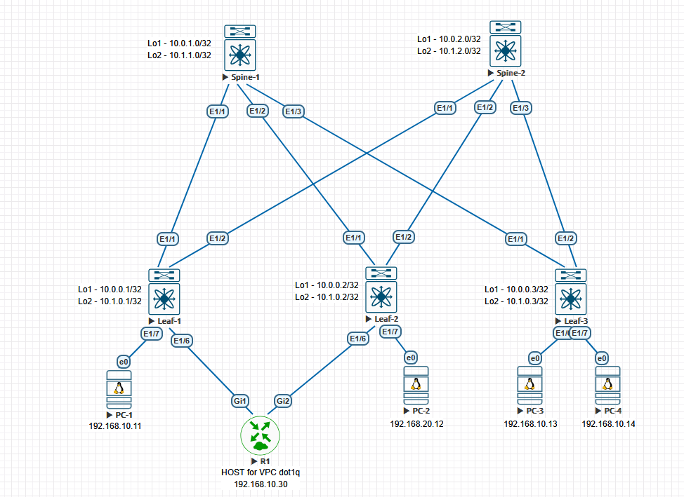

# Домашние задание 6
## VxLAN. EVPN L3

### Схема сети



### AS выбран по принципу:
   - 65000 - спайны
   - 65501-65536 - лифы

## Конфигурация и таблица маршрутизации

<details>
  <summary><b> Spine-1 </b></summary>
  <p> 

```
nv overlay evpn
feature bgp

route-map NH_UNCHANGED permit 10
  set ip next-hop unchanged
route-map REDISTRIBUTE_CONNECTED permit 10
  match interface loopback1 loopback2 
route-map RM_Leaves_BGP permit 10
  match as-number 65501-65599

interface Ethernet1/1
  description to leaf-1
  no switchport
  mtu 9216
  port-type fabric
  no ip redirects
  ip address 10.2.1.0/31
  no shutdown

interface Ethernet1/2
  description to leaf-2
  no switchport
  mtu 9216
  port-type fabric
  no ip redirects
  ip address 10.2.1.2/31
  no shutdown

interface Ethernet1/3
  no switchport
  mtu 9216
  port-type fabric
  no ip redirects
  ip address 10.2.1.4/31
  no shutdown

interface loopback1
  ip address 10.0.1.0/32

interface loopback2
  ip address 10.1.1.0/32

router bgp 65000
  router-id 10.0.1.0
  timers bgp 3 9
  reconnect-interval 12
  log-neighbor-changes
  address-family ipv4 unicast
    redistribute direct route-map REDISTRIBUTE_CONNECTED
    maximum-paths 10
  address-family l2vpn evpn
    maximum-paths 10
    retain route-target all
  neighbor 10.0.0.0/24 remote-as route-map RM_Leaves_BGP
    remote-as external
    update-source loopback1
    ebgp-multihop 5
    address-family l2vpn evpn
      send-community
      send-community extended
      route-map NH_UNCHANGED out
      rewrite-evpn-rt-asn
  neighbor 10.2.1.0/24 remote-as route-map RM_Leaves_BGP
    address-family ipv4 unicast
```
### Вывод маршрутной информации
```
Spine-1# sh ip route
IP Route Table for VRF "default"
'*' denotes best ucast next-hop
'**' denotes best mcast next-hop
'[x/y]' denotes [preference/metric]
'%<string>' in via output denotes VRF <string>

10.0.0.1/32, ubest/mbest: 1/0
    *via 10.2.1.1, [20/0], 00:22:30, bgp-65000, external, tag 65501
10.0.0.2/32, ubest/mbest: 1/0
    *via 10.2.1.3, [20/0], 00:28:30, bgp-65000, external, tag 65502
10.0.0.3/32, ubest/mbest: 1/0
    *via 10.2.1.5, [20/0], 00:28:14, bgp-65000, external, tag 65503
10.0.1.0/32, ubest/mbest: 2/0, attached
    *via 10.0.1.0, Lo1, [0/0], 18:04:06, local
    *via 10.0.1.0, Lo1, [0/0], 18:04:06, direct
10.1.0.1/32, ubest/mbest: 1/0
    *via 10.2.1.1, [20/0], 00:22:30, bgp-65000, external, tag 65501
10.1.0.2/32, ubest/mbest: 1/0
    *via 10.2.1.3, [20/0], 00:28:30, bgp-65000, external, tag 65502
10.1.0.3/32, ubest/mbest: 1/0
    *via 10.2.1.5, [20/0], 00:28:14, bgp-65000, external, tag 65503
10.1.1.0/32, ubest/mbest: 2/0, attached
    *via 10.1.1.0, Lo2, [0/0], 18:09:27, local
    *via 10.1.1.0, Lo2, [0/0], 18:09:27, direct
10.2.1.0/31, ubest/mbest: 1/0, attached
    *via 10.2.1.0, Eth1/1, [0/0], 18:08:06, direct
10.2.1.0/32, ubest/mbest: 1/0, attached
    *via 10.2.1.0, Eth1/1, [0/0], 18:08:06, local
10.2.1.2/31, ubest/mbest: 1/0, attached
    *via 10.2.1.2, Eth1/2, [0/0], 18:08:06, direct
10.2.1.2/32, ubest/mbest: 1/0, attached
    *via 10.2.1.2, Eth1/2, [0/0], 18:08:06, local
10.2.1.4/31, ubest/mbest: 1/0, attached
    *via 10.2.1.4, Eth1/3, [0/0], 18:08:06, direct
10.2.1.4/32, ubest/mbest: 1/0, attached
    *via 10.2.1.4, Eth1/3, [0/0], 18:08:06, local
```
### Вывод l2vpn evpn
```
Spine-1# sh bgp l2vpn evpn
BGP routing table information for VRF default, address family L2VPN EVPN
BGP table version is 186, Local Router ID is 10.0.1.0
Status: s-suppressed, x-deleted, S-stale, d-dampened, h-history, *-valid, >-best
Path type: i-internal, e-external, c-confed, l-local, a-aggregate, r-redist, I-injected
Origin codes: i - IGP, e - EGP, ? - incomplete, | - multipath, & - backup, 2 - best2

   Network            Next Hop            Metric     LocPrf     Weight Path
Route Distinguisher: 10.0.0.1:32777
*>e[2]:[0]:[0]:[48]:[0050.0000.0100]:[0]:[0.0.0.0]/216
                      10.0.0.1                                       0 65501 i
*>e[2]:[0]:[0]:[48]:[167d.0352.f25c]:[0]:[0.0.0.0]/216
                      10.0.0.1                                       0 65501 i
*>e[2]:[0]:[0]:[48]:[0050.0000.0100]:[32]:[192.168.10.11]/272
                      10.0.0.1                                       0 65501 i
*>e[3]:[0]:[32]:[10.0.0.1]/88
                      10.0.0.1                                       0 65501 i

Route Distinguisher: 10.0.0.1:32787
*>e[3]:[0]:[32]:[10.0.0.1]/88
                      10.0.0.1                                       0 65501 i

Route Distinguisher: 10.0.0.2:32777
*>e[3]:[0]:[32]:[10.0.0.2]/88
                      10.0.0.2                                       0 65502 i

Route Distinguisher: 10.0.0.2:32787
*>e[2]:[0]:[0]:[48]:[0050.0000.0700]:[0]:[0.0.0.0]/216
                      10.0.0.2                                       0 65502 i
*>e[2]:[0]:[0]:[48]:[0050.0000.0700]:[32]:[192.168.20.12]/272
                      10.0.0.2                                       0 65502 i
*>e[3]:[0]:[32]:[10.0.0.2]/88
                      10.0.0.2                                       0 65502 i

Route Distinguisher: 10.0.0.3:32777
*>e[2]:[0]:[0]:[48]:[0050.0000.0800]:[0]:[0.0.0.0]/216
                      10.0.0.3                                       0 65503 i
*>e[2]:[0]:[0]:[48]:[0050.0000.0900]:[0]:[0.0.0.0]/216
                      10.0.0.3                                       0 65503 i
*>e[2]:[0]:[0]:[48]:[0050.0000.0800]:[32]:[192.168.10.13]/272
                      10.0.0.3                                       0 65503 i
*>e[2]:[0]:[0]:[48]:[0050.0000.0900]:[32]:[192.168.10.14]/272
                      10.0.0.3                                       0 65503 i
*>e[3]:[0]:[32]:[10.0.0.3]/88
                      10.0.0.3                                       0 65503 i

Route Distinguisher: 10.0.0.3:32787
*>e[3]:[0]:[32]:[10.0.0.3]/88
                      10.0.0.3                                       0 65503 i

```

</p>
</details>

<details>
  <summary><b> Spine-2 </b></summary>
  <p> 

```
nv overlay evpn
feature bgp

route-map NH_UNCHANGED permit 10
  set ip next-hop unchanged
route-map REDISTRIBUTE_CONNECTED permit 10
  match interface loopback1 loopback2 
route-map RM_Leaves_BGP permit 10
  match as-number 65501-65599 

interface Ethernet1/1
  description to leaf-1
  no switchport
  mtu 9216
  port-type fabric
  no ip redirects
  ip address 10.2.2.0/31
  no shutdown

interface Ethernet1/2
  description to leaf-2
  no switchport
  mtu 9216
  port-type fabric
  no ip redirects
  ip address 10.2.2.2/31
  no shutdown

interface Ethernet1/3
  no switchport
  mtu 9216
  port-type fabric
  no ip redirects
  ip address 10.2.2.4/31
  no shutdown

interface loopback1
  ip address 10.0.2.0/32

interface loopback2
  ip address 10.1.2.0/32

router bgp 65000
  router-id 10.0.2.0
  timers bgp 3 9
  reconnect-interval 12
  log-neighbor-changes
  address-family ipv4 unicast
    redistribute direct route-map REDISTRIBUTE_CONNECTED
    maximum-paths 10
  address-family l2vpn evpn
    maximum-paths 10
    retain route-target all
  neighbor 10.0.0.0/24 remote-as route-map RM_Leaves_BGP
    remote-as external
    update-source loopback1
    ebgp-multihop 5
    address-family l2vpn evpn
      send-community
      send-community extended
      route-map NH_UNCHANGED out
      rewrite-evpn-rt-asn
  neighbor 10.2.2.0/24 remote-as route-map RM_Leaves_BGP
    address-family ipv4 unicast
```
### Вывод маршрутной информации
```
Spine-2# sh ip route
IP Route Table for VRF "default"
'*' denotes best ucast next-hop
'**' denotes best mcast next-hop
'[x/y]' denotes [preference/metric]
'%<string>' in via output denotes VRF <string>

10.0.0.1/32, ubest/mbest: 1/0
    *via 10.2.2.1, [20/0], 00:22:30, bgp-65000, external, tag 65501
10.0.0.2/32, ubest/mbest: 1/0
    *via 10.2.2.3, [20/0], 00:28:30, bgp-65000, external, tag 65502
10.0.0.3/32, ubest/mbest: 1/0
    *via 10.2.2.5, [20/0], 00:28:14, bgp-65000, external, tag 65503
10.0.2.0/32, ubest/mbest: 2/0, attached
    *via 10.0.2.0, Lo1, [0/0], 18:04:06, local
    *via 10.0.2.0, Lo1, [0/0], 18:04:06, direct
10.1.0.1/32, ubest/mbest: 1/0
    *via 10.2.2.1, [20/0], 00:22:30, bgp-65000, external, tag 65501
10.1.0.2/32, ubest/mbest: 1/0
    *via 10.2.2.3, [20/0], 00:28:30, bgp-65000, external, tag 65502
10.1.0.3/32, ubest/mbest: 1/0
    *via 10.2.2.5, [20/0], 00:28:14, bgp-65000, external, tag 65503
10.1.2.0/32, ubest/mbest: 2/0, attached
    *via 10.1.2.0, Lo2, [0/0], 18:09:23, local
    *via 10.1.2.0, Lo2, [0/0], 18:09:23, direct
10.2.2.0/31, ubest/mbest: 1/0, attached
    *via 10.2.2.0, Eth1/1, [0/0], 18:08:09, direct
10.2.2.0/32, ubest/mbest: 1/0, attached
    *via 10.2.2.0, Eth1/1, [0/0], 18:08:09, local
10.2.2.2/31, ubest/mbest: 1/0, attached
    *via 10.2.2.2, Eth1/2, [0/0], 18:08:08, direct
10.2.2.2/32, ubest/mbest: 1/0, attached
    *via 10.2.2.2, Eth1/2, [0/0], 18:08:08, local
10.2.2.4/31, ubest/mbest: 1/0, attached
    *via 10.2.2.4, Eth1/3, [0/0], 18:08:08, direct
10.2.2.4/32, ubest/mbest: 1/0, attached
    *via 10.2.2.4, Eth1/3, [0/0], 18:08:08, local
```
### Вывод l2vpn evpn
```
Spine-2# sh bgp l2vpn evpn
BGP routing table information for VRF default, address family L2VPN EVPN
BGP table version is 201, Local Router ID is 10.0.2.0
Status: s-suppressed, x-deleted, S-stale, d-dampened, h-history, *-valid, >-best
Path type: i-internal, e-external, c-confed, l-local, a-aggregate, r-redist, I-injected
Origin codes: i - IGP, e - EGP, ? - incomplete, | - multipath, & - backup, 2 - best2

   Network            Next Hop            Metric     LocPrf     Weight Path
Route Distinguisher: 10.0.0.1:32777
*>e[2]:[0]:[0]:[48]:[0050.0000.0100]:[0]:[0.0.0.0]/216
                      10.0.0.1                                       0 65501 i
*>e[2]:[0]:[0]:[48]:[167d.0352.f25c]:[0]:[0.0.0.0]/216
                      10.0.0.1                                       0 65501 i
*>e[2]:[0]:[0]:[48]:[0050.0000.0100]:[32]:[192.168.10.11]/272
                      10.0.0.1                                       0 65501 i
*>e[3]:[0]:[32]:[10.0.0.1]/88
                      10.0.0.1                                       0 65501 i

Route Distinguisher: 10.0.0.1:32787
*>e[3]:[0]:[32]:[10.0.0.1]/88
                      10.0.0.1                                       0 65501 i

Route Distinguisher: 10.0.0.2:32777
*>e[3]:[0]:[32]:[10.0.0.2]/88
                      10.0.0.2                                       0 65502 i

Route Distinguisher: 10.0.0.2:32787
*>e[2]:[0]:[0]:[48]:[0050.0000.0700]:[0]:[0.0.0.0]/216
                      10.0.0.2                                       0 65502 i
*>e[2]:[0]:[0]:[48]:[0050.0000.0700]:[32]:[192.168.20.12]/272
                      10.0.0.2                                       0 65502 i
*>e[3]:[0]:[32]:[10.0.0.2]/88
                      10.0.0.2                                       0 65502 i

Route Distinguisher: 10.0.0.3:32777
*>e[2]:[0]:[0]:[48]:[0050.0000.0800]:[0]:[0.0.0.0]/216
                      10.0.0.3                                       0 65503 i
*>e[2]:[0]:[0]:[48]:[0050.0000.0900]:[0]:[0.0.0.0]/216
                      10.0.0.3                                       0 65503 i
*>e[2]:[0]:[0]:[48]:[0050.0000.0800]:[32]:[192.168.10.13]/272
                      10.0.0.3                                       0 65503 i
*>e[2]:[0]:[0]:[48]:[0050.0000.0900]:[32]:[192.168.10.14]/272
                      10.0.0.3                                       0 65503 i
*>e[3]:[0]:[32]:[10.0.0.3]/88
                      10.0.0.3                                       0 65503 i

Route Distinguisher: 10.0.0.3:32787
*>e[3]:[0]:[32]:[10.0.0.3]/88
                      10.0.0.3                                       0 65503 i
```

</p>
</details>

<details>
  <summary><b> Leaf-1</b></summary>
  <p>
 
```
nv overlay evpn
feature bgp
feature pim
feature fabric forwarding
feature interface-vlan
feature vn-segment-vlan-based
feature lacp
feature nv overlay

hardware access-list tcam region racl 512
hardware access-list tcam region arp-ether 256 double-wide

fabric forwarding anycast-gateway-mac 0000.0000.0001
vlan 1-2,10,20
vlan 2
  name VxLan_L3
  vn-segment 5000
vlan 10
  name Vlan_10
  vn-segment 10010
vlan 20
  name Vlan_20
  vn-segment 10020

route-map REDISTRIBUTE_CONNECTED permit 10
  match interface loopback1 loopback2 
vrf context VXLAN
  vni 5000
  rd auto
  address-family ipv4 unicast
    route-target both auto
    route-target both auto evpn
vrf context management


interface Vlan1

interface Vlan2
  description VxLan_L3
  no shutdown
  vrf member VXLAN
  ip forward

interface Vlan10
  no shutdown
  vrf member VXLAN
  ip address 192.168.10.1/24
  fabric forwarding mode anycast-gateway

interface Vlan20
  no shutdown
  vrf member VXLAN
  ip address 192.168.20.1/24
  fabric forwarding mode anycast-gateway

interface nve1
  no shutdown
  host-reachability protocol bgp
  source-interface loopback1
  global suppress-arp
  global ingress-replication protocol bgp
  member vni 5000 associate-vrf
  member vni 10010
  member vni 10020

interface Ethernet1/1
  description to Spine-1
  no switchport
  mtu 9216
  port-type fabric
  no ip redirects
  ip address 10.2.1.1/31
  no shutdown

interface Ethernet1/2
  description to Spine-2
  no switchport
  mtu 9216
  port-type fabric
  no ip redirects
  ip address 10.2.2.1/31
  no shutdown

interface Ethernet1/6
  switchport access vlan 10

interface Ethernet1/7
  switchport access vlan 10

interface loopback1
  ip address 10.0.0.1/32

interface loopback2
  ip address 10.1.0.1/32

router bgp 65501
  router-id 10.0.0.1
  bestpath as-path multipath-relax
  reconnect-interval 12
  log-neighbor-changes
  address-family ipv4 unicast
    redistribute direct route-map REDISTRIBUTE_CONNECTED
    maximum-paths 10
  address-family l2vpn evpn
    maximum-paths 10
  template peer SPINES
    remote-as 65000
    timers 3 9
    address-family ipv4 unicast
  template peer SPINES_OV
    remote-as 65000
    update-source loopback1
    ebgp-multihop 2
    timers 3 9
    address-family l2vpn evpn
      send-community
      send-community extended
      rewrite-evpn-rt-asn
  neighbor 10.0.1.0
    inherit peer SPINES_OV
  neighbor 10.0.2.0
    inherit peer SPINES_OV
  neighbor 10.2.1.0
    inherit peer SPINES
  neighbor 10.2.2.0
    inherit peer SPINES

```
### Вывод маршрутной информации
```
Leaf-1# sh ip route
IP Route Table for VRF "default"
'*' denotes best ucast next-hop
'**' denotes best mcast next-hop
'[x/y]' denotes [preference/metric]
'%<string>' in via output denotes VRF <string>

10.0.0.1/32, ubest/mbest: 2/0, attached
    *via 10.0.0.1, Lo1, [0/0], 00:24:03, local
    *via 10.0.0.1, Lo1, [0/0], 00:24:03, direct
10.0.0.2/32, ubest/mbest: 2/0
    *via 10.2.1.0, [20/0], 00:22:30, bgp-65501, external, tag 65000
    *via 10.2.2.0, [20/0], 00:22:30, bgp-65501, external, tag 65000
10.0.0.3/32, ubest/mbest: 2/0
    *via 10.2.1.0, [20/0], 00:22:30, bgp-65501, external, tag 65000
    *via 10.2.2.0, [20/0], 00:22:30, bgp-65501, external, tag 65000
10.0.1.0/32, ubest/mbest: 1/0
    *via 10.2.1.0, [20/0], 00:22:30, bgp-65501, external, tag 65000
10.0.2.0/32, ubest/mbest: 1/0
    *via 10.2.2.0, [20/0], 00:22:30, bgp-65501, external, tag 65000
10.1.0.1/32, ubest/mbest: 2/0, attached
    *via 10.1.0.1, Lo2, [0/0], 00:24:03, local
    *via 10.1.0.1, Lo2, [0/0], 00:24:03, direct
10.1.0.2/32, ubest/mbest: 2/0
    *via 10.2.1.0, [20/0], 00:22:30, bgp-65501, external, tag 65000
    *via 10.2.2.0, [20/0], 00:22:30, bgp-65501, external, tag 65000
10.1.0.3/32, ubest/mbest: 2/0
    *via 10.2.1.0, [20/0], 00:22:30, bgp-65501, external, tag 65000
    *via 10.2.2.0, [20/0], 00:22:30, bgp-65501, external, tag 65000
10.1.1.0/32, ubest/mbest: 1/0
    *via 10.2.1.0, [20/0], 00:22:30, bgp-65501, external, tag 65000
10.1.2.0/32, ubest/mbest: 1/0
    *via 10.2.2.0, [20/0], 00:22:30, bgp-65501, external, tag 65000
10.2.1.0/31, ubest/mbest: 1/0, attached
    *via 10.2.1.1, Eth1/1, [0/0], 00:22:44, direct
10.2.1.1/32, ubest/mbest: 1/0, attached
    *via 10.2.1.1, Eth1/1, [0/0], 00:22:44, local
10.2.2.0/31, ubest/mbest: 1/0, attached
    *via 10.2.2.1, Eth1/2, [0/0], 00:22:44, direct
10.2.2.1/32, ubest/mbest: 1/0, attached
    *via 10.2.2.1, Eth1/2, [0/0], 00:22:44, local
```
### Вывод маршрутной информации vrf
```
Leaf-1# sh ip route vrf vxlan
IP Route Table for VRF "VXLAN"
'*' denotes best ucast next-hop
'**' denotes best mcast next-hop
'[x/y]' denotes [preference/metric]
'%<string>' in via output denotes VRF <string>

192.168.10.0/24, ubest/mbest: 1/0, attached
    *via 192.168.10.1, Vlan10, [0/0], 00:15:01, direct
192.168.10.1/32, ubest/mbest: 1/0, attached
    *via 192.168.10.1, Vlan10, [0/0], 00:15:01, local
192.168.10.11/32, ubest/mbest: 1/0, attached
    *via 192.168.10.11, Vlan10, [190/0], 00:13:08, hmm
192.168.10.13/32, ubest/mbest: 1/0
    *via 10.0.0.3%default, [20/0], 00:13:15, bgp-65501, external, tag 65000, seg
id: 5000 tunnelid: 0xa000003 encap: VXLAN
 
192.168.10.14/32, ubest/mbest: 1/0
    *via 10.0.0.3%default, [20/0], 00:13:15, bgp-65501, external, tag 65000, seg
id: 5000 tunnelid: 0xa000003 encap: VXLAN
 
192.168.20.0/24, ubest/mbest: 1/0, attached
    *via 192.168.20.1, Vlan20, [0/0], 00:15:01, direct
192.168.20.1/32, ubest/mbest: 1/0, attached
    *via 192.168.20.1, Vlan20, [0/0], 00:15:01, local
192.168.20.12/32, ubest/mbest: 1/0
    *via 10.0.0.2%default, [20/0], 00:13:15, bgp-65501, external, tag 65000, seg
id: 5000 tunnelid: 0xa000002 encap: VXLAN
```
### Вывод l2vpn evpn
```
Leaf-1# sh bgp l2vpn evpn
BGP routing table information for VRF default, address family L2VPN EVPN
BGP table version is 30, Local Router ID is 10.0.0.1
Status: s-suppressed, x-deleted, S-stale, d-dampened, h-history, *-valid, >-best
Path type: i-internal, e-external, c-confed, l-local, a-aggregate, r-redist, I-injected
Origin codes: i - IGP, e - EGP, ? - incomplete, | - multipath, & - backup, 2 - best2

   Network            Next Hop            Metric     LocPrf     Weight Path
Route Distinguisher: 10.0.0.1:32777    (L2VNI 10010)
*>l[2]:[0]:[0]:[48]:[0050.0000.0100]:[0]:[0.0.0.0]/216
                      10.0.0.1                          100      32768 i
*>e[2]:[0]:[0]:[48]:[0050.0000.0800]:[0]:[0.0.0.0]/216
                      10.0.0.3                                       0 65000 65503 i
*>e[2]:[0]:[0]:[48]:[0050.0000.0900]:[0]:[0.0.0.0]/216
                      10.0.0.3                                       0 65000 65503 i
*>l[2]:[0]:[0]:[48]:[167d.0352.f25c]:[0]:[0.0.0.0]/216
                      10.0.0.1                          100      32768 i
*>l[2]:[0]:[0]:[48]:[0050.0000.0100]:[32]:[192.168.10.11]/272
                      10.0.0.1                          100      32768 i
*>e[2]:[0]:[0]:[48]:[0050.0000.0800]:[32]:[192.168.10.13]/272
                      10.0.0.3                                       0 65000 65503 i
*>e[2]:[0]:[0]:[48]:[0050.0000.0900]:[32]:[192.168.10.14]/272
                      10.0.0.3                                       0 65000 65503 i
*>l[3]:[0]:[32]:[10.0.0.1]/88
                      10.0.0.1                          100      32768 i
*>e[3]:[0]:[32]:[10.0.0.2]/88
                      10.0.0.2                                       0 65000 65502 i
*>e[3]:[0]:[32]:[10.0.0.3]/88
                      10.0.0.3                                       0 65000 65503 i

Route Distinguisher: 10.0.0.1:32787    (L2VNI 10020)
*>e[2]:[0]:[0]:[48]:[0050.0000.0700]:[0]:[0.0.0.0]/216
                      10.0.0.2                                       0 65000 65502 i
*>e[2]:[0]:[0]:[48]:[0050.0000.0700]:[32]:[192.168.20.12]/272
                      10.0.0.2                                       0 65000 65502 i
*>l[3]:[0]:[32]:[10.0.0.1]/88
                      10.0.0.1                          100      32768 i
*>e[3]:[0]:[32]:[10.0.0.2]/88
                      10.0.0.2                                       0 65000 65502 i
*>e[3]:[0]:[32]:[10.0.0.3]/88
                      10.0.0.3                                       0 65000 65503 i

Route Distinguisher: 10.0.0.2:32777
*>e[3]:[0]:[32]:[10.0.0.2]/88
                      10.0.0.2                                       0 65000 65502 i
* e                   10.0.0.2                                       0 65000 65502 i

Route Distinguisher: 10.0.0.2:32787
*>e[2]:[0]:[0]:[48]:[0050.0000.0700]:[0]:[0.0.0.0]/216
                      10.0.0.2                                       0 65000 65502 i
* e                   10.0.0.2                                       0 65000 65502 i
*>e[2]:[0]:[0]:[48]:[0050.0000.0700]:[32]:[192.168.20.12]/272
                      10.0.0.2                                       0 65000 65502 i
* e                   10.0.0.2                                       0 65000 65502 i
*>e[3]:[0]:[32]:[10.0.0.2]/88
                      10.0.0.2                                       0 65000 65502 i
* e                   10.0.0.2                                       0 65000 65502 i

Route Distinguisher: 10.0.0.3:32777
*>e[2]:[0]:[0]:[48]:[0050.0000.0800]:[0]:[0.0.0.0]/216
                      10.0.0.3                                       0 65000 65503 i
* e                   10.0.0.3                                       0 65000 65503 i
*>e[2]:[0]:[0]:[48]:[0050.0000.0900]:[0]:[0.0.0.0]/216
                      10.0.0.3                                       0 65000 65503 i
* e                   10.0.0.3                                       0 65000 65503 i
*>e[2]:[0]:[0]:[48]:[0050.0000.0800]:[32]:[192.168.10.13]/272
                      10.0.0.3                                       0 65000 65503 i
* e                   10.0.0.3                                       0 65000 65503 i
*>e[2]:[0]:[0]:[48]:[0050.0000.0900]:[32]:[192.168.10.14]/272
                      10.0.0.3                                       0 65000 65503 i
* e                   10.0.0.3                                       0 65000 65503 i
*>e[3]:[0]:[32]:[10.0.0.3]/88
                      10.0.0.3                                       0 65000 65503 i
* e                   10.0.0.3                                       0 65000 65503 i

Route Distinguisher: 10.0.0.3:32787
*>e[3]:[0]:[32]:[10.0.0.3]/88
                      10.0.0.3                                       0 65000 65503 i
* e                   10.0.0.3                                       0 65000 65503 i

Route Distinguisher: 10.0.0.1:4    (L3VNI 5000)
*>e[2]:[0]:[0]:[48]:[0050.0000.0700]:[32]:[192.168.20.12]/272
                      10.0.0.2                                       0 65000 65502 i
*>e[2]:[0]:[0]:[48]:[0050.0000.0800]:[32]:[192.168.10.13]/272
                      10.0.0.3                                       0 65000 65503 i
*>e[2]:[0]:[0]:[48]:[0050.0000.0900]:[32]:[192.168.10.14]/272
                      10.0.0.3                                       0 65000 65503 i
```
### Вывод MAC таблицы
```
Leaf-1# sh mac address-t
Legend: 
        * - primary entry, G - Gateway MAC, (R) - Routed MAC, O - Overlay MAC
        age - seconds since last seen,+ - primary entry using vPC Peer-Link,
        (T) - True, (F) - False, C - ControlPlane MAC, ~ - vsan,
        (NA)- Not Applicable
   VLAN     MAC Address      Type      age     Secure NTFY Ports
---------+-----------------+--------+---------+------+----+------------------
*    2     5004.0000.1b08   static   -         F      F    Vlan2
*    2     5005.0000.1b08   static   -         F      F    nve1(10.0.0.2)
*    2     5006.0000.1b08   static   -         F      F    nve1(10.0.0.3)
*   10     0050.0000.0100   dynamic  NA         F      F    Eth1/7
C   10     0050.0000.0800   dynamic  NA         F      F    nve1(10.0.0.3)
C   10     0050.0000.0900   dynamic  NA         F      F    nve1(10.0.0.3)
*   10     167d.0352.f25c   dynamic  NA         F      F    Eth1/6
C   20     0050.0000.0700   dynamic  NA         F      F    nve1(10.0.0.2)
G    -     0000.0000.0001   static   -         F      F    sup-eth1(R)
G    -     5004.0000.1b08   static   -         F      F    sup-eth1(R)
G    2     5004.0000.1b08   static   -         F      F    sup-eth1(R)
G   10     5004.0000.1b08   static   -         F      F    sup-eth1(R)
G   20     5004.0000.1b08   static   -         F      F    sup-eth1(R)
```
### Вывод arp suppression
```
Leaf-1# sh ip arp suppression-cache l

Flags: + - Adjacencies synced via CFSoE
       L - Local Adjacency
       R - Remote Adjacency
       L2 - Learnt over L2 interface

Ip Address      Age      Mac Address    Vlan Physical-ifindex    Flags

192.168.10.11   00:15:02 0050.0000.0100   10 Ethernet1/7         L
Leaf-1# sh ip arp suppression-cache re

Flags: + - Adjacencies synced via CFSoE
       L - Local Adjacency
       R - Remote Adjacency
       L2 - Learnt over L2 interface
       PS - Added via L2RIB, Peer Sync
       RO - Dervied from L2RIB Peer Sync Entry

Ip Address      Age      Mac Address    Vlan Physical-ifindex    Flags    Remote Vtep Addrs

192.168.10.14   00:02:53 0050.0000.0900   10 (null)              R        10.0.0.3    
192.168.10.13   00:03:00 0050.0000.0800   10 (null)              R        10.0.0.3    
192.168.20.12   00:55:47 0050.0000.0700   20 (null)              R        10.0.0.2    
```
  </p>
</details>

<details>
  <summary><b> Leaf-2</b></summary>
  <p>
 
```
nv overlay evpn
feature bgp
feature pim
feature fabric forwarding
feature interface-vlan
feature vn-segment-vlan-based
feature lacp
feature nv overlay

hardware access-list tcam region racl 512
hardware access-list tcam region arp-ether 256 double-wide

fabric forwarding anycast-gateway-mac 0000.0000.0001
vlan 1-2,10,20
vlan 2
  name VxLan_L3
  vn-segment 5000
vlan 10
  name Vlan_10
  vn-segment 10010
vlan 20
  name Vlan_20
  vn-segment 10020

route-map REDISTRIBUTE_CONNECTED permit 10
  match interface loopback1 loopback2 
vrf context VXLAN
  vni 5000
  rd auto
  address-family ipv4 unicast
    route-target both auto
    route-target both auto evpn
vrf context management

interface Vlan1

interface Vlan2
  description VxLan_L3
  no shutdown
  vrf member VXLAN
  ip forward

interface Vlan10
  no shutdown
  vrf member VXLAN
  ip address 192.168.10.1/24
  fabric forwarding mode anycast-gateway

interface Vlan20
  no shutdown
  vrf member VXLAN
  ip address 192.168.20.1/24
  fabric forwarding mode anycast-gateway

interface nve1
  no shutdown
  host-reachability protocol bgp
  source-interface loopback1
  global suppress-arp
  global ingress-replication protocol bgp
  member vni 5000 associate-vrf
  member vni 10010
  member vni 10020

interface Ethernet1/1
  description to Spine-1
  no switchport
  mtu 9216
  port-type fabric
  no ip redirects
  ip address 10.2.1.3/31
  no shutdown

interface Ethernet1/2
  description to Spine-2
  no switchport
  mtu 9216
  port-type fabric
  no ip redirects
  ip address 10.2.2.3/31
  no shutdown

interface Ethernet1/6
  switchport access vlan 10

interface Ethernet1/7
  switchport access vlan 20

interface loopback1
  ip address 10.0.0.2/32

interface loopback2
  ip address 10.1.0.2/32

router bgp 65502
  router-id 10.0.0.2
  bestpath as-path multipath-relax
  reconnect-interval 12
  log-neighbor-changes
  address-family ipv4 unicast
    redistribute direct route-map REDISTRIBUTE_CONNECTED
    maximum-paths 10
  address-family l2vpn evpn
    maximum-paths 10
  template peer SPINES
    remote-as 65000
    timers 3 9
    address-family ipv4 unicast
  template peer SPINES_OV
    remote-as 65000
    update-source loopback1
    ebgp-multihop 2
    timers 3 9
    address-family l2vpn evpn
      send-community
      send-community extended
      rewrite-evpn-rt-asn
  neighbor 10.0.1.0
    inherit peer SPINES_OV
  neighbor 10.0.2.0
    inherit peer SPINES_OV
  neighbor 10.2.1.2
    inherit peer SPINES
  neighbor 10.2.2.2
    inherit peer SPINES
```
### Вывод маршрутной информации
```
Leaf-2# sh ip route
IP Route Table for VRF "default"
'*' denotes best ucast next-hop
'**' denotes best mcast next-hop
'[x/y]' denotes [preference/metric]
'%<string>' in via output denotes VRF <string>

10.0.0.1/32, ubest/mbest: 2/0
    *via 10.2.1.2, [20/0], 00:22:30, bgp-65502, external, tag 65000
    *via 10.2.2.2, [20/0], 00:22:30, bgp-65502, external, tag 65000
10.0.0.2/32, ubest/mbest: 2/0, attached
    *via 10.0.0.2, Lo1, [0/0], 00:29:45, local
    *via 10.0.0.2, Lo1, [0/0], 00:29:45, direct
10.0.0.3/32, ubest/mbest: 2/0
    *via 10.2.1.2, [20/0], 00:28:14, bgp-65502, external, tag 65000
    *via 10.2.2.2, [20/0], 00:28:14, bgp-65502, external, tag 65000
10.0.1.0/32, ubest/mbest: 1/0
    *via 10.2.1.2, [20/0], 00:28:30, bgp-65502, external, tag 65000
10.0.2.0/32, ubest/mbest: 1/0
    *via 10.2.2.2, [20/0], 00:28:30, bgp-65502, external, tag 65000
10.1.0.1/32, ubest/mbest: 2/0
    *via 10.2.1.2, [20/0], 00:22:30, bgp-65502, external, tag 65000
    *via 10.2.2.2, [20/0], 00:22:30, bgp-65502, external, tag 65000
10.1.0.2/32, ubest/mbest: 2/0, attached
    *via 10.1.0.2, Lo2, [0/0], 00:29:45, local
    *via 10.1.0.2, Lo2, [0/0], 00:29:45, direct
10.1.0.3/32, ubest/mbest: 2/0
    *via 10.2.1.2, [20/0], 00:28:14, bgp-65502, external, tag 65000
    *via 10.2.2.2, [20/0], 00:28:14, bgp-65502, external, tag 65000
10.1.1.0/32, ubest/mbest: 1/0
    *via 10.2.1.2, [20/0], 00:28:30, bgp-65502, external, tag 65000
10.1.2.0/32, ubest/mbest: 1/0
    *via 10.2.2.2, [20/0], 00:28:30, bgp-65502, external, tag 65000
10.2.1.2/31, ubest/mbest: 1/0, attached
    *via 10.2.1.3, Eth1/1, [0/0], 00:28:37, direct
10.2.1.3/32, ubest/mbest: 1/0, attached
    *via 10.2.1.3, Eth1/1, [0/0], 00:28:37, local
10.2.2.2/31, ubest/mbest: 1/0, attached
    *via 10.2.2.3, Eth1/2, [0/0], 00:28:37, direct
10.2.2.3/32, ubest/mbest: 1/0, attached
    *via 10.2.2.3, Eth1/2, [0/0], 00:28:37, local
```
### Вывод маршрутной информации vrf
```
Leaf-2# sh ip route vrf vxlan
IP Route Table for VRF "VXLAN"
'*' denotes best ucast next-hop
'**' denotes best mcast next-hop
'[x/y]' denotes [preference/metric]
'%<string>' in via output denotes VRF <string>

192.168.10.11/32, ubest/mbest: 1/0
    *via 10.0.0.1%default, [20/0], 00:13:08, bgp-65502, external, tag 65000, seg
id: 5000 tunnelid: 0xa000001 encap: VXLAN
 
192.168.10.13/32, ubest/mbest: 1/0
    *via 10.0.0.3%default, [20/0], 00:18:31, bgp-65502, external, tag 65000, seg
id: 5000 tunnelid: 0xa000003 encap: VXLAN
 
192.168.10.14/32, ubest/mbest: 1/0
    *via 10.0.0.3%default, [20/0], 00:17:55, bgp-65502, external, tag 65000, seg
id: 5000 tunnelid: 0xa000003 encap: VXLAN
 
192.168.20.0/24, ubest/mbest: 1/0, attached
    *via 192.168.20.1, Vlan20, [0/0], 00:20:41, direct
192.168.20.1/32, ubest/mbest: 1/0, attached
    *via 192.168.20.1, Vlan20, [0/0], 00:20:41, local
192.168.20.12/32, ubest/mbest: 1/0, attached
    *via 192.168.20.12, Vlan20, [190/0], 00:13:49, hmm

```
### Вывод l2vpn evpn
```
Leaf-2# sh bgp l2vpn evpn
BGP routing table information for VRF default, address family L2VPN EVPN
BGP table version is 39, Local Router ID is 10.0.0.2
Status: s-suppressed, x-deleted, S-stale, d-dampened, h-history, *-valid, >-best
Path type: i-internal, e-external, c-confed, l-local, a-aggregate, r-redist, I-injected
Origin codes: i - IGP, e - EGP, ? - incomplete, | - multipath, & - backup, 2 - best2

   Network            Next Hop            Metric     LocPrf     Weight Path
Route Distinguisher: 10.0.0.1:32777
* e[2]:[0]:[0]:[48]:[0050.0000.0100]:[0]:[0.0.0.0]/216
                      10.0.0.1                                       0 65000 65501 i
*>e                   10.0.0.1                                       0 65000 65501 i
* e[2]:[0]:[0]:[48]:[167d.0352.f25c]:[0]:[0.0.0.0]/216
                      10.0.0.1                                       0 65000 65501 i
*>e                   10.0.0.1                                       0 65000 65501 i
*>e[2]:[0]:[0]:[48]:[0050.0000.0100]:[32]:[192.168.10.11]/272
                      10.0.0.1                                       0 65000 65501 i
* e                   10.0.0.1                                       0 65000 65501 i
* e[3]:[0]:[32]:[10.0.0.1]/88
                      10.0.0.1                                       0 65000 65501 i
*>e                   10.0.0.1                                       0 65000 65501 i

Route Distinguisher: 10.0.0.1:32787
* e[3]:[0]:[32]:[10.0.0.1]/88
                      10.0.0.1                                       0 65000 65501 i
*>e                   10.0.0.1                                       0 65000 65501 i

Route Distinguisher: 10.0.0.2:32777    (L2VNI 10010)
*>e[2]:[0]:[0]:[48]:[0050.0000.0100]:[0]:[0.0.0.0]/216
                      10.0.0.1                                       0 65000 65501 i
*>e[2]:[0]:[0]:[48]:[0050.0000.0800]:[0]:[0.0.0.0]/216
                      10.0.0.3                                       0 65000 65503 i
*>e[2]:[0]:[0]:[48]:[0050.0000.0900]:[0]:[0.0.0.0]/216
                      10.0.0.3                                       0 65000 65503 i
*>e[2]:[0]:[0]:[48]:[167d.0352.f25c]:[0]:[0.0.0.0]/216
                      10.0.0.1                                       0 65000 65501 i
*>e[2]:[0]:[0]:[48]:[0050.0000.0100]:[32]:[192.168.10.11]/272
                      10.0.0.1                                       0 65000 65501 i
*>e[2]:[0]:[0]:[48]:[0050.0000.0800]:[32]:[192.168.10.13]/272
                      10.0.0.3                                       0 65000 65503 i
*>e[2]:[0]:[0]:[48]:[0050.0000.0900]:[32]:[192.168.10.14]/272
                      10.0.0.3                                       0 65000 65503 i
*>e[3]:[0]:[32]:[10.0.0.1]/88
                      10.0.0.1                                       0 65000 65501 i
*>l[3]:[0]:[32]:[10.0.0.2]/88
                      10.0.0.2                          100      32768 i
*>e[3]:[0]:[32]:[10.0.0.3]/88
                      10.0.0.3                                       0 65000 65503 i

Route Distinguisher: 10.0.0.2:32787    (L2VNI 10020)
*>l[2]:[0]:[0]:[48]:[0050.0000.0700]:[0]:[0.0.0.0]/216
                      10.0.0.2                          100      32768 i
*>l[2]:[0]:[0]:[48]:[0050.0000.0700]:[32]:[192.168.20.12]/272
                      10.0.0.2                          100      32768 i
*>e[3]:[0]:[32]:[10.0.0.1]/88
                      10.0.0.1                                       0 65000 65501 i
*>l[3]:[0]:[32]:[10.0.0.2]/88
                      10.0.0.2                          100      32768 i
*>e[3]:[0]:[32]:[10.0.0.3]/88
                      10.0.0.3                                       0 65000 65503 i

Route Distinguisher: 10.0.0.3:32777
* e[2]:[0]:[0]:[48]:[0050.0000.0800]:[0]:[0.0.0.0]/216
                      10.0.0.3                                       0 65000 65503 i
*>e                   10.0.0.3                                       0 65000 65503 i
* e[2]:[0]:[0]:[48]:[0050.0000.0900]:[0]:[0.0.0.0]/216
                      10.0.0.3                                       0 65000 65503 i
*>e                   10.0.0.3                                       0 65000 65503 i
* e[2]:[0]:[0]:[48]:[0050.0000.0800]:[32]:[192.168.10.13]/272
                      10.0.0.3                                       0 65000 65503 i
*>e                   10.0.0.3                                       0 65000 65503 i
* e[2]:[0]:[0]:[48]:[0050.0000.0900]:[32]:[192.168.10.14]/272
                      10.0.0.3                                       0 65000 65503 i
*>e                   10.0.0.3                                       0 65000 65503 i
* e[3]:[0]:[32]:[10.0.0.3]/88
                      10.0.0.3                                       0 65000 65503 i
*>e                   10.0.0.3                                       0 65000 65503 i

Route Distinguisher: 10.0.0.3:32787
* e[3]:[0]:[32]:[10.0.0.3]/88
                      10.0.0.3                                       0 65000 65503 i
*>e                   10.0.0.3                                       0 65000 65503 i

Route Distinguisher: 10.0.0.2:4    (L3VNI 5000)
*>e[2]:[0]:[0]:[48]:[0050.0000.0100]:[32]:[192.168.10.11]/272
                      10.0.0.1                                       0 65000 65501 i
*>e[2]:[0]:[0]:[48]:[0050.0000.0800]:[32]:[192.168.10.13]/272
                      10.0.0.3                                       0 65000 65503 i
*>e[2]:[0]:[0]:[48]:[0050.0000.0900]:[32]:[192.168.10.14]/272
                      10.0.0.3                                       0 65000 65503 i

```
### Вывод MAC таблицы
```
Leaf-2# sh mac address-t
Legend: 
        * - primary entry, G - Gateway MAC, (R) - Routed MAC, O - Overlay MAC
        age - seconds since last seen,+ - primary entry using vPC Peer-Link,
        (T) - True, (F) - False, C - ControlPlane MAC, ~ - vsan,
        (NA)- Not Applicable
   VLAN     MAC Address      Type      age     Secure NTFY Ports
---------+-----------------+--------+---------+------+----+------------------
*    2     5004.0000.1b08   static   -         F      F    nve1(10.0.0.1)
*    2     5005.0000.1b08   static   -         F      F    Vlan2
*    2     5006.0000.1b08   static   -         F      F    nve1(10.0.0.3)
C   10     0050.0000.0100   dynamic  NA         F      F    nve1(10.0.0.1)
C   10     0050.0000.0800   dynamic  NA         F      F    nve1(10.0.0.3)
C   10     0050.0000.0900   dynamic  NA         F      F    nve1(10.0.0.3)
C   10     167d.0352.f25c   dynamic  NA         F      F    nve1(10.0.0.1)
*   20     0050.0000.0700   dynamic  NA         F      F    Eth1/7
G    -     0000.0000.0001   static   -         F      F    sup-eth1(R)
G    -     5005.0000.1b08   static   -         F      F    sup-eth1(R)
G    2     5005.0000.1b08   static   -         F      F    sup-eth1(R)
G   20     5005.0000.1b08   static   -         F      F    sup-eth1(R)
```
### Вывод arp suppression
```
Leaf-2# sh ip arp suppression-cache l

Flags: + - Adjacencies synced via CFSoE
       L - Local Adjacency
       R - Remote Adjacency
       L2 - Learnt over L2 interface

Ip Address      Age      Mac Address    Vlan Physical-ifindex    Flags

192.168.20.12   00:00:58 0050.0000.0700   20 Ethernet1/7         L

Leaf-2# sh ip arp suppression-cache re

Flags: + - Adjacencies synced via CFSoE
       L - Local Adjacency
       R - Remote Adjacency
       L2 - Learnt over L2 interface
       PS - Added via L2RIB, Peer Sync
       RO - Dervied from L2RIB Peer Sync Entry

Ip Address      Age      Mac Address    Vlan Physical-ifindex    Flags    Remote Vtep Addrs

192.168.10.14   00:01:45 0050.0000.0900   10 (null)              R        10.0.0.3    
192.168.10.13   00:01:52 0050.0000.0800   10 (null)              R        10.0.0.3    
192.168.10.11   00:19:07 0050.0000.0100   10 (null)              R        10.0.0.1 
```
  </p>
</details>

<details>
  <summary><b> Leaf-3</b></summary>
  <p>
 
```
nv overlay evpn
feature bgp
feature pim
feature fabric forwarding
feature interface-vlan
feature vn-segment-vlan-based
feature lacp
feature nv overlay

hardware access-list tcam region racl 512
hardware access-list tcam region arp-ether 256 double-wide

fabric forwarding anycast-gateway-mac 0000.0000.0001
vlan 1-2,10,20
vlan 2
  name VxLan_L3
  vn-segment 5000
vlan 10
  name Vlan_10
  vn-segment 10010
vlan 20
  name Vlan_20
  vn-segment 10020

route-map REDISTRIBUTE_CONNECTED permit 10
  match interface loopback1 loopback2 
vrf context VXLAN
  vni 5000
  rd auto
  address-family ipv4 unicast
    route-target both auto
    route-target both auto evpn
vrf context management

interface Vlan1

interface Vlan2
  description VxLan_L3
  no shutdown
  vrf member VXLAN
  ip forward

interface Vlan10
  no shutdown
  vrf member VXLAN
  ip address 192.168.10.1/24
  fabric forwarding mode anycast-gateway

interface Vlan20
  no shutdown
  vrf member VXLAN
  ip address 192.168.20.1/24
  fabric forwarding mode anycast-gateway

interface nve1
  no shutdown
  host-reachability protocol bgp
  source-interface loopback1
  global ingress-replication protocol bgp
  member vni 5000 associate-vrf
  member vni 10010
  member vni 10020

interface Ethernet1/1
  description to Spine-1
  no switchport
  mtu 9216
  port-type fabric
  no ip redirects
  ip address 10.2.1.5/31
  no shutdown

interface Ethernet1/2
  description to Spine-2
  no switchport
  mtu 9216
  port-type fabric
  no ip redirects
  ip address 10.2.2.5/31
  no shutdown
interface Ethernet1/6
  switchport access vlan 10

interface Ethernet1/7
  switchport access vlan 10

interface loopback1
  ip address 10.0.0.3/32

interface loopback2
  ip address 10.1.0.3/32

router bgp 65503
  router-id 10.0.0.3
  bestpath as-path multipath-relax
  reconnect-interval 12
  log-neighbor-changes
  address-family ipv4 unicast
    redistribute direct route-map REDISTRIBUTE_CONNECTED
    maximum-paths 10
  address-family l2vpn evpn
    maximum-paths 10
  template peer SPINES
    remote-as 65000
    timers 3 9
    address-family ipv4 unicast
  template peer SPINES_OV
    remote-as 65000
    update-source loopback1
    ebgp-multihop 2
    timers 3 9
    address-family l2vpn evpn
      send-community
      send-community extended
      rewrite-evpn-rt-asn
  neighbor 10.0.1.0
    inherit peer SPINES_OV
  neighbor 10.0.2.0
    inherit peer SPINES_OV
  neighbor 10.2.1.4
    inherit peer SPINES
  neighbor 10.2.2.4
    inherit peer SPINES
```
### Вывод маршрутной информации
```
Leaf-3# sh ip ro
IP Route Table for VRF "default"
'*' denotes best ucast next-hop
'**' denotes best mcast next-hop
'[x/y]' denotes [preference/metric]
'%<string>' in via output denotes VRF <string>

10.0.0.1/32, ubest/mbest: 2/0
    *via 10.2.1.4, [20/0], 00:27:33, bgp-65503, external, tag 65000
    *via 10.2.2.4, [20/0], 00:27:33, bgp-65503, external, tag 65000
10.0.0.2/32, ubest/mbest: 2/0
    *via 10.2.1.4, [20/0], 00:27:34, bgp-65503, external, tag 65000
    *via 10.2.2.4, [20/0], 00:27:34, bgp-65503, external, tag 65000
10.0.0.3/32, ubest/mbest: 2/0, attached
    *via 10.0.0.3, Lo1, [0/0], 00:29:07, local
    *via 10.0.0.3, Lo1, [0/0], 00:29:07, direct
10.0.1.0/32, ubest/mbest: 1/0
    *via 10.2.1.4, [20/0], 00:27:34, bgp-65503, external, tag 65000
10.0.2.0/32, ubest/mbest: 1/0
    *via 10.2.2.4, [20/0], 00:27:41, bgp-65503, external, tag 65000
10.1.0.1/32, ubest/mbest: 2/0
    *via 10.2.1.4, [20/0], 00:27:33, bgp-65503, external, tag 65000
    *via 10.2.2.4, [20/0], 00:27:33, bgp-65503, external, tag 65000
10.1.0.2/32, ubest/mbest: 2/0
    *via 10.2.1.4, [20/0], 00:27:34, bgp-65503, external, tag 65000
    *via 10.2.2.4, [20/0], 00:27:34, bgp-65503, external, tag 65000
10.1.0.3/32, ubest/mbest: 2/0, attached
    *via 10.1.0.3, Lo2, [0/0], 00:29:07, local
    *via 10.1.0.3, Lo2, [0/0], 00:29:07, direct
10.1.1.0/32, ubest/mbest: 1/0
    *via 10.2.1.4, [20/0], 00:27:34, bgp-65503, external, tag 65000
10.1.2.0/32, ubest/mbest: 1/0
    *via 10.2.2.4, [20/0], 00:27:41, bgp-65503, external, tag 65000
10.2.1.4/31, ubest/mbest: 1/0, attached
    *via 10.2.1.5, Eth1/1, [0/0], 00:27:55, direct
10.2.1.5/32, ubest/mbest: 1/0, attached
    *via 10.2.1.5, Eth1/1, [0/0], 00:27:55, local
10.2.2.4/31, ubest/mbest: 1/0, attached
    *via 10.2.2.5, Eth1/2, [0/0], 00:27:55, direct
10.2.2.5/32, ubest/mbest: 1/0, attached
    *via 10.2.2.5, Eth1/2, [0/0], 00:27:55, local
```
### Вывод маршрутной информации vrf
```
Leaf-3# sh ip route
IP Route Table for VRF "default"
'*' denotes best ucast next-hop
'**' denotes best mcast next-hop
'[x/y]' denotes [preference/metric]
'%<string>' in via output denotes VRF <string>

10.0.0.1/32, ubest/mbest: 2/0
    *via 10.2.1.4, [20/0], 00:22:30, bgp-65503, external, tag 65000
    *via 10.2.2.4, [20/0], 00:22:30, bgp-65503, external, tag 65000
10.0.0.2/32, ubest/mbest: 2/0
    *via 10.2.1.4, [20/0], 00:28:14, bgp-65503, external, tag 65000
    *via 10.2.2.4, [20/0], 00:28:14, bgp-65503, external, tag 65000
10.0.0.3/32, ubest/mbest: 2/0, attached
    *via 10.0.0.3, Lo1, [0/0], 00:29:40, local
    *via 10.0.0.3, Lo1, [0/0], 00:29:40, direct
10.0.1.0/32, ubest/mbest: 1/0
    *via 10.2.1.4, [20/0], 00:28:14, bgp-65503, external, tag 65000
10.0.2.0/32, ubest/mbest: 1/0
    *via 10.2.2.4, [20/0], 00:28:14, bgp-65503, external, tag 65000
10.1.0.1/32, ubest/mbest: 2/0
    *via 10.2.1.4, [20/0], 00:22:30, bgp-65503, external, tag 65000
    *via 10.2.2.4, [20/0], 00:22:30, bgp-65503, external, tag 65000
10.1.0.2/32, ubest/mbest: 2/0
    *via 10.2.1.4, [20/0], 00:28:14, bgp-65503, external, tag 65000
    *via 10.2.2.4, [20/0], 00:28:14, bgp-65503, external, tag 65000
10.1.0.3/32, ubest/mbest: 2/0, attached
    *via 10.1.0.3, Lo2, [0/0], 00:29:40, local
    *via 10.1.0.3, Lo2, [0/0], 00:29:40, direct
10.1.1.0/32, ubest/mbest: 1/0
    *via 10.2.1.4, [20/0], 00:28:14, bgp-65503, external, tag 65000
10.1.2.0/32, ubest/mbest: 1/0
    *via 10.2.2.4, [20/0], 00:28:14, bgp-65503, external, tag 65000
10.2.1.4/31, ubest/mbest: 1/0, attached
    *via 10.2.1.5, Eth1/1, [0/0], 00:28:27, direct
10.2.1.5/32, ubest/mbest: 1/0, attached
    *via 10.2.1.5, Eth1/1, [0/0], 00:28:27, local
10.2.2.4/31, ubest/mbest: 1/0, attached
    *via 10.2.2.5, Eth1/2, [0/0], 00:28:27, direct
10.2.2.5/32, ubest/mbest: 1/0, attached
    *via 10.2.2.5, Eth1/2, [0/0], 00:28:27, local
```
### Вывод l2vpn evpn
```
Leaf-3# sh bgp l2vpn evpn
BGP routing table information for VRF default, address family L2VPN EVPN
BGP table version is 32, Local Router ID is 10.0.0.3
Status: s-suppressed, x-deleted, S-stale, d-dampened, h-history, *-valid, >-best
Path type: i-internal, e-external, c-confed, l-local, a-aggregate, r-redist, I-injected
Origin codes: i - IGP, e - EGP, ? - incomplete, | - multipath, & - backup, 2 - best2

   Network            Next Hop            Metric     LocPrf     Weight Path
Route Distinguisher: 10.0.0.1:32777
* e[2]:[0]:[0]:[48]:[0050.0000.0100]:[0]:[0.0.0.0]/216
                      10.0.0.1                                       0 65000 65501 i
*>e                   10.0.0.1                                       0 65000 65501 i
* e[2]:[0]:[0]:[48]:[167d.0352.f25c]:[0]:[0.0.0.0]/216
                      10.0.0.1                                       0 65000 65501 i
*>e                   10.0.0.1                                       0 65000 65501 i
*>e[2]:[0]:[0]:[48]:[0050.0000.0100]:[32]:[192.168.10.11]/272
                      10.0.0.1                                       0 65000 65501 i
* e                   10.0.0.1                                       0 65000 65501 i
* e[3]:[0]:[32]:[10.0.0.1]/88
                      10.0.0.1                                       0 65000 65501 i
*>e                   10.0.0.1                                       0 65000 65501 i

Route Distinguisher: 10.0.0.1:32787
* e[3]:[0]:[32]:[10.0.0.1]/88
                      10.0.0.1                                       0 65000 65501 i
*>e                   10.0.0.1                                       0 65000 65501 i

Route Distinguisher: 10.0.0.2:32777
* e[3]:[0]:[32]:[10.0.0.2]/88
                      10.0.0.2                                       0 65000 65502 i
*>e                   10.0.0.2                                       0 65000 65502 i

Route Distinguisher: 10.0.0.2:32787
* e[2]:[0]:[0]:[48]:[0050.0000.0700]:[0]:[0.0.0.0]/216
                      10.0.0.2                                       0 65000 65502 i
*>e                   10.0.0.2                                       0 65000 65502 i
* e[2]:[0]:[0]:[48]:[0050.0000.0700]:[32]:[192.168.20.12]/272
                      10.0.0.2                                       0 65000 65502 i
*>e                   10.0.0.2                                       0 65000 65502 i
* e[3]:[0]:[32]:[10.0.0.2]/88
                      10.0.0.2                                       0 65000 65502 i
*>e                   10.0.0.2                                       0 65000 65502 i

Route Distinguisher: 10.0.0.3:32777    (L2VNI 10010)
*>e[2]:[0]:[0]:[48]:[0050.0000.0100]:[0]:[0.0.0.0]/216
                      10.0.0.1                                       0 65000 65501 i
*>l[2]:[0]:[0]:[48]:[0050.0000.0800]:[0]:[0.0.0.0]/216
                      10.0.0.3                          100      32768 i
*>l[2]:[0]:[0]:[48]:[0050.0000.0900]:[0]:[0.0.0.0]/216
                      10.0.0.3                          100      32768 i
*>e[2]:[0]:[0]:[48]:[167d.0352.f25c]:[0]:[0.0.0.0]/216
                      10.0.0.1                                       0 65000 65501 i
*>e[2]:[0]:[0]:[48]:[0050.0000.0100]:[32]:[192.168.10.11]/272
                      10.0.0.1                                       0 65000 65501 i
*>l[2]:[0]:[0]:[48]:[0050.0000.0800]:[32]:[192.168.10.13]/272
                      10.0.0.3                          100      32768 i
*>l[2]:[0]:[0]:[48]:[0050.0000.0900]:[32]:[192.168.10.14]/272
                      10.0.0.3                          100      32768 i
*>e[3]:[0]:[32]:[10.0.0.1]/88
                      10.0.0.1                                       0 65000 65501 i
*>e[3]:[0]:[32]:[10.0.0.2]/88
                      10.0.0.2                                       0 65000 65502 i
*>l[3]:[0]:[32]:[10.0.0.3]/88
                      10.0.0.3                          100      32768 i

Route Distinguisher: 10.0.0.3:32787    (L2VNI 10020)
*>e[2]:[0]:[0]:[48]:[0050.0000.0700]:[0]:[0.0.0.0]/216
                      10.0.0.2                                       0 65000 65502 i
*>e[2]:[0]:[0]:[48]:[0050.0000.0700]:[32]:[192.168.20.12]/272
                      10.0.0.2                                       0 65000 65502 i
*>e[3]:[0]:[32]:[10.0.0.1]/88
                      10.0.0.1                                       0 65000 65501 i
*>e[3]:[0]:[32]:[10.0.0.2]/88
                      10.0.0.2                                       0 65000 65502 i
*>l[3]:[0]:[32]:[10.0.0.3]/88
                      10.0.0.3                          100      32768 i

Route Distinguisher: 10.0.0.3:4    (L3VNI 5000)
*>e[2]:[0]:[0]:[48]:[0050.0000.0100]:[32]:[192.168.10.11]/272
                      10.0.0.1                                       0 65000 65501 i
*>e[2]:[0]:[0]:[48]:[0050.0000.0700]:[32]:[192.168.20.12]/272
                      10.0.0.2                                       0 65000 65502 i
```
### Вывод MAC таблицы
```
Leaf-3# sh mac address-t
Legend: 
        * - primary entry, G - Gateway MAC, (R) - Routed MAC, O - Overlay MAC
        age - seconds since last seen,+ - primary entry using vPC Peer-Link,
        (T) - True, (F) - False, C - ControlPlane MAC, ~ - vsan,
        (NA)- Not Applicable
   VLAN     MAC Address      Type      age     Secure NTFY Ports
---------+-----------------+--------+---------+------+----+------------------
*    2     5004.0000.1b08   static   -         F      F    nve1(10.0.0.1)
*    2     5005.0000.1b08   static   -         F      F    nve1(10.0.0.2)
*    2     5006.0000.1b08   static   -         F      F    Vlan2
C   10     0050.0000.0100   dynamic  NA         F      F    nve1(10.0.0.1)
*   10     0050.0000.0800   dynamic  NA         F      F    Eth1/6
*   10     0050.0000.0900   dynamic  NA         F      F    Eth1/7
C   10     167d.0352.f25c   dynamic  NA         F      F    nve1(10.0.0.1)
C   20     0050.0000.0700   dynamic  NA         F      F    nve1(10.0.0.2)
G    -     0000.0000.0001   static   -         F      F    sup-eth1(R)
G    -     5006.0000.1b08   static   -         F      F    sup-eth1(R)
G    2     5006.0000.1b08   static   -         F      F    sup-eth1(R)
G   10     5006.0000.1b08   static   -         F      F    sup-eth1(R)
G   20     5006.0000.1b08   static   -         F      F    sup-eth1(R)
```
### Вывод arp suppression
```
Leaf-3# sh ip arp suppression-cache l

Flags: + - Adjacencies synced via CFSoE
       L - Local Adjacency
       R - Remote Adjacency
       L2 - Learnt over L2 interface

Ip Address      Age      Mac Address    Vlan Physical-ifindex    Flags

192.168.10.14   00:00:05 0050.0000.0900   10 Ethernet1/7         L
192.168.10.13   00:00:05 0050.0000.0800   10 Ethernet1/6         L

Leaf-3# sh ip arp suppression-cache r

Flags: + - Adjacencies synced via CFSoE
       L - Local Adjacency
       R - Remote Adjacency
       L2 - Learnt over L2 interface
       PS - Added via L2RIB, Peer Sync
       RO - Dervied from L2RIB Peer Sync Entry

Ip Address      Age      Mac Address    Vlan Physical-ifindex    Flags    Remote Vtep Addrs

192.168.10.11   00:01:23 0050.0000.0100   10 (null)              R        10.0.0.1    
192.168.20.12   00:01:23 0050.0000.0700   20 (null)              R        10.0.0.2    
```
  </p>
</details>

## ICMP


