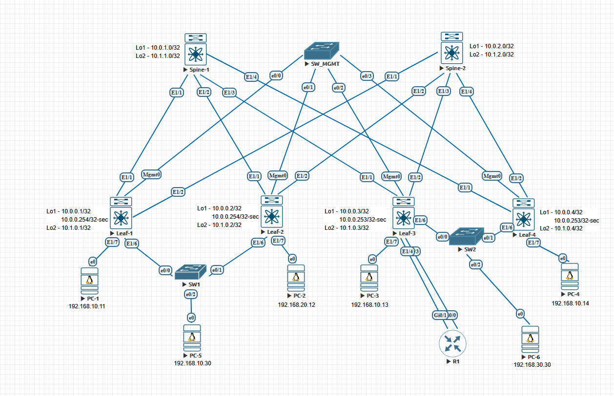

# Домашние задание 8
## VxLAN. Оптимизация таблиц маршрутизации

### Схема сети



### AS выбран по принципу:
   - 65000 - спайны
   - 65501-65536 - лифы

## Конфигурация и таблица маршрутизации
<details>
  <summary><b>R1</b></summary>
  <p>
 
```
R1#sh run 
*Apr 30 18:40:55.616: %SYS-5-CONFIG_I: Configured from console by console
Building configuration...

Current configuration : 1304 bytes
!
! Last configuration change at 18:40:55 UTC Wed Apr 30 2025
!
version 15.9
service timestamps debug datetime msec
service timestamps log datetime msec
no service password-encryption
!
hostname R1
!
boot-start-marker
boot-end-marker
!
!
!
no aaa new-model
!
!
!
mmi polling-interval 60
no mmi auto-configure
no mmi pvc
mmi snmp-timeout 180
!

ip cef
no ipv6 cef
!
multilink bundle-name authenticated
!
!
!
redundancy
!
!
!
interface GigabitEthernet0/0
 mac-address 1212.1212.1212
 ip address 192.168.70.3 255.255.255.0
 duplex auto
 speed auto
 media-type rj45
!
interface GigabitEthernet0/1
 mac-address 1212.1212.1213
 ip address 192.168.80.3 255.255.255.0
 duplex auto
 speed auto
 media-type rj45
!
interface GigabitEthernet0/2
 no ip address
 shutdown
 duplex auto
 speed auto
 media-type rj45
!
interface GigabitEthernet0/3
 no ip address
 shutdown
 duplex auto
 speed auto
 media-type rj45
!
router bgp 49900
 bgp log-neighbor-changes
 neighbor 192.168.70.1 remote-as 65503
 neighbor 192.168.70.1 as-override
 neighbor 192.168.80.1 remote-as 65503
 neighbor 192.168.80.1 as-override
!
ip forward-protocol nd
!
!
no ip http server
!
ipv6 ioam timestamp
!
!         
!
control-plane
!
!
line con 0
line aux 0
line vty 0 4
 login
 transport input none
!
no scheduler allocate
!
end
```
### Вывод Маршрутной информации
```
SW2#sh mac address-t
 sh ip route bgp
Codes: L - local, C - connected, S - static, R - RIP, M - mobile, B - BGP
       D - EIGRP, EX - EIGRP external, O - OSPF, IA - OSPF inter area 
       N1 - OSPF NSSA external type 1, N2 - OSPF NSSA external type 2
       E1 - OSPF external type 1, E2 - OSPF external type 2
       i - IS-IS, su - IS-IS summary, L1 - IS-IS level-1, L2 - IS-IS level-2
       ia - IS-IS inter area, * - candidate default, U - per-user static route
       o - ODR, P - periodic downloaded static route, H - NHRP, l - LISP
       a - application route
       + - replicated route, % - next hop override, p - overrides from PfR

Gateway of last resort is not set

      192.168.10.0/24 is variably subnetted, 3 subnets, 2 masks
B        192.168.10.0/24 [20/0] via 192.168.70.1, 01:54:27
B        192.168.10.11/32 [20/0] via 192.168.70.1, 01:52:24
B        192.168.10.30/32 [20/0] via 192.168.70.1, 01:52:24
      192.168.20.0/24 is variably subnetted, 2 subnets, 2 masks
B        192.168.20.0/24 [20/0] via 192.168.70.1, 01:54:27
B        192.168.20.12/32 [20/0] via 192.168.70.1, 01:52:24
      192.168.30.0/24 is variably subnetted, 2 subnets, 2 masks
B        192.168.30.0/24 [20/0] via 192.168.80.1, 01:54:27
B        192.168.30.30/32 [20/0] via 192.168.80.1, 01:51:22
```
  </p>
</details>
<details>
  <summary><b> Spine-1 </b></summary>
  <p> 

```
nv overlay evpn
feature bgp
feature pim

route-map NH_UNCHANGED permit 10
  set ip next-hop unchanged
route-map REDISTRIBUTE_CONNECTED permit 10
  match interface loopback1 loopback2 
route-map RM_Leaves_BGP permit 10
  match as-number 65501-65599


interface Ethernet1/1
  description to leaf-1
  no switchport
  mtu 9216
  port-type fabric
  no ip redirects
  ip address 10.2.1.0/31
  ip pim sparse-mode
  no shutdown

interface Ethernet1/2
  description to leaf-2
  no switchport
  mtu 9216
  port-type fabric
  no ip redirects
  ip address 10.2.1.2/31
  ip pim sparse-mode
  no shutdown

interface Ethernet1/3
  no switchport
  mtu 9216
  port-type fabric
  no ip redirects
  ip address 10.2.1.4/31
  ip pim sparse-mode
  no shutdown

interface Ethernet1/4
  no switchport
  mtu 9216
  port-type fabric
  no ip redirects
  ip address 10.2.1.6/31
  ip pim sparse-mode
  no shutdown

interface loopback1
  ip address 10.0.1.0/32

interface loopback2
  ip address 10.1.1.0/32

router bgp 65000
  router-id 10.0.1.0
  timers bgp 3 9
  reconnect-interval 12
  log-neighbor-changes
  address-family ipv4 unicast
    redistribute direct route-map REDISTRIBUTE_CONNECTED
    maximum-paths 10
 address-family l2vpn evpn
    maximum-paths 10
    retain route-target all
    advertise-pip
  neighbor 10.0.0.0/24 remote-as route-map RM_Leaves_BGP
    remote-as external
    update-source loopback1
    ebgp-multihop 5
    address-family l2vpn evpn
      send-community
      send-community extended
      route-map NH_UNCHANGED out
      rewrite-evpn-rt-asn
  neighbor 10.2.1.0/24 remote-as route-map RM_Leaves_BGP
    address-family ipv4 unicast
```
### Вывод маршрутной информации
```
Spine-1# sh ip route
IP Route Table for VRF "default"
'*' denotes best ucast next-hop
'**' denotes best mcast next-hop
'[x/y]' denotes [preference/metric]
'%<string>' in via output denotes VRF <string>

10.0.0.1/32, ubest/mbest: 1/0
    *via 10.2.1.1, [20/0], 01:49:23, bgp-65000, external, tag 65501
10.0.0.2/32, ubest/mbest: 1/0
    *via 10.2.1.3, [20/0], 01:49:23, bgp-65000, external, tag 65502
10.0.0.3/32, ubest/mbest: 1/0
    *via 10.2.1.5, [20/0], 01:14:56, bgp-65000, external, tag 65503
10.0.0.4/32, ubest/mbest: 1/0
    *via 10.2.1.7, [20/0], 01:15:21, bgp-65000, external, tag 65504
10.0.0.253/32, ubest/mbest: 1/0
    *via 10.2.1.7, [20/0], 01:15:21, bgp-65000, external, tag 65504
10.0.0.254/32, ubest/mbest: 1/0
    *via 10.2.1.3, [20/0], 01:49:23, bgp-65000, external, tag 65502
10.0.1.0/32, ubest/mbest: 2/0, attached
    *via 10.0.1.0, Lo1, [0/0], 4d17h, local
    *via 10.0.1.0, Lo1, [0/0], 4d17h, direct
10.1.0.1/32, ubest/mbest: 1/0
    *via 10.2.1.1, [20/0], 01:52:36, bgp-65000, external, tag 65501
10.1.0.2/32, ubest/mbest: 1/0
    *via 10.2.1.3, [20/0], 01:52:36, bgp-65000, external, tag 65502
10.1.0.3/32, ubest/mbest: 1/0
    *via 10.2.1.5, [20/0], 01:52:34, bgp-65000, external, tag 65503
10.1.0.4/32, ubest/mbest: 1/0
    *via 10.2.1.7, [20/0], 01:52:52, bgp-65000, external, tag 65504
10.1.1.0/32, ubest/mbest: 2/0, attached
    *via 10.1.1.0, Lo2, [0/0], 4d17h, local
    *via 10.1.1.0, Lo2, [0/0], 4d17h, direct
10.2.1.0/31, ubest/mbest: 1/0, attached
    *via 10.2.1.0, Eth1/1, [0/0], 4d17h, direct
10.2.1.0/32, ubest/mbest: 1/0, attached
    *via 10.2.1.0, Eth1/1, [0/0], 4d17h, local
10.2.1.2/31, ubest/mbest: 1/0, attached
    *via 10.2.1.2, Eth1/2, [0/0], 4d17h, direct
10.2.1.2/32, ubest/mbest: 1/0, attached
    *via 10.2.1.2, Eth1/2, [0/0], 4d17h, local
10.2.1.4/31, ubest/mbest: 1/0, attached
    *via 10.2.1.4, Eth1/3, [0/0], 4d17h, direct
10.2.1.4/32, ubest/mbest: 1/0, attached
    *via 10.2.1.4, Eth1/3, [0/0], 4d17h, local
10.2.1.6/31, ubest/mbest: 1/0, attached
    *via 10.2.1.6, Eth1/4, [0/0], 4d17h, direct
10.2.1.6/32, ubest/mbest: 1/0, attached
    *via 10.2.1.6, Eth1/4, [0/0], 4d17h, local
```
### Вывод l2vpn evpn
```
Spine-1(config-router-af)# sh bgp l2vpn evpn
BGP routing table information for VRF default, address family L2VPN EVPN
BGP table version is 1451, Local Router ID is 10.0.1.0
Status: s-suppressed, x-deleted, S-stale, d-dampened, h-history, *-valid, >-best
Path type: i-internal, e-external, c-confed, l-local, a-aggregate, r-redist, I-injected
Origin codes: i - IGP, e - EGP, ? - incomplete, | - multipath, & - backup, 2 - best2

   Network            Next Hop            Metric     LocPrf     Weight Path
Route Distinguisher: 10.0.0.1:4
*>e[2]:[0]:[0]:[48]:[5004.0000.1b08]:[0]:[0.0.0.0]/216
                      10.0.0.254                                     0 65501 i

Route Distinguisher: 10.0.0.1:32777
*>e[2]:[0]:[0]:[48]:[0050.0000.0100]:[0]:[0.0.0.0]/216
                      10.0.0.1                                       0 65501 i
*>e[2]:[0]:[0]:[48]:[0050.0000.0d00]:[0]:[0.0.0.0]/216
                      10.0.0.254                                     0 65501 i
*>e[2]:[0]:[0]:[48]:[5004.0000.1b08]:[0]:[0.0.0.0]/216
                      10.0.0.254                                     0 65501 i
*>e[2]:[0]:[0]:[48]:[0050.0000.0100]:[32]:[192.168.10.11]/272
                      10.0.0.1                                       0 65501 i
*>e[2]:[0]:[0]:[48]:[0050.0000.0d00]:[32]:[192.168.10.30]/272
                      10.0.0.254                                     0 65501 i
*>e[3]:[0]:[32]:[10.0.0.254]/88
                      10.0.0.254                                     0 65501 i

Route Distinguisher: 10.0.0.1:32787
*>e[2]:[0]:[0]:[48]:[5004.0000.1b08]:[0]:[0.0.0.0]/216
                      10.0.0.254                                     0 65501 i
*>e[3]:[0]:[32]:[10.0.0.254]/88
                      10.0.0.254                                     0 65501 i

Route Distinguisher: 10.0.0.2:4
*>e[2]:[0]:[0]:[48]:[5005.0000.1b08]:[0]:[0.0.0.0]/216
                      10.0.0.254                                     0 65502 i

Route Distinguisher: 10.0.0.2:32777
*>e[2]:[0]:[0]:[48]:[0050.0000.0d00]:[0]:[0.0.0.0]/216
                      10.0.0.254                                     0 65502 i
*>e[2]:[0]:[0]:[48]:[5005.0000.1b08]:[0]:[0.0.0.0]/216
                      10.0.0.254                                     0 65502 i
*>e[2]:[0]:[0]:[48]:[0050.0000.0d00]:[32]:[192.168.10.30]/272
                      10.0.0.254                                     0 65502 i
*>e[3]:[0]:[32]:[10.0.0.254]/88
                      10.0.0.254                                     0 65502 i

Route Distinguisher: 10.0.0.2:32787
*>e[2]:[0]:[0]:[48]:[0050.0000.0700]:[0]:[0.0.0.0]/216
                      10.0.0.2                                       0 65502 i
*>e[2]:[0]:[0]:[48]:[5005.0000.1b08]:[0]:[0.0.0.0]/216
                      10.0.0.254                                     0 65502 i
*>e[2]:[0]:[0]:[48]:[0050.0000.0700]:[32]:[192.168.20.12]/272
                      10.0.0.2                                       0 65502 i
*>e[3]:[0]:[32]:[10.0.0.254]/88
                      10.0.0.254                                     0 65502 i

Route Distinguisher: 10.0.0.3:4
*>e[2]:[0]:[0]:[48]:[5006.0000.1b08]:[0]:[0.0.0.0]/216
                      10.0.0.253                                     0 65503 i

Route Distinguisher: 10.0.0.3:32777
*>e[2]:[0]:[0]:[48]:[0050.0000.0800]:[0]:[0.0.0.0]/216
                      10.0.0.3                                       0 65503 i
*>e[2]:[0]:[0]:[48]:[5006.0000.1b08]:[0]:[0.0.0.0]/216
                      10.0.0.253                                     0 65503 i
*>e[2]:[0]:[0]:[48]:[0050.0000.0800]:[32]:[192.168.10.13]/272
                      10.0.0.3                                       0 65503 i
*>e[3]:[0]:[32]:[10.0.0.253]/88
                      10.0.0.253                                     0 65503 i

Route Distinguisher: 10.0.0.3:32787
*>e[2]:[0]:[0]:[48]:[0050.0000.0f00]:[0]:[0.0.0.0]/216
                      10.0.0.253                                     0 65503 i
*>e[2]:[0]:[0]:[48]:[5006.0000.1b08]:[0]:[0.0.0.0]/216
                      10.0.0.253                                     0 65503 i
*>e[2]:[0]:[0]:[48]:[0050.0000.0f00]:[32]:[192.168.20.30]/272
                      10.0.0.253                                     0 65503 i
*>e[3]:[0]:[32]:[10.0.0.253]/88
                      10.0.0.253                                     0 65503 i

Route Distinguisher: 10.0.0.4:4
*>e[2]:[0]:[0]:[48]:[500a.0000.1b08]:[0]:[0.0.0.0]/216
                      10.0.0.253                                     0 65504 i

Route Distinguisher: 10.0.0.4:32777
*>e[2]:[0]:[0]:[48]:[0050.0000.0900]:[0]:[0.0.0.0]/216
                      10.0.0.4                                       0 65504 i
*>e[2]:[0]:[0]:[48]:[500a.0000.1b08]:[0]:[0.0.0.0]/216
                      10.0.0.253                                     0 65504 i
*>e[2]:[0]:[0]:[48]:[0050.0000.0900]:[32]:[192.168.10.14]/272
                      10.0.0.4                                       0 65504 i
*>e[3]:[0]:[32]:[10.0.0.253]/88
                      10.0.0.253                                     0 65504 i

Route Distinguisher: 10.0.0.4:32787
*>e[2]:[0]:[0]:[48]:[0050.0000.0f00]:[0]:[0.0.0.0]/216
                      10.0.0.253                                     0 65504 i
*>e[2]:[0]:[0]:[48]:[500a.0000.1b08]:[0]:[0.0.0.0]/216
                      10.0.0.253                                     0 65504 i
*>e[2]:[0]:[0]:[48]:[0050.0000.0f00]:[32]:[192.168.20.30]/272
                      10.0.0.253                                     0 65504 i
*>e[3]:[0]:[32]:[10.0.0.253]/88
                      10.0.0.253                                     0 65504 i
```

</p>
</details>

<details>
  <summary><b> Spine-2 </b></summary>
  <p> 

```
nv overlay evpn
feature bgp
feature pim

route-map NH_UNCHANGED permit 10
  set ip next-hop unchanged
route-map REDISTRIBUTE_CONNECTED permit 10
  match interface loopback1 loopback2 
route-map RM_Leaves_BGP permit 10
  match as-number 65501-65599 

interface Ethernet1/1
  description to leaf-1
  no switchport
  mtu 9216
  port-type fabric
  no ip redirects
  ip address 10.2.2.0/31
  ip pim sparse-mode
  no shutdown

interface Ethernet1/2
  description to leaf-2
  no switchport
  mtu 9216
  port-type fabric
  no ip redirects
  ip address 10.2.2.2/31
  ip pim sparse-mode
  no shutdown

interface Ethernet1/3
  no switchport
  mtu 9216
  port-type fabric
  no ip redirects
  ip address 10.2.2.4/31
  ip pim sparse-mode
  no shutdown

interface Ethernet1/4
  no switchport
  mtu 9216
  port-type fabric
  no ip redirects
  ip address 10.2.2.6/31
  ip pim sparse-mode
  no shutdown

interface loopback1
  ip address 10.0.2.0/32

interface loopback2
  ip address 10.1.2.0/32

router bgp 65000
  router-id 10.0.2.0
  timers bgp 3 9
  reconnect-interval 12
  log-neighbor-changes
  address-family ipv4 unicast
    redistribute direct route-map REDISTRIBUTE_CONNECTED
    maximum-paths 10
 address-family l2vpn evpn
    maximum-paths 10
    retain route-target all
    advertise-pip
  neighbor 10.0.0.0/24 remote-as route-map RM_Leaves_BGP
    remote-as external
    update-source loopback1
    ebgp-multihop 5
    address-family l2vpn evpn
      send-community
      send-community extended
      route-map NH_UNCHANGED out
      rewrite-evpn-rt-asn
  neighbor 10.2.2.0/24 remote-as route-map RM_Leaves_BGP
    address-family ipv4 unicast
```
### Вывод маршрутной информации
```
Spine-2# sh ip route
IP Route Table for VRF "default"
'*' denotes best ucast next-hop
'**' denotes best mcast next-hop
'[x/y]' denotes [preference/metric]
'%<string>' in via output denotes VRF <string>

10.0.0.1/32, ubest/mbest: 1/0
    *via 10.2.2.1, [20/0], 01:49:24, bgp-65000, external, tag 65501
10.0.0.2/32, ubest/mbest: 1/0
    *via 10.2.2.3, [20/0], 01:49:24, bgp-65000, external, tag 65502
10.0.0.3/32, ubest/mbest: 1/0
    *via 10.2.2.5, [20/0], 01:14:56, bgp-65000, external, tag 65503
10.0.0.4/32, ubest/mbest: 1/0
    *via 10.2.2.7, [20/0], 01:15:21, bgp-65000, external, tag 65504
10.0.0.253/32, ubest/mbest: 1/0
    *via 10.2.2.7, [20/0], 01:15:21, bgp-65000, external, tag 65504
10.0.0.254/32, ubest/mbest: 1/0
    *via 10.2.2.3, [20/0], 01:49:24, bgp-65000, external, tag 65502
10.0.2.0/32, ubest/mbest: 2/0, attached
    *via 10.0.2.0, Lo1, [0/0], 4d17h, local
    *via 10.0.2.0, Lo1, [0/0], 4d17h, direct
10.1.0.1/32, ubest/mbest: 1/0
    *via 10.2.2.1, [20/0], 01:52:36, bgp-65000, external, tag 65501
10.1.0.2/32, ubest/mbest: 1/0
    *via 10.2.2.3, [20/0], 01:52:36, bgp-65000, external, tag 65502
10.1.0.3/32, ubest/mbest: 1/0
    *via 10.2.2.5, [20/0], 01:52:35, bgp-65000, external, tag 65503
10.1.0.4/32, ubest/mbest: 1/0
    *via 10.2.2.7, [20/0], 01:52:53, bgp-65000, external, tag 65504
10.1.2.0/32, ubest/mbest: 2/0, attached
    *via 10.1.2.0, Lo2, [0/0], 4d17h, local
    *via 10.1.2.0, Lo2, [0/0], 4d17h, direct
10.2.2.0/31, ubest/mbest: 1/0, attached
    *via 10.2.2.0, Eth1/1, [0/0], 4d17h, direct
10.2.2.0/32, ubest/mbest: 1/0, attached
    *via 10.2.2.0, Eth1/1, [0/0], 4d17h, local
10.2.2.2/31, ubest/mbest: 1/0, attached
    *via 10.2.2.2, Eth1/2, [0/0], 4d17h, direct
10.2.2.2/32, ubest/mbest: 1/0, attached
    *via 10.2.2.2, Eth1/2, [0/0], 4d17h, local
10.2.2.4/31, ubest/mbest: 1/0, attached
    *via 10.2.2.4, Eth1/3, [0/0], 4d17h, direct
10.2.2.4/32, ubest/mbest: 1/0, attached
    *via 10.2.2.4, Eth1/3, [0/0], 4d17h, local
10.2.2.6/31, ubest/mbest: 1/0, attached
    *via 10.2.2.6, Eth1/4, [0/0], 4d17h, direct
10.2.2.6/32, ubest/mbest: 1/0, attached
    *via 10.2.2.6, Eth1/4, [0/0], 4d17h, local
```
### Вывод l2vpn evpn
```
Spine-2(config-router-af)# sh bgp l2vpn evpn
BGP routing table information for VRF default, address family L2VPN EVPN
BGP table version is 1433, Local Router ID is 10.0.2.0
Status: s-suppressed, x-deleted, S-stale, d-dampened, h-history, *-valid, >-best
Path type: i-internal, e-external, c-confed, l-local, a-aggregate, r-redist, I-injected
Origin codes: i - IGP, e - EGP, ? - incomplete, | - multipath, & - backup, 2 - best2

   Network            Next Hop            Metric     LocPrf     Weight Path
Route Distinguisher: 10.0.0.1:4
*>e[2]:[0]:[0]:[48]:[5004.0000.1b08]:[0]:[0.0.0.0]/216
                      10.0.0.254                                     0 65501 i

Route Distinguisher: 10.0.0.1:32777
*>e[2]:[0]:[0]:[48]:[0050.0000.0100]:[0]:[0.0.0.0]/216
                      10.0.0.1                                       0 65501 i
*>e[2]:[0]:[0]:[48]:[0050.0000.0d00]:[0]:[0.0.0.0]/216
                      10.0.0.254                                     0 65501 i
*>e[2]:[0]:[0]:[48]:[5004.0000.1b08]:[0]:[0.0.0.0]/216
                      10.0.0.254                                     0 65501 i
*>e[2]:[0]:[0]:[48]:[0050.0000.0100]:[32]:[192.168.10.11]/272
                      10.0.0.1                                       0 65501 i
*>e[2]:[0]:[0]:[48]:[0050.0000.0d00]:[32]:[192.168.10.30]/272
                      10.0.0.254                                     0 65501 i
*>e[3]:[0]:[32]:[10.0.0.254]/88
                      10.0.0.254                                     0 65501 i

Route Distinguisher: 10.0.0.1:32787
*>e[2]:[0]:[0]:[48]:[5004.0000.1b08]:[0]:[0.0.0.0]/216
                      10.0.0.254                                     0 65501 i
*>e[3]:[0]:[32]:[10.0.0.254]/88
                      10.0.0.254                                     0 65501 i

Route Distinguisher: 10.0.0.2:4
*>e[2]:[0]:[0]:[48]:[5005.0000.1b08]:[0]:[0.0.0.0]/216
                      10.0.0.254                                     0 65502 i

Route Distinguisher: 10.0.0.2:32777
*>e[2]:[0]:[0]:[48]:[0050.0000.0d00]:[0]:[0.0.0.0]/216
                      10.0.0.254                                     0 65502 i
*>e[2]:[0]:[0]:[48]:[5005.0000.1b08]:[0]:[0.0.0.0]/216
                      10.0.0.254                                     0 65502 i
*>e[2]:[0]:[0]:[48]:[0050.0000.0d00]:[32]:[192.168.10.30]/272
                      10.0.0.254                                     0 65502 i
*>e[3]:[0]:[32]:[10.0.0.254]/88
                      10.0.0.254                                     0 65502 i

Route Distinguisher: 10.0.0.2:32787
*>e[2]:[0]:[0]:[48]:[0050.0000.0700]:[0]:[0.0.0.0]/216
                      10.0.0.2                                       0 65502 i
*>e[2]:[0]:[0]:[48]:[5005.0000.1b08]:[0]:[0.0.0.0]/216
                      10.0.0.254                                     0 65502 i
*>e[2]:[0]:[0]:[48]:[0050.0000.0700]:[32]:[192.168.20.12]/272
                      10.0.0.2                                       0 65502 i
*>e[3]:[0]:[32]:[10.0.0.254]/88
                      10.0.0.254                                     0 65502 i

Route Distinguisher: 10.0.0.3:4
*>e[2]:[0]:[0]:[48]:[5006.0000.1b08]:[0]:[0.0.0.0]/216
                      10.0.0.253                                     0 65503 i

Route Distinguisher: 10.0.0.3:32777
*>e[2]:[0]:[0]:[48]:[0050.0000.0800]:[0]:[0.0.0.0]/216
                      10.0.0.3                                       0 65503 i
*>e[2]:[0]:[0]:[48]:[5006.0000.1b08]:[0]:[0.0.0.0]/216
                      10.0.0.253                                     0 65503 i
*>e[2]:[0]:[0]:[48]:[0050.0000.0800]:[32]:[192.168.10.13]/272
                      10.0.0.3                                       0 65503 i
*>e[3]:[0]:[32]:[10.0.0.253]/88
                      10.0.0.253                                     0 65503 i

Route Distinguisher: 10.0.0.3:32787
*>e[2]:[0]:[0]:[48]:[0050.0000.0f00]:[0]:[0.0.0.0]/216
                      10.0.0.253                                     0 65503 i
*>e[2]:[0]:[0]:[48]:[5006.0000.1b08]:[0]:[0.0.0.0]/216
                      10.0.0.253                                     0 65503 i
*>e[2]:[0]:[0]:[48]:[0050.0000.0f00]:[32]:[192.168.20.30]/272
                      10.0.0.253                                     0 65503 i
*>e[3]:[0]:[32]:[10.0.0.253]/88
                      10.0.0.253                                     0 65503 i

Route Distinguisher: 10.0.0.4:4
*>e[2]:[0]:[0]:[48]:[500a.0000.1b08]:[0]:[0.0.0.0]/216
                      10.0.0.253                                     0 65504 i

Route Distinguisher: 10.0.0.4:32777
*>e[2]:[0]:[0]:[48]:[0050.0000.0900]:[0]:[0.0.0.0]/216
                      10.0.0.4                                       0 65504 i
*>e[2]:[0]:[0]:[48]:[500a.0000.1b08]:[0]:[0.0.0.0]/216
                      10.0.0.253                                     0 65504 i
*>e[2]:[0]:[0]:[48]:[0050.0000.0900]:[32]:[192.168.10.14]/272
                      10.0.0.4                                       0 65504 i
*>e[3]:[0]:[32]:[10.0.0.253]/88
                      10.0.0.253                                     0 65504 i

Route Distinguisher: 10.0.0.4:32787
*>e[2]:[0]:[0]:[48]:[0050.0000.0f00]:[0]:[0.0.0.0]/216
                      10.0.0.253                                     0 65504 i
*>e[2]:[0]:[0]:[48]:[500a.0000.1b08]:[0]:[0.0.0.0]/216
                      10.0.0.253                                     0 65504 i
*>e[2]:[0]:[0]:[48]:[0050.0000.0f00]:[32]:[192.168.20.30]/272
                      10.0.0.253                                     0 65504 i
*>e[3]:[0]:[32]:[10.0.0.253]/88
                      10.0.0.253                                     0 65504 i
```

</p>
</details>

<details>
  <summary><b> Leaf-1</b></summary>
  <p>
 
```
nv overlay evpn
feature bgp
feature pim
feature fabric forwarding
feature interface-vlan
feature vn-segment-vlan-based
feature lacp
feature vpc
feature nv overlay

hardware access-list tcam region racl 512
hardware access-list tcam region arp-ether 256 double-wide

fabric forwarding anycast-gateway-mac 0000.0000.0001
vlan 1-3,10,20,30
vlan 2
  name VxLan_L3
  vn-segment 5000
vlan 3
  vn-segment 6000
vlan 10
  name Vlan_10
  vn-segment 10010
vlan 20
  name Vlan_20
  vn-segment 10020
vlan 30
  name Vlan_30
  vn-segment 10030

route-map PERMIT permit 10
route-map REDISTRIBUTE_CONNECTED permit 10
  match interface loopback1 loopback2 
vrf context VXL
  vni 6000
  rd auto
  address-family ipv4 unicast
    route-target both auto
    route-target both auto evpn
vrf context VXLAN
  vni 5000
  rd auto
  address-family ipv4 unicast
    route-target both auto
    route-target both auto evpn
vrf context management
vpc domain 1
  peer-switch
  role priority 100
  system-mac aa:11:ff:aa:11:11
  peer-keepalive destination 192.168.0.2 source 192.168.0.1
  virtual peer-link destination 10.1.0.2 source 10.1.0.1 dscp 56
  delay restore 60
  peer-gateway
  layer3 peer-router
  auto-recovery
  fast-convergence
  ip arp synchronize

interface Vlan2
  description VxLan_L3
  no shutdown
  vrf member VXLAN
  no ip redirects
  ip forward
  no ipv6 redirects

interface Vlan3
  description VxL_L3
  no shutdown
  vrf member VXL
  no ip redirects
  ip forward
  no ipv6 redirects

interface Vlan10
  no shutdown
  vrf member VXLAN
  no ip redirects
  ip address 192.168.10.1/24
  no ipv6 redirects
  fabric forwarding mode anycast-gateway

interface Vlan20
  no shutdown
  vrf member VXLAN
  no ip redirects
  ip address 192.168.20.1/24
  no ipv6 redirects
  fabric forwarding mode anycast-gateway

interface Vlan30
  no shutdown
  vrf member VXL
  no ip redirects
  ip address 192.168.30.1/24
  no ipv6 redirects
  fabric forwarding mode anycast-gateway

interface port-channel6
  switchport mode trunk
  vpc 6

interface port-channel1000
  switchport mode trunk
  spanning-tree port type network
  vpc peer-link

interface nve1
  no shutdown
  host-reachability protocol bgp
  advertise virtual-rmac
  source-interface loopback1
  global suppress-arp
  global ingress-replication protocol bgp
  member vni 5000 associate-vrf
  member vni 6000 associate-vrf
  member vni 10010
  member vni 10020
  member vni 10030

interface Ethernet1/1
  description to Spine-1
  no switchport
  mtu 9216
  port-type fabric
  no ip redirects
  ip address 10.2.1.1/31
  no shutdown

interface Ethernet1/2
  description to Spine-2
  no switchport
  mtu 9216
  port-type fabric
  no ip redirects
  ip address 10.2.2.1/31
  no shutdown

interface Ethernet1/6
  switchport mode trunk
  channel-group 6 mode active

interface Ethernet1/7
  switchport access vlan 10

interface mgmt0
  vrf member management
  ip address 192.168.0.1/24

interface loopback1
  ip address 10.0.0.1/32
  ip address 10.0.0.254/32 secondary

interface loopback2
  ip address 10.1.0.1/32

router bgp 65501
  router-id 10.0.0.1
  bestpath as-path multipath-relax
  reconnect-interval 12
  log-neighbor-changes
  address-family ipv4 unicast
    redistribute direct route-map REDISTRIBUTE_CONNECTED
    maximum-paths 10
  address-family l2vpn evpn
    maximum-paths 10
    advertise-pip
  template peer SPINES
    remote-as 65000
    timers 3 9
    address-family ipv4 unicast
  template peer SPINES_OV
    remote-as 65000
    update-source loopback1
    ebgp-multihop 2
    timers 3 9
    address-family l2vpn evpn
      send-community
      send-community extended
      rewrite-evpn-rt-asn
  neighbor 10.0.1.0
    inherit peer SPINES_OV
  neighbor 10.0.2.0
    inherit peer SPINES_OV
  neighbor 10.2.1.0
    inherit peer SPINES
  neighbor 10.2.2.0
    inherit peer SPINES
```
### Вывод маршрутной информации
```
sh ip bgp all
BGP routing table information for VRF default, address family IPv4 Unicast
BGP table version is 131, Local Router ID is 10.0.0.1
Status: s-suppressed, x-deleted, S-stale, d-dampened, h-history, *-valid, >-best
Path type: i-internal, e-external, c-confed, l-local, a-aggregate, r-redist, I-injected
Origin codes: i - IGP, e - EGP, ? - incomplete, | - multipath, & - backup, 2 - best2

   Network            Next Hop            Metric     LocPrf     Weight Path
*>r10.0.0.1/32        0.0.0.0                  0        100      32768 ?
*|e10.0.0.2/32        10.2.2.0                                       0 65000 65502 ?
*>e                   10.2.1.0                                       0 65000 65502 ?
*|e10.0.0.3/32        10.2.1.0                                       0 65000 65503 ?
*>e                   10.2.2.0                                       0 65000 65503 ?
*|e10.0.0.4/32        10.2.1.0                                       0 65000 65504 ?
*>e                   10.2.2.0                                       0 65000 65504 ?
*|e10.0.0.253/32      10.2.1.0                                       0 65000 65504 ?
*>e                   10.2.2.0                                       0 65000 65504 ?
*>r10.0.0.254/32      0.0.0.0                  0        100      32768 ?
*>e10.0.1.0/32        10.2.1.0                 0                     0 65000 ?
*>e10.0.2.0/32        10.2.2.0                 0                     0 65000 ?
*>r10.1.0.1/32        0.0.0.0                  0        100      32768 ?
*|e10.1.0.2/32        10.2.2.0                                       0 65000 65502 ?
*>e                   10.2.1.0                                       0 65000 65502 ?
*|e10.1.0.3/32        10.2.2.0                                       0 65000 65503 ?
*>e                   10.2.1.0                                       0 65000 65503 ?
*|e10.1.0.4/32        10.2.2.0                                       0 65000 65504 ?
*>e                   10.2.1.0                                       0 65000 65504 ?
*>e10.1.1.0/32        10.2.1.0                 0                     0 65000 ?
*>e10.1.2.0/32        10.2.2.0                 0                     0 65000 ?

BGP routing table information for VRF default, address family VPNv4 Unicast
BGP table version is 151, Local Router ID is 10.0.0.1
Status: s-suppressed, x-deleted, S-stale, d-dampened, h-history, *-valid, >-best
Path type: i-internal, e-external, c-confed, l-local, a-aggregate, r-redist, I-injected
Origin codes: i - IGP, e - EGP, ? - incomplete, | - multipath, & - backup, 2 - best2

   Network            Next Hop            Metric     LocPrf     Weight Path
Route Distinguisher: 10.0.0.1:4    (VRF VXLAN)
* e192.168.10.0/24    10.0.0.3                                       0 65000 65503 ?
*>e                   10.0.0.4                                       0 65000 65504 ?
* e192.168.20.0/24    10.0.0.3                                       0 65000 65503 ?
*>e                   10.0.0.4                                       0 65000 65504 ?
*>e192.168.20.12/32   10.0.0.2                                       0 65000 65502 i
*>e192.168.30.0/24    10.0.0.3                                       0 65000 65503 49900 49900 ?
*>e192.168.30.30/32   10.0.0.3                                       0 65000 65503 49900 49900 ?
* e192.168.70.0/24    10.0.0.4                                       0 65000 65504 ?
*>e                   10.0.0.3                                       0 65000 65503 ?
*>e192.168.80.0/24    10.0.0.3                                       0 65000 65503 49900 49900 ?

Route Distinguisher: 10.0.0.1:5    (VRF VXL)
*>e192.168.10.0/24    10.0.0.3                                       0 65000 65503 49900 49900 ?
*>e192.168.20.0/24    10.0.0.3                                       0 65000 65503 49900 49900 ?
* e192.168.30.0/24    10.0.0.3                                       0 65000 65503 ?
*>e                   10.0.0.4                                       0 65000 65504 ?
* e192.168.30.30/32   10.0.0.253                                     0 65000 65504 i
*>e                   10.0.0.253                                     0 65000 65503 i
* e                   10.0.0.3                                       0 65000 65503 ?
*>e192.168.70.0/24    10.0.0.3                                       0 65000 65503 49900 49900 ?
* e192.168.80.0/24    10.0.0.4                                       0 65000 65504 ?
*>e                   10.0.0.3                                       0 65000 65503 ?

BGP routing table information for VRF default, address family L2VPN EVPN
BGP table version is 12376, Local Router ID is 10.0.0.1
Status: s-suppressed, x-deleted, S-stale, d-dampened, h-history, *-valid, >-best
Path type: i-internal, e-external, c-confed, l-local, a-aggregate, r-redist, I-injected
Origin codes: i - IGP, e - EGP, ? - incomplete, | - multipath, & - backup, 2 - best2

   Network            Next Hop            Metric     LocPrf     Weight Path
Route Distinguisher: 10.0.0.1:32777    (L2VNI 10010)
*>l[2]:[0]:[0]:[48]:[0050.0000.0100]:[0]:[0.0.0.0]/216
                      10.0.0.1                          100      32768 i
*>e[2]:[0]:[0]:[48]:[0050.0000.0800]:[0]:[0.0.0.0]/216
                      10.0.0.3                                       0 65000 65503 i
*>e[2]:[0]:[0]:[48]:[0050.0000.0900]:[0]:[0.0.0.0]/216
                      10.0.0.4                                       0 65000 65504 i
*>l[2]:[0]:[0]:[48]:[0050.0000.0d00]:[0]:[0.0.0.0]/216
                      10.0.0.254                        100      32768 i
*>l[2]:[0]:[0]:[48]:[5004.0000.1b08]:[0]:[0.0.0.0]/216
                      10.0.0.254                        100      32768 i
*>e[2]:[0]:[0]:[48]:[5006.0000.1b08]:[0]:[0.0.0.0]/216
                      10.0.0.253                                     0 65000 65503 i
*>e[2]:[0]:[0]:[48]:[500a.0000.1b08]:[0]:[0.0.0.0]/216
                      10.0.0.253                                     0 65000 65504 i
*>l[2]:[0]:[0]:[48]:[0050.0000.0100]:[32]:[192.168.10.11]/272
                      10.0.0.1                          100      32768 i
*>l[2]:[0]:[0]:[48]:[0050.0000.0d00]:[32]:[192.168.10.30]/272
                      10.0.0.254                        100      32768 i
* e[3]:[0]:[32]:[10.0.0.253]/88
                      10.0.0.253                                     0 65000 65503 i
*>e                   10.0.0.253                                     0 65000 65504 i
*>l[3]:[0]:[32]:[10.0.0.254]/88
                      10.0.0.254                        100      32768 i

Route Distinguisher: 10.0.0.1:32787    (L2VNI 10020)
*>e[2]:[0]:[0]:[48]:[0050.0000.0700]:[0]:[0.0.0.0]/216
                      10.0.0.2                                       0 65000 65502 i
*>l[2]:[0]:[0]:[48]:[5004.0000.1b08]:[0]:[0.0.0.0]/216
                      10.0.0.254                        100      32768 i
*>e[2]:[0]:[0]:[48]:[5006.0000.1b08]:[0]:[0.0.0.0]/216
                      10.0.0.253                                     0 65000 65503 i
*>e[2]:[0]:[0]:[48]:[500a.0000.1b08]:[0]:[0.0.0.0]/216
                      10.0.0.253                                     0 65000 65504 i
*>e[2]:[0]:[0]:[48]:[0050.0000.0700]:[32]:[192.168.20.12]/272
                      10.0.0.2                                       0 65000 65502 i
* e[3]:[0]:[32]:[10.0.0.253]/88
                      10.0.0.253                                     0 65000 65503 i
*>e                   10.0.0.253                                     0 65000 65504 i
*>l[3]:[0]:[32]:[10.0.0.254]/88
                      10.0.0.254                        100      32768 i

Route Distinguisher: 10.0.0.1:32797    (L2VNI 10030)
*>e[2]:[0]:[0]:[48]:[0050.0000.0f00]:[0]:[0.0.0.0]/216
                      10.0.0.253                                     0 65000 65503 i
* e                   10.0.0.253                                     0 65000 65504 i
*>l[2]:[0]:[0]:[48]:[5004.0000.1b08]:[0]:[0.0.0.0]/216
                      10.0.0.254                        100      32768 i
*>e[2]:[0]:[0]:[48]:[5006.0000.1b08]:[0]:[0.0.0.0]/216
                      10.0.0.253                                     0 65000 65503 i
*>e[2]:[0]:[0]:[48]:[500a.0000.1b08]:[0]:[0.0.0.0]/216
                      10.0.0.253                                     0 65000 65504 i
* e[2]:[0]:[0]:[48]:[0050.0000.0f00]:[32]:[192.168.30.30]/272
                      10.0.0.253                                     0 65000 65504 i
*>e                   10.0.0.253                                     0 65000 65503 i
* e[3]:[0]:[32]:[10.0.0.253]/88
                      10.0.0.253                                     0 65000 65503 i
*>e                   10.0.0.253                                     0 65000 65504 i
*>l[3]:[0]:[32]:[10.0.0.254]/88
                      10.0.0.254                        100      32768 i

Route Distinguisher: 10.0.0.2:32787
* e[2]:[0]:[0]:[48]:[0050.0000.0700]:[0]:[0.0.0.0]/216
                      10.0.0.2                                       0 65000 65502 i
*>e                   10.0.0.2                                       0 65000 65502 i
* e[2]:[0]:[0]:[48]:[0050.0000.0700]:[32]:[192.168.20.12]/272
                      10.0.0.2                                       0 65000 65502 i
*>e                   10.0.0.2                                       0 65000 65502 i

Route Distinguisher: 10.0.0.3:4
* e[2]:[0]:[0]:[48]:[5006.0000.1b08]:[0]:[0.0.0.0]/216
                      10.0.0.253                                     0 65000 65503 i
*>e                   10.0.0.253                                     0 65000 65503 i
* e[5]:[0]:[0]:[24]:[192.168.10.0]/224
                      10.0.0.3                                       0 65000 65503 49900 49900 ?
*>e                   10.0.0.3                                       0 65000 65503 49900 49900 ?
* e[5]:[0]:[0]:[24]:[192.168.20.0]/224
                      10.0.0.3                                       0 65000 65503 49900 49900 ?
*>e                   10.0.0.3                                       0 65000 65503 49900 49900 ?
* e[5]:[0]:[0]:[24]:[192.168.30.0]/224
                      10.0.0.3                                       0 65000 65503 ?
*>e                   10.0.0.3                                       0 65000 65503 ?
* e[5]:[0]:[0]:[24]:[192.168.70.0]/224
                      10.0.0.3                                       0 65000 65503 49900 49900 ?
*>e                   10.0.0.3                                       0 65000 65503 49900 49900 ?
* e[5]:[0]:[0]:[24]:[192.168.80.0]/224
                      10.0.0.3                                       0 65000 65503 ?
*>e                   10.0.0.3                                       0 65000 65503 ?
* e[5]:[0]:[0]:[32]:[192.168.30.30]/224
                      10.0.0.3                                       0 65000 65503 ?
*>e                   10.0.0.3                                       0 65000 65503 ?

Route Distinguisher: 10.0.0.3:5
* e[2]:[0]:[0]:[48]:[5006.0000.1b08]:[0]:[0.0.0.0]/216
                      10.0.0.253                                     0 65000 65503 i
*>e                   10.0.0.253                                     0 65000 65503 i
* e[5]:[0]:[0]:[24]:[192.168.10.0]/224
                      10.0.0.3                                       0 65000 65503 ?
*>e                   10.0.0.3                                       0 65000 65503 ?
* e[5]:[0]:[0]:[24]:[192.168.20.0]/224
                      10.0.0.3                                       0 65000 65503 ?
*>e                   10.0.0.3                                       0 65000 65503 ?
* e[5]:[0]:[0]:[24]:[192.168.30.0]/224
                      10.0.0.3                                       0 65000 65503 49900 49900 ?
*>e                   10.0.0.3                                       0 65000 65503 49900 49900 ?
* e[5]:[0]:[0]:[24]:[192.168.70.0]/224
                      10.0.0.3                                       0 65000 65503 ?
*>e                   10.0.0.3                                       0 65000 65503 ?
* e[5]:[0]:[0]:[24]:[192.168.80.0]/224
                      10.0.0.3                                       0 65000 65503 49900 49900 ?
*>e                   10.0.0.3                                       0 65000 65503 49900 49900 ?
* e[5]:[0]:[0]:[32]:[192.168.30.30]/224
                      10.0.0.3                                       0 65000 65503 49900 49900 ?
*>e                   10.0.0.3                                       0 65000 65503 49900 49900 ?

Route Distinguisher: 10.0.0.3:32777
* e[2]:[0]:[0]:[48]:[0050.0000.0800]:[0]:[0.0.0.0]/216
                      10.0.0.3                                       0 65000 65503 i
*>e                   10.0.0.3                                       0 65000 65503 i
* e[2]:[0]:[0]:[48]:[5006.0000.1b08]:[0]:[0.0.0.0]/216
                      10.0.0.253                                     0 65000 65503 i
*>e                   10.0.0.253                                     0 65000 65503 i
* e[3]:[0]:[32]:[10.0.0.253]/88
                      10.0.0.253                                     0 65000 65503 i
*>e                   10.0.0.253                                     0 65000 65503 i

Route Distinguisher: 10.0.0.3:32787
* e[2]:[0]:[0]:[48]:[5006.0000.1b08]:[0]:[0.0.0.0]/216
                      10.0.0.253                                     0 65000 65503 i
*>e                   10.0.0.253                                     0 65000 65503 i
* e[3]:[0]:[32]:[10.0.0.253]/88
                      10.0.0.253                                     0 65000 65503 i
*>e                   10.0.0.253                                     0 65000 65503 i

Route Distinguisher: 10.0.0.3:32797
* e[2]:[0]:[0]:[48]:[0050.0000.0f00]:[0]:[0.0.0.0]/216
                      10.0.0.253                                     0 65000 65503 i
*>e                   10.0.0.253                                     0 65000 65503 i
* e[2]:[0]:[0]:[48]:[5006.0000.1b08]:[0]:[0.0.0.0]/216
                      10.0.0.253                                     0 65000 65503 i
*>e                   10.0.0.253                                     0 65000 65503 i
* e[2]:[0]:[0]:[48]:[0050.0000.0f00]:[32]:[192.168.30.30]/272
                      10.0.0.253                                     0 65000 65503 i
*>e                   10.0.0.253                                     0 65000 65503 i
* e[3]:[0]:[32]:[10.0.0.253]/88
                      10.0.0.253                                     0 65000 65503 i
*>e                   10.0.0.253                                     0 65000 65503 i

Route Distinguisher: 10.0.0.4:4
* e[2]:[0]:[0]:[48]:[500a.0000.1b08]:[0]:[0.0.0.0]/216
                      10.0.0.253                                     0 65000 65504 i
*>e                   10.0.0.253                                     0 65000 65504 i
* e[5]:[0]:[0]:[24]:[192.168.30.0]/224
                      10.0.0.4                                       0 65000 65504 ?
*>e                   10.0.0.4                                       0 65000 65504 ?
* e[5]:[0]:[0]:[24]:[192.168.80.0]/224
                      10.0.0.4                                       0 65000 65504 ?
*>e                   10.0.0.4                                       0 65000 65504 ?

Route Distinguisher: 10.0.0.4:5
* e[2]:[0]:[0]:[48]:[500a.0000.1b08]:[0]:[0.0.0.0]/216
                      10.0.0.253                                     0 65000 65504 i
*>e                   10.0.0.253                                     0 65000 65504 i
*>e[5]:[0]:[0]:[24]:[192.168.10.0]/224
                      10.0.0.4                                       0 65000 65504 ?
* e                   10.0.0.4                                       0 65000 65504 ?
*>e[5]:[0]:[0]:[24]:[192.168.20.0]/224
                      10.0.0.4                                       0 65000 65504 ?
* e                   10.0.0.4                                       0 65000 65504 ?
* e[5]:[0]:[0]:[24]:[192.168.70.0]/224
                      10.0.0.4                                       0 65000 65504 ?
*>e                   10.0.0.4                                       0 65000 65504 ?

Route Distinguisher: 10.0.0.4:32777
* e[2]:[0]:[0]:[48]:[0050.0000.0900]:[0]:[0.0.0.0]/216
                      10.0.0.4                                       0 65000 65504 i
*>e                   10.0.0.4                                       0 65000 65504 i
* e[2]:[0]:[0]:[48]:[500a.0000.1b08]:[0]:[0.0.0.0]/216
                      10.0.0.253                                     0 65000 65504 i
*>e                   10.0.0.253                                     0 65000 65504 i
* e[3]:[0]:[32]:[10.0.0.253]/88
                      10.0.0.253                                     0 65000 65504 i
*>e                   10.0.0.253                                     0 65000 65504 i

Route Distinguisher: 10.0.0.4:32787
* e[2]:[0]:[0]:[48]:[500a.0000.1b08]:[0]:[0.0.0.0]/216
                      10.0.0.253                                     0 65000 65504 i
*>e                   10.0.0.253                                     0 65000 65504 i
* e[3]:[0]:[32]:[10.0.0.253]/88
                      10.0.0.253                                     0 65000 65504 i
*>e                   10.0.0.253                                     0 65000 65504 i

Route Distinguisher: 10.0.0.4:32797
*>e[2]:[0]:[0]:[48]:[0050.0000.0f00]:[0]:[0.0.0.0]/216
                      10.0.0.253                                     0 65000 65504 i
* e                   10.0.0.253                                     0 65000 65504 i
* e[2]:[0]:[0]:[48]:[500a.0000.1b08]:[0]:[0.0.0.0]/216
                      10.0.0.253                                     0 65000 65504 i
*>e                   10.0.0.253                                     0 65000 65504 i
* e[2]:[0]:[0]:[48]:[0050.0000.0f00]:[32]:[192.168.30.30]/272
                      10.0.0.253                                     0 65000 65504 i
*>e                   10.0.0.253                                     0 65000 65504 i
* e[3]:[0]:[32]:[10.0.0.253]/88
                      10.0.0.253                                     0 65000 65504 i
*>e                   10.0.0.253                                     0 65000 65504 i

Route Distinguisher: 10.0.0.1:4    (L3VNI 5000)
*>l[2]:[0]:[0]:[48]:[5004.0000.1b08]:[0]:[0.0.0.0]/216
                      10.0.0.254                        100      32768 i
*>e[2]:[0]:[0]:[48]:[5006.0000.1b08]:[0]:[0.0.0.0]/216
                      10.0.0.253                                     0 65000 65503 i
*>e[2]:[0]:[0]:[48]:[500a.0000.1b08]:[0]:[0.0.0.0]/216
                      10.0.0.253                                     0 65000 65504 i
*>e[2]:[0]:[0]:[48]:[0050.0000.0700]:[32]:[192.168.20.12]/272
                      10.0.0.2                                       0 65000 65502 i
*|e[5]:[0]:[0]:[24]:[192.168.10.0]/224
                      10.0.0.3                                       0 65000 65503 ?
*>e                   10.0.0.4                                       0 65000 65504 ?
*|e[5]:[0]:[0]:[24]:[192.168.20.0]/224
                      10.0.0.3                                       0 65000 65503 ?
*>e                   10.0.0.4                                       0 65000 65504 ?
*>e[5]:[0]:[0]:[24]:[192.168.30.0]/224
                      10.0.0.3                                       0 65000 65503 49900 49900 ?
*|e[5]:[0]:[0]:[24]:[192.168.70.0]/224
                      10.0.0.4                                       0 65000 65504 ?
*>e                   10.0.0.3                                       0 65000 65503 ?
*>e[5]:[0]:[0]:[24]:[192.168.80.0]/224
                      10.0.0.3                                       0 65000 65503 49900 49900 ?
*>e[5]:[0]:[0]:[32]:[192.168.30.30]/224
                      10.0.0.3                                       0 65000 65503 49900 49900 ?

Route Distinguisher: 10.0.0.1:5    (L3VNI 6000)
*>l[2]:[0]:[0]:[48]:[5004.0000.1b08]:[0]:[0.0.0.0]/216
                      10.0.0.254                        100      32768 i
*>e[2]:[0]:[0]:[48]:[5006.0000.1b08]:[0]:[0.0.0.0]/216
                      10.0.0.253                                     0 65000 65503 i
*>e[2]:[0]:[0]:[48]:[500a.0000.1b08]:[0]:[0.0.0.0]/216
                      10.0.0.253                                     0 65000 65504 i
* e[2]:[0]:[0]:[48]:[0050.0000.0f00]:[32]:[192.168.30.30]/272
                      10.0.0.253                                     0 65000 65504 i
*>e                   10.0.0.253                                     0 65000 65503 i
*>e[5]:[0]:[0]:[24]:[192.168.10.0]/224
                      10.0.0.3                                       0 65000 65503 49900 49900 ?
*>e[5]:[0]:[0]:[24]:[192.168.20.0]/224
                      10.0.0.3                                       0 65000 65503 49900 49900 ?
*|e[5]:[0]:[0]:[24]:[192.168.30.0]/224
                      10.0.0.3                                       0 65000 65503 ?
*>e                   10.0.0.4                                       0 65000 65504 ?
*>e[5]:[0]:[0]:[24]:[192.168.70.0]/224
                      10.0.0.3                                       0 65000 65503 49900 49900 ?
*|e[5]:[0]:[0]:[24]:[192.168.80.0]/224
                      10.0.0.4                                       0 65000 65504 ?
*>e                   10.0.0.3                                       0 65000 65503 ?
*>e[5]:[0]:[0]:[32]:[192.168.30.30]/224
                      10.0.0.3                                       0 65000 65503 ?
```
### Вывод MAC таблицы
```
Leaf-1# sh mac address-t
Legend: 
        * - primary entry, G - Gateway MAC, (R) - Routed MAC, O - Overlay MAC
        age - seconds since last seen,+ - primary entry using vPC Peer-Link,
        (T) - True, (F) - False, C - ControlPlane MAC, ~ - vsan,
        (NA)- Not Applicable
   VLAN     MAC Address      Type      age     Secure NTFY Ports
---------+-----------------+--------+---------+------+----+------------------
*    2     0200.0a00.00fd   static   -         F      F    nve1(10.0.0.253)
*    2     0200.0a00.00fe   static   -         F      F    Vlan2
*    2     5004.0000.1b08   static   -         F      F    Vlan2
*    2     5006.0000.1b08   static   -         F      F    nve1(10.0.0.3)
*    2     500a.0000.1b08   static   -         F      F    nve1(10.0.0.4)
*    3     0200.0a00.00fd   static   -         F      F    nve1(10.0.0.253)
*    3     0200.0a00.00fe   static   -         F      F    Vlan3
*    3     5004.0000.1b08   static   -         F      F    Vlan3
*    3     5006.0000.1b08   static   -         F      F    nve1(10.0.0.3)
*    3     500a.0000.1b08   static   -         F      F    nve1(10.0.0.4)
*   10     0050.0000.0100   dynamic  NA         F      F    Eth1/7
C   10     0050.0000.0800   dynamic  NA         F      F    nve1(10.0.0.3)
C   10     0050.0000.0900   dynamic  NA         F      F    nve1(10.0.0.4)
*   10     0050.0000.0d00   dynamic  NA         F      F    Po6
C   30     0050.0000.0f00   dynamic  NA         F      F    nve1(10.0.0.253)
G    -     0000.0000.0001   static   -         F      F    sup-eth1(R)
G    -     0200.0a00.00fe   static   -         F      F    sup-eth1(R)
G    -     5004.0000.1b08   static   -         F      F    sup-eth1(R)
G    2     5004.0000.1b08   static   -         F      F    sup-eth1(R)
G    3     5004.0000.1b08   static   -         F      F    sup-eth1(R)
G   10     5004.0000.1b08   static   -         F      F    sup-eth1(R)
G   20     5004.0000.1b08   static   -         F      F    sup-eth1(R)
G   30     5004.0000.1b08   static   -         F      F    sup-eth1(R)
G    2     5005.0000.1b08   static   -         F      F    vPC Peer-Link(R)
G    3     5005.0000.1b08   static   -         F      F    vPC Peer-Link(R)
G   10     5005.0000.1b08   static   -         F      F    vPC Peer-Link(R)
G   20     5005.0000.1b08   static   -         F      F    vPC Peer-Link(R)
G   30     5005.0000.1b08   static   -         F      F    vPC Peer-Link(R)
```
### Вывод arp suppression
```
Leaf-1# sh ip arp suppression-cache l

Flags: + - Adjacencies synced via CFSoE
       L - Local Adjacency
       R - Remote Adjacency
       L2 - Learnt over L2 interface

Ip Address      Age      Mac Address    Vlan Physical-ifindex    Flags

192.168.10.11   00:00:04 0050.0000.0100   10 Ethernet1/7         L
192.168.10.30   00:02:36 0050.0000.0d00   10 port-channel6       L
Leaf-1# sh ip arp suppression-cache r

Flags: + - Adjacencies synced via CFSoE
       L - Local Adjacency
       R - Remote Adjacency
       L2 - Learnt over L2 interface
       PS - Added via L2RIB, Peer Sync
       RO - Dervied from L2RIB Peer Sync Entry

Ip Address      Age      Mac Address    Vlan Physical-ifindex    Flags    Remote Vtep Addrs

192.168.10.14   00:00:57 0050.0000.0900   10 (null)              R        10.0.0.4    
192.168.10.13   00:01:48 0050.0000.0800   10 (null)              R        10.0.0.3    
192.168.20.12       1w0d 0050.0000.0700   20 (null)              R        10.0.0.2    
192.168.30.30   02:23:51 0050.0000.0f00   30 (null)              R        10.0.0.253  
```
### Вывод VPC
```
Leaf-1# sh vpc
Legend:
                (*) - local vPC is down, forwarding via vPC peer-link

vPC domain id                     : 1   
Peer status                       : peer adjacency formed ok      
vPC keep-alive status             : peer is alive                 
Configuration consistency status  : success 
Per-vlan consistency status       : success                       
Type-2 consistency status         : success 
vPC role                          : primary                       
Number of vPCs configured         : 1   
Peer Gateway                      : Enabled
Dual-active excluded VLANs        : -
Graceful Consistency Check        : Enabled
Auto-recovery status              : Enabled, timer is off.(timeout = 240s)
Delay-restore status              : Timer is off.(timeout = 60s)
Delay-restore SVI status          : Timer is off.(timeout = 10s)
Delay-restore Orphan-port status  : Timer is off.(timeout = 0s)
Operational Layer3 Peer-router    : Enabled
Virtual-peerlink mode             : Enabled

vPC Peer-link status
---------------------------------------------------------------------
id    Port   Status Active vlans    
--    ----   ------ -------------------------------------------------
1     Po1000 up     1-3,10,20,30                                                         

vPC status
----------------------------------------------------------------------------
Id    Port          Status Consistency Reason                Active vlans
--    ------------  ------ ----------- ------                ---------------
6     Po6           up     success     success               1-3,10,20,30                      
```
### Вывод port-channel summary
```
Leaf-1# sh port-ch sum
Flags:  D - Down        P - Up in port-channel (members)
        I - Individual  H - Hot-standby (LACP only)
        s - Suspended   r - Module-removed
        b - BFD Session Wait
        S - Switched    R - Routed
        U - Up (port-channel)
        p - Up in delay-lacp mode (member)
        M - Not in use. Min-links not met
--------------------------------------------------------------------------------
Group Port-       Type     Protocol  Member Ports
      Channel
--------------------------------------------------------------------------------
6     Po6(SU)     Eth      LACP      Eth1/6(P)    
1000  Po1000(SU)  Eth      NONE      --
```

  </p>
</details>

<details>
  <summary><b> Leaf-2</b></summary>
  <p>
 
```
nv overlay evpn
feature bgp
feature pim
feature fabric forwarding
feature interface-vlan
feature vn-segment-vlan-based
feature lacp
feature vpc
feature nv overlay

hardware access-list tcam region racl 512
hardware access-list tcam region arp-ether 256 double-wide

fabric forwarding anycast-gateway-mac 0000.0000.0001
vlan 1-3,10,20,30
vlan 2
  name VxLan_L3
  vn-segment 5000
vlan 3
  vn-segment 6000
vlan 10
  name Vlan_10
  vn-segment 10010
vlan 20
  name Vlan_20
  vn-segment 10020
vlan 30
  name Vlan_30
  vn-segment 10030

route-map PERMIT permit 10
route-map REDISTRIBUTE_CONNECTED permit 10
  match interface loopback1 loopback2 
vrf context VXL
  vni 6000
  rd auto
  address-family ipv4 unicast
    route-target both auto
    route-target both auto evpn
vrf context VXLAN
  vni 5000
  rd auto
  address-family ipv4 unicast
    route-target both auto
    route-target both auto evpn
vrf context management
vpc domain 1
  peer-switch
  role priority 200
  system-mac aa:11:ff:aa:11:11
  peer-keepalive destination 192.168.0.1 source 192.168.0.2
  virtual peer-link destination 10.1.0.1 source 10.1.0.2 dscp 56
  delay restore 60
  peer-gateway
  layer3 peer-router
  auto-recovery
  fast-convergence
  ip arp synchronize


interface Vlan1
  no ip redirects
  no ipv6 redirects

interface Vlan2
  description VxLan_L3
  no shutdown
  vrf member VXLAN
  no ip redirects
  ip forward
  no ipv6 redirects

interface Vlan3
  description VxL_L3
  no shutdown
  vrf member VXL
  no ip redirects
  ip forward
  no ipv6 redirects

interface Vlan10
  no shutdown
  vrf member VXLAN
  no ip redirects
  ip address 192.168.10.1/24
  no ipv6 redirects
  fabric forwarding mode anycast-gateway

interface Vlan20
  no shutdown
  vrf member VXLAN
  no ip redirects
  ip address 192.168.20.1/24
  no ipv6 redirects
  fabric forwarding mode anycast-gateway

interface Vlan30
  no shutdown
  vrf member VXL
  no ip redirects
  ip address 192.168.30.1/24
  no ipv6 redirects
  fabric forwarding mode anycast-gateway

interface port-channel6
  switchport mode trunk
  vpc 6

interface port-channel1000
  switchport mode trunk
  spanning-tree port type network
  vpc peer-link

interface nve1
  no shutdown
  host-reachability protocol bgp
  advertise virtual-rmac
  source-interface loopback1
  global suppress-arp
  global ingress-replication protocol bgp
  member vni 5000 associate-vrf
  member vni 6000 associate-vrf
  member vni 10010
  member vni 10020
  member vni 10030

interface Ethernet1/1
  description to Spine-1
  no switchport
  mtu 9216
  port-type fabric
  no ip redirects
  ip address 10.2.1.3/31
  ip pim sparse-mode
  no shutdown

interface Ethernet1/2
  description to Spine-2
  no switchport
  mtu 9216
  port-type fabric
  no ip redirects
  ip address 10.2.2.3/31
  ip pim sparse-mode
  no shutdown
interface Ethernet1/6
  switchport mode trunk
  channel-group 6 mode active

interface Ethernet1/7
  switchport access vlan 20

interface mgmt0
  vrf member management
  ip address 192.168.0.2/24

interface loopback1
  ip address 10.0.0.2/32
  ip address 10.0.0.254/32 secondary

interface loopback2
  ip address 10.1.0.2/32

router bgp 65502
  router-id 10.0.0.2
  bestpath as-path multipath-relax
  reconnect-interval 12
  log-neighbor-changes
  address-family ipv4 unicast
    redistribute direct route-map REDISTRIBUTE_CONNECTED
    maximum-paths 10
  address-family l2vpn evpn
    maximum-paths 10
    advertise-pip
  template peer SPINES
    remote-as 65000
    timers 3 9
    address-family ipv4 unicast
  template peer SPINES_OV
    remote-as 65000
    update-source loopback1
    ebgp-multihop 2
    timers 3 9
    address-family l2vpn evpn
      send-community
      send-community extended
      rewrite-evpn-rt-asn
  neighbor 10.0.1.0
    inherit peer SPINES_OV
  neighbor 10.0.2.0
    inherit peer SPINES_OV
  neighbor 10.2.1.2
    inherit peer SPINES
  neighbor 10.2.2.2
    inherit peer SPINES
```
### Вывод маршрутной информации
```
Leaf-2# sh ip bgp all
BGP routing table information for VRF default, address family IPv4 Unicast
BGP table version is 90, Local Router ID is 10.0.0.2
Status: s-suppressed, x-deleted, S-stale, d-dampened, h-history, *-valid, >-best
Path type: i-internal, e-external, c-confed, l-local, a-aggregate, r-redist, I-injected
Origin codes: i - IGP, e - EGP, ? - incomplete, | - multipath, & - backup, 2 - best2

   Network            Next Hop            Metric     LocPrf     Weight Path
*>e10.0.0.1/32        10.2.1.2                                       0 65000 65501 ?
*|e                   10.2.2.2                                       0 65000 65501 ?
*>r10.0.0.2/32        0.0.0.0                  0        100      32768 ?
*|e10.0.0.3/32        10.2.1.2                                       0 65000 65503 ?
*>e                   10.2.2.2                                       0 65000 65503 ?
*|e10.0.0.4/32        10.2.1.2                                       0 65000 65504 ?
*>e                   10.2.2.2                                       0 65000 65504 ?
*|e10.0.0.253/32      10.2.1.2                                       0 65000 65504 ?
*>e                   10.2.2.2                                       0 65000 65504 ?
* e10.0.0.254/32      10.2.1.2                                       0 65000 65501 ?
* e                   10.2.2.2                                       0 65000 65501 ?
*>r                   0.0.0.0                  0        100      32768 ?
*>e10.0.1.0/32        10.2.1.2                 0                     0 65000 ?
*>e10.0.2.0/32        10.2.2.2                 0                     0 65000 ?
*>e10.1.0.1/32        10.2.1.2                                       0 65000 65501 ?
*|e                   10.2.2.2                                       0 65000 65501 ?
*>r10.1.0.2/32        0.0.0.0                  0        100      32768 ?
*|e10.1.0.3/32        10.2.2.2                                       0 65000 65503 ?
*>e                   10.2.1.2                                       0 65000 65503 ?
*|e10.1.0.4/32        10.2.2.2                                       0 65000 65504 ?
*>e                   10.2.1.2                                       0 65000 65504 ?
*>e10.1.1.0/32        10.2.1.2                 0                     0 65000 ?
*>e10.1.2.0/32        10.2.2.2                 0                     0 65000 ?

BGP routing table information for VRF default, address family VPNv4 Unicast
BGP table version is 133, Local Router ID is 10.0.0.2
Status: s-suppressed, x-deleted, S-stale, d-dampened, h-history, *-valid, >-best
Path type: i-internal, e-external, c-confed, l-local, a-aggregate, r-redist, I-injected
Origin codes: i - IGP, e - EGP, ? - incomplete, | - multipath, & - backup, 2 - best2

   Network            Next Hop            Metric     LocPrf     Weight Path
Route Distinguisher: 10.0.0.2:4    (VRF VXLAN)
* e192.168.10.0/24    10.0.0.3                                       0 65000 65503 ?
*>e                   10.0.0.4                                       0 65000 65504 ?
*>e192.168.10.11/32   10.0.0.1                                       0 65000 65501 i
* e192.168.20.0/24    10.0.0.3                                       0 65000 65503 ?
*>e                   10.0.0.4                                       0 65000 65504 ?
*>e192.168.30.0/24    10.0.0.3                                       0 65000 65503 49900 49900 ?
*>e192.168.30.30/32   10.0.0.3                                       0 65000 65503 49900 49900 ?
* e192.168.70.0/24    10.0.0.4                                       0 65000 65504 ?
*>e                   10.0.0.3                                       0 65000 65503 ?
*>e192.168.80.0/24    10.0.0.3                                       0 65000 65503 49900 49900 ?

Route Distinguisher: 10.0.0.2:5    (VRF VXL)
*>e192.168.10.0/24    10.0.0.3                                       0 65000 65503 49900 49900 ?
*>e192.168.20.0/24    10.0.0.3                                       0 65000 65503 49900 49900 ?
* e192.168.30.0/24    10.0.0.3                                       0 65000 65503 ?
*>e                   10.0.0.4                                       0 65000 65504 ?
* e192.168.30.30/32   10.0.0.253                                     0 65000 65504 i
*>e                   10.0.0.253                                     0 65000 65503 i
* e                   10.0.0.3                                       0 65000 65503 ?
*>e192.168.70.0/24    10.0.0.3                                       0 65000 65503 49900 49900 ?
* e192.168.80.0/24    10.0.0.4                                       0 65000 65504 ?
*>e                   10.0.0.3                                       0 65000 65503 ?

BGP routing table information for VRF default, address family L2VPN EVPN
BGP table version is 11249, Local Router ID is 10.0.0.2
Status: s-suppressed, x-deleted, S-stale, d-dampened, h-history, *-valid, >-best
Path type: i-internal, e-external, c-confed, l-local, a-aggregate, r-redist, I-injected
Origin codes: i - IGP, e - EGP, ? - incomplete, | - multipath, & - backup, 2 - best2

   Network            Next Hop            Metric     LocPrf     Weight Path
Route Distinguisher: 10.0.0.1:32777
*>e[2]:[0]:[0]:[48]:[0050.0000.0100]:[0]:[0.0.0.0]/216
                      10.0.0.1                                       0 65000 65501 i
* e                   10.0.0.1                                       0 65000 65501 i
* e[2]:[0]:[0]:[48]:[0050.0000.0100]:[32]:[192.168.10.11]/272
                      10.0.0.1                                       0 65000 65501 i
*>e                   10.0.0.1                                       0 65000 65501 i

Route Distinguisher: 10.0.0.2:32777    (L2VNI 10010)
*>e[2]:[0]:[0]:[48]:[0050.0000.0100]:[0]:[0.0.0.0]/216
                      10.0.0.1                                       0 65000 65501 i
*>e[2]:[0]:[0]:[48]:[0050.0000.0800]:[0]:[0.0.0.0]/216
                      10.0.0.3                                       0 65000 65503 i
*>e[2]:[0]:[0]:[48]:[0050.0000.0900]:[0]:[0.0.0.0]/216
                      10.0.0.4                                       0 65000 65504 i
*>l[2]:[0]:[0]:[48]:[0050.0000.0d00]:[0]:[0.0.0.0]/216
                      10.0.0.254                        100      32768 i
*>l[2]:[0]:[0]:[48]:[5005.0000.1b08]:[0]:[0.0.0.0]/216
                      10.0.0.254                        100      32768 i
*>e[2]:[0]:[0]:[48]:[5006.0000.1b08]:[0]:[0.0.0.0]/216
                      10.0.0.253                                     0 65000 65503 i
*>e[2]:[0]:[0]:[48]:[500a.0000.1b08]:[0]:[0.0.0.0]/216
                      10.0.0.253                                     0 65000 65504 i
*>e[2]:[0]:[0]:[48]:[0050.0000.0100]:[32]:[192.168.10.11]/272
                      10.0.0.1                                       0 65000 65501 i
*>l[2]:[0]:[0]:[48]:[0050.0000.0d00]:[32]:[192.168.10.30]/272
                      10.0.0.254                        100      32768 i
* e[3]:[0]:[32]:[10.0.0.253]/88
                      10.0.0.253                                     0 65000 65503 i
*>e                   10.0.0.253                                     0 65000 65504 i
*>l[3]:[0]:[32]:[10.0.0.254]/88
                      10.0.0.254                        100      32768 i

Route Distinguisher: 10.0.0.2:32787    (L2VNI 10020)
*>l[2]:[0]:[0]:[48]:[0050.0000.0700]:[0]:[0.0.0.0]/216
                      10.0.0.2                          100      32768 i
*>l[2]:[0]:[0]:[48]:[5005.0000.1b08]:[0]:[0.0.0.0]/216
                      10.0.0.254                        100      32768 i
*>e[2]:[0]:[0]:[48]:[5006.0000.1b08]:[0]:[0.0.0.0]/216
                      10.0.0.253                                     0 65000 65503 i
*>e[2]:[0]:[0]:[48]:[500a.0000.1b08]:[0]:[0.0.0.0]/216
                      10.0.0.253                                     0 65000 65504 i
*>l[2]:[0]:[0]:[48]:[0050.0000.0700]:[32]:[192.168.20.12]/272
                      10.0.0.2                          100      32768 i
* e[3]:[0]:[32]:[10.0.0.253]/88
                      10.0.0.253                                     0 65000 65503 i
*>e                   10.0.0.253                                     0 65000 65504 i
*>l[3]:[0]:[32]:[10.0.0.254]/88
                      10.0.0.254                        100      32768 i

Route Distinguisher: 10.0.0.2:32797    (L2VNI 10030)
* e[2]:[0]:[0]:[48]:[0050.0000.0f00]:[0]:[0.0.0.0]/216
                      10.0.0.253                                     0 65000 65504 i
*>e                   10.0.0.253                                     0 65000 65503 i
*>l[2]:[0]:[0]:[48]:[5005.0000.1b08]:[0]:[0.0.0.0]/216
                      10.0.0.254                        100      32768 i
*>e[2]:[0]:[0]:[48]:[5006.0000.1b08]:[0]:[0.0.0.0]/216
                      10.0.0.253                                     0 65000 65503 i
*>e[2]:[0]:[0]:[48]:[500a.0000.1b08]:[0]:[0.0.0.0]/216
                      10.0.0.253                                     0 65000 65504 i
* e[2]:[0]:[0]:[48]:[0050.0000.0f00]:[32]:[192.168.30.30]/272
                      10.0.0.253                                     0 65000 65504 i
*>e                   10.0.0.253                                     0 65000 65503 i
* e[3]:[0]:[32]:[10.0.0.253]/88
                      10.0.0.253                                     0 65000 65503 i
*>e                   10.0.0.253                                     0 65000 65504 i
*>l[3]:[0]:[32]:[10.0.0.254]/88
                      10.0.0.254                        100      32768 i

Route Distinguisher: 10.0.0.3:4
* e[2]:[0]:[0]:[48]:[5006.0000.1b08]:[0]:[0.0.0.0]/216
                      10.0.0.253                                     0 65000 65503 i
*>e                   10.0.0.253                                     0 65000 65503 i
* e[5]:[0]:[0]:[24]:[192.168.10.0]/224
                      10.0.0.3                                       0 65000 65503 49900 49900 ?
*>e                   10.0.0.3                                       0 65000 65503 49900 49900 ?
* e[5]:[0]:[0]:[24]:[192.168.20.0]/224
                      10.0.0.3                                       0 65000 65503 49900 49900 ?
*>e                   10.0.0.3                                       0 65000 65503 49900 49900 ?
* e[5]:[0]:[0]:[24]:[192.168.30.0]/224
                      10.0.0.3                                       0 65000 65503 ?
*>e                   10.0.0.3                                       0 65000 65503 ?
* e[5]:[0]:[0]:[24]:[192.168.70.0]/224
                      10.0.0.3                                       0 65000 65503 49900 49900 ?
*>e                   10.0.0.3                                       0 65000 65503 49900 49900 ?
* e[5]:[0]:[0]:[24]:[192.168.80.0]/224
                      10.0.0.3                                       0 65000 65503 ?
*>e                   10.0.0.3                                       0 65000 65503 ?
* e[5]:[0]:[0]:[32]:[192.168.30.30]/224
                      10.0.0.3                                       0 65000 65503 ?
*>e                   10.0.0.3                                       0 65000 65503 ?

Route Distinguisher: 10.0.0.3:5
* e[2]:[0]:[0]:[48]:[5006.0000.1b08]:[0]:[0.0.0.0]/216
                      10.0.0.253                                     0 65000 65503 i
*>e                   10.0.0.253                                     0 65000 65503 i
* e[5]:[0]:[0]:[24]:[192.168.10.0]/224
                      10.0.0.3                                       0 65000 65503 ?
*>e                   10.0.0.3                                       0 65000 65503 ?
* e[5]:[0]:[0]:[24]:[192.168.20.0]/224
                      10.0.0.3                                       0 65000 65503 ?
*>e                   10.0.0.3                                       0 65000 65503 ?
* e[5]:[0]:[0]:[24]:[192.168.30.0]/224
                      10.0.0.3                                       0 65000 65503 49900 49900 ?
*>e                   10.0.0.3                                       0 65000 65503 49900 49900 ?
* e[5]:[0]:[0]:[24]:[192.168.70.0]/224
                      10.0.0.3                                       0 65000 65503 ?
*>e                   10.0.0.3                                       0 65000 65503 ?
* e[5]:[0]:[0]:[24]:[192.168.80.0]/224
                      10.0.0.3                                       0 65000 65503 49900 49900 ?
*>e                   10.0.0.3                                       0 65000 65503 49900 49900 ?
* e[5]:[0]:[0]:[32]:[192.168.30.30]/224
                      10.0.0.3                                       0 65000 65503 49900 49900 ?
*>e                   10.0.0.3                                       0 65000 65503 49900 49900 ?

Route Distinguisher: 10.0.0.3:32777
* e[2]:[0]:[0]:[48]:[0050.0000.0800]:[0]:[0.0.0.0]/216
                      10.0.0.3                                       0 65000 65503 i
*>e                   10.0.0.3                                       0 65000 65503 i
* e[2]:[0]:[0]:[48]:[5006.0000.1b08]:[0]:[0.0.0.0]/216
                      10.0.0.253                                     0 65000 65503 i
*>e                   10.0.0.253                                     0 65000 65503 i
* e[3]:[0]:[32]:[10.0.0.253]/88
                      10.0.0.253                                     0 65000 65503 i
*>e                   10.0.0.253                                     0 65000 65503 i

Route Distinguisher: 10.0.0.3:32787
* e[2]:[0]:[0]:[48]:[5006.0000.1b08]:[0]:[0.0.0.0]/216
                      10.0.0.253                                     0 65000 65503 i
*>e                   10.0.0.253                                     0 65000 65503 i
* e[3]:[0]:[32]:[10.0.0.253]/88
                      10.0.0.253                                     0 65000 65503 i
*>e                   10.0.0.253                                     0 65000 65503 i

Route Distinguisher: 10.0.0.3:32797
* e[2]:[0]:[0]:[48]:[0050.0000.0f00]:[0]:[0.0.0.0]/216
                      10.0.0.253                                     0 65000 65503 i
*>e                   10.0.0.253                                     0 65000 65503 i
* e[2]:[0]:[0]:[48]:[5006.0000.1b08]:[0]:[0.0.0.0]/216
                      10.0.0.253                                     0 65000 65503 i
*>e                   10.0.0.253                                     0 65000 65503 i
*>e[2]:[0]:[0]:[48]:[0050.0000.0f00]:[32]:[192.168.30.30]/272
                      10.0.0.253                                     0 65000 65503 i
* e                   10.0.0.253                                     0 65000 65503 i
* e[3]:[0]:[32]:[10.0.0.253]/88
                      10.0.0.253                                     0 65000 65503 i
*>e                   10.0.0.253                                     0 65000 65503 i

Route Distinguisher: 10.0.0.4:4
* e[2]:[0]:[0]:[48]:[500a.0000.1b08]:[0]:[0.0.0.0]/216
                      10.0.0.253                                     0 65000 65504 i
*>e                   10.0.0.253                                     0 65000 65504 i
* e[5]:[0]:[0]:[24]:[192.168.30.0]/224
                      10.0.0.4                                       0 65000 65504 ?
*>e                   10.0.0.4                                       0 65000 65504 ?
* e[5]:[0]:[0]:[24]:[192.168.80.0]/224
                      10.0.0.4                                       0 65000 65504 ?
*>e                   10.0.0.4                                       0 65000 65504 ?

Route Distinguisher: 10.0.0.4:5
* e[2]:[0]:[0]:[48]:[500a.0000.1b08]:[0]:[0.0.0.0]/216
                      10.0.0.253                                     0 65000 65504 i
*>e                   10.0.0.253                                     0 65000 65504 i
*>e[5]:[0]:[0]:[24]:[192.168.10.0]/224
                      10.0.0.4                                       0 65000 65504 ?
* e                   10.0.0.4                                       0 65000 65504 ?
*>e[5]:[0]:[0]:[24]:[192.168.20.0]/224
                      10.0.0.4                                       0 65000 65504 ?
* e                   10.0.0.4                                       0 65000 65504 ?
* e[5]:[0]:[0]:[24]:[192.168.70.0]/224
                      10.0.0.4                                       0 65000 65504 ?
*>e                   10.0.0.4                                       0 65000 65504 ?

Route Distinguisher: 10.0.0.4:32777
* e[2]:[0]:[0]:[48]:[0050.0000.0900]:[0]:[0.0.0.0]/216
                      10.0.0.4                                       0 65000 65504 i
*>e                   10.0.0.4                                       0 65000 65504 i
* e[2]:[0]:[0]:[48]:[500a.0000.1b08]:[0]:[0.0.0.0]/216
                      10.0.0.253                                     0 65000 65504 i
*>e                   10.0.0.253                                     0 65000 65504 i
* e[3]:[0]:[32]:[10.0.0.253]/88
                      10.0.0.253                                     0 65000 65504 i
*>e                   10.0.0.253                                     0 65000 65504 i

Route Distinguisher: 10.0.0.4:32787
* e[2]:[0]:[0]:[48]:[500a.0000.1b08]:[0]:[0.0.0.0]/216
                      10.0.0.253                                     0 65000 65504 i
*>e                   10.0.0.253                                     0 65000 65504 i
* e[3]:[0]:[32]:[10.0.0.253]/88
                      10.0.0.253                                     0 65000 65504 i
*>e                   10.0.0.253                                     0 65000 65504 i

Route Distinguisher: 10.0.0.4:32797
*>e[2]:[0]:[0]:[48]:[0050.0000.0f00]:[0]:[0.0.0.0]/216
                      10.0.0.253                                     0 65000 65504 i
* e                   10.0.0.253                                     0 65000 65504 i
* e[2]:[0]:[0]:[48]:[500a.0000.1b08]:[0]:[0.0.0.0]/216
                      10.0.0.253                                     0 65000 65504 i
*>e                   10.0.0.253                                     0 65000 65504 i
* e[2]:[0]:[0]:[48]:[0050.0000.0f00]:[32]:[192.168.30.30]/272
                      10.0.0.253                                     0 65000 65504 i
*>e                   10.0.0.253                                     0 65000 65504 i
* e[3]:[0]:[32]:[10.0.0.253]/88
                      10.0.0.253                                     0 65000 65504 i
*>e                   10.0.0.253                                     0 65000 65504 i

Route Distinguisher: 10.0.0.2:4    (L3VNI 5000)
*>l[2]:[0]:[0]:[48]:[5005.0000.1b08]:[0]:[0.0.0.0]/216
                      10.0.0.254                        100      32768 i
*>e[2]:[0]:[0]:[48]:[5006.0000.1b08]:[0]:[0.0.0.0]/216
                      10.0.0.253                                     0 65000 65503 i
*>e[2]:[0]:[0]:[48]:[500a.0000.1b08]:[0]:[0.0.0.0]/216
                      10.0.0.253                                     0 65000 65504 i
*>e[2]:[0]:[0]:[48]:[0050.0000.0100]:[32]:[192.168.10.11]/272
                      10.0.0.1                                       0 65000 65501 i
*|e[5]:[0]:[0]:[24]:[192.168.10.0]/224
                      10.0.0.3                                       0 65000 65503 ?
*>e                   10.0.0.4                                       0 65000 65504 ?
*|e[5]:[0]:[0]:[24]:[192.168.20.0]/224
                      10.0.0.3                                       0 65000 65503 ?
*>e                   10.0.0.4                                       0 65000 65504 ?
*>e[5]:[0]:[0]:[24]:[192.168.30.0]/224
                      10.0.0.3                                       0 65000 65503 49900 49900 ?
*|e[5]:[0]:[0]:[24]:[192.168.70.0]/224
                      10.0.0.4                                       0 65000 65504 ?
*>e                   10.0.0.3                                       0 65000 65503 ?
*>e[5]:[0]:[0]:[24]:[192.168.80.0]/224
                      10.0.0.3                                       0 65000 65503 49900 49900 ?
*>e[5]:[0]:[0]:[32]:[192.168.30.30]/224
                      10.0.0.3                                       0 65000 65503 49900 49900 ?

Route Distinguisher: 10.0.0.2:5    (L3VNI 6000)
*>l[2]:[0]:[0]:[48]:[5005.0000.1b08]:[0]:[0.0.0.0]/216
                      10.0.0.254                        100      32768 i
*>e[2]:[0]:[0]:[48]:[5006.0000.1b08]:[0]:[0.0.0.0]/216
                      10.0.0.253                                     0 65000 65503 i
*>e[2]:[0]:[0]:[48]:[500a.0000.1b08]:[0]:[0.0.0.0]/216
                      10.0.0.253                                     0 65000 65504 i
* e[2]:[0]:[0]:[48]:[0050.0000.0f00]:[32]:[192.168.30.30]/272
                      10.0.0.253                                     0 65000 65504 i
*>e                   10.0.0.253                                     0 65000 65503 i
*>e[5]:[0]:[0]:[24]:[192.168.10.0]/224
                      10.0.0.3                                       0 65000 65503 49900 49900 ?
*>e[5]:[0]:[0]:[24]:[192.168.20.0]/224
                      10.0.0.3                                       0 65000 65503 49900 49900 ?
*|e[5]:[0]:[0]:[24]:[192.168.30.0]/224
                      10.0.0.3                                       0 65000 65503 ?
*>e                   10.0.0.4                                       0 65000 65504 ?
*>e[5]:[0]:[0]:[24]:[192.168.70.0]/224
                      10.0.0.3                                       0 65000 65503 49900 49900 ?
*|e[5]:[0]:[0]:[24]:[192.168.80.0]/224
                      10.0.0.4                                       0 65000 65504 ?
*>e                   10.0.0.3                                       0 65000 65503 ?
*>e[5]:[0]:[0]:[32]:[192.168.30.30]/224
                      10.0.0.3                                       0 65000 65503 ?
```
### Вывод MAC таблицы
```
Leaf-2# sh mac address-t
Legend: 
        * - primary entry, G - Gateway MAC, (R) - Routed MAC, O - Overlay MAC
        age - seconds since last seen,+ - primary entry using vPC Peer-Link,
        (T) - True, (F) - False, C - ControlPlane MAC, ~ - vsan,
        (NA)- Not Applicable
   VLAN     MAC Address      Type      age     Secure NTFY Ports
---------+-----------------+--------+---------+------+----+------------------
*    2     0200.0a00.00fd   static   -         F      F    nve1(10.0.0.253)
*    2     0200.0a00.00fe   static   -         F      F    Vlan2
*    2     5005.0000.1b08   static   -         F      F    Vlan2
*    2     5006.0000.1b08   static   -         F      F    nve1(10.0.0.3)
*    2     500a.0000.1b08   static   -         F      F    nve1(10.0.0.4)
*    3     0200.0a00.00fd   static   -         F      F    nve1(10.0.0.253)
*    3     0200.0a00.00fe   static   -         F      F    Vlan3
*    3     5005.0000.1b08   static   -         F      F    Vlan3
*    3     5006.0000.1b08   static   -         F      F    nve1(10.0.0.3)
*    3     500a.0000.1b08   static   -         F      F    nve1(10.0.0.4)
C   10     0050.0000.0800   dynamic  NA         F      F    nve1(10.0.0.3)
C   10     0050.0000.0900   dynamic  NA         F      F    nve1(10.0.0.4)
+   10     0050.0000.0d00   dynamic  NA         F      F    Po6
*   20     0050.0000.0700   dynamic  NA         F      F    Eth1/7
C   30     0050.0000.0f00   dynamic  NA         F      F    nve1(10.0.0.253)
G    -     0000.0000.0001   static   -         F      F    sup-eth1(R)
G    -     0200.0a00.00fe   static   -         F      F    sup-eth1(R)
G    2     5004.0000.1b08   static   -         F      F    vPC Peer-Link(R)
G    3     5004.0000.1b08   static   -         F      F    vPC Peer-Link(R)
G   10     5004.0000.1b08   static   -         F      F    vPC Peer-Link(R)
G   20     5004.0000.1b08   static   -         F      F    vPC Peer-Link(R)
G   30     5004.0000.1b08   static   -         F      F    vPC Peer-Link(R)
G    -     5005.0000.1b08   static   -         F      F    sup-eth1(R)
G    2     5005.0000.1b08   static   -         F      F    sup-eth1(R)
G    3     5005.0000.1b08   static   -         F      F    sup-eth1(R)
G   10     5005.0000.1b08   static   -         F      F    sup-eth1(R)
G   20     5005.0000.1b08   static   -         F      F    sup-eth1(R)
G   30     5005.0000.1b08   static   -         F      F    sup-eth1(R)
```
### Вывод arp suppression
```
Leaf-2# sh ip arp suppression-cache l

Flags: + - Adjacencies synced via CFSoE
       L - Local Adjacency
       R - Remote Adjacency
       L2 - Learnt over L2 interface

Ip Address      Age      Mac Address    Vlan Physical-ifindex    Flags

192.168.10.30   00:02:36 0050.0000.0d00   10 port-channel6       L
192.168.20.12   00:02:16 0050.0000.0700   20 Ethernet1/7         L

Leaf-2# sh ip arp suppression-cache r

Flags: + - Adjacencies synced via CFSoE
       L - Local Adjacency
       R - Remote Adjacency
       L2 - Learnt over L2 interface
       PS - Added via L2RIB, Peer Sync
       RO - Dervied from L2RIB Peer Sync Entry

Ip Address      Age      Mac Address    Vlan Physical-ifindex    Flags    Remote Vtep Addrs

192.168.10.14   00:00:57 0050.0000.0900   10 (null)              R        10.0.0.4    
192.168.10.13   00:01:48 0050.0000.0800   10 (null)              R        10.0.0.3    
192.168.10.11       2w0d 0050.0000.0100   10 (null)              R        10.0.0.1    
192.168.30.30   02:23:51 0050.0000.0f00   30 (null)              R        10.0.0.253 
```
### Вывод VPC
```
Leaf-2# sh vpc
Legend:
                (*) - local vPC is down, forwarding via vPC peer-link

vPC domain id                     : 1   
Peer status                       : peer adjacency formed ok      
vPC keep-alive status             : peer is alive                 
Configuration consistency status  : success 
Per-vlan consistency status       : success                       
Type-2 consistency status         : success 
vPC role                          : secondary                     
Number of vPCs configured         : 1   
Peer Gateway                      : Enabled
Dual-active excluded VLANs        : -
Graceful Consistency Check        : Enabled
Auto-recovery status              : Enabled, timer is off.(timeout = 240s)
Delay-restore status              : Timer is off.(timeout = 60s)
Delay-restore SVI status          : Timer is off.(timeout = 10s)
Delay-restore Orphan-port status  : Timer is off.(timeout = 0s)
Operational Layer3 Peer-router    : Enabled
Virtual-peerlink mode             : Enabled

vPC Peer-link status
---------------------------------------------------------------------
id    Port   Status Active vlans    
--    ----   ------ -------------------------------------------------
1     Po1000 up     1-3,10,20,30                                                         

vPC status
----------------------------------------------------------------------------
Id    Port          Status Consistency Reason                Active vlans
--    ------------  ------ ----------- ------                ---------------
6     Po6           up     success     success               1-3,10,20,30
```
### Вывод port-channel summary
```
Leaf-2# sh port-ch sum
Flags:  D - Down        P - Up in port-channel (members)
        I - Individual  H - Hot-standby (LACP only)
        s - Suspended   r - Module-removed
        b - BFD Session Wait
        S - Switched    R - Routed
        U - Up (port-channel)
        p - Up in delay-lacp mode (member)
        M - Not in use. Min-links not met
--------------------------------------------------------------------------------
Group Port-       Type     Protocol  Member Ports
      Channel
--------------------------------------------------------------------------------
6     Po6(SU)     Eth      LACP      Eth1/6(P)    
1000  Po1000(SU)  Eth      NONE      --
```

  </p>
</details>

<details>
  <summary><b> Leaf-3</b></summary>
  <p>
 
```
nv overlay evpn
feature bgp
feature pim
feature fabric forwarding
feature interface-vlan
feature vn-segment-vlan-based
feature lacp
feature vpc
feature nv overlay

hardware access-list tcam region racl 512
hardware access-list tcam region arp-ether 256 double-wide

fabric forwarding anycast-gateway-mac 0000.0000.0001
vlan 1-3,10,20,30,70,80
vlan 2
  name VxLan_L3
  vn-segment 5000
vlan 3
  vn-segment 6000
vlan 10
  name Vlan_10
  vn-segment 10010
vlan 20
  name Vlan_20
  vn-segment 10020
vlan 30
  name Vlan_30
  vn-segment 10030

route-map PERMIT permit 10
route-map REDISTRIBUTE_CONNECTED permit 10
  match interface loopback1 loopback2 
vrf context VXL
  vni 6000
  rd auto
  address-family ipv4 unicast
    route-target both auto
    route-target both auto evpn
vrf context VXLAN
  vni 5000
  rd auto
  address-family ipv4 unicast
    route-target both auto
    route-target both auto evpn
vrf context management
vpc domain 2
  peer-switch
  system-mac aa:11:ff:aa:11:12
  peer-keepalive destination 192.168.0.4
  virtual peer-link destination 10.1.0.4 source 10.1.0.3 dscp 56
  delay restore 60
  peer-gateway
  layer3 peer-router
  auto-recovery
  fast-convergence
  ip arp synchronize


interface Vlan1
  no ip redirects
  no ipv6 redirects

interface Vlan2
  description VxLan_L3
  no shutdown
  vrf member VXLAN
  no ip redirects
  ip forward
  no ipv6 redirects

interface Vlan3
  description VxLan_L3
  no shutdown
  vrf member VXL
  no ip redirects
  ip forward
  no ipv6 redirects

interface Vlan10
  no shutdown
  vrf member VXLAN
  no ip redirects
  ip address 192.168.10.1/24
  no ipv6 redirects
  fabric forwarding mode anycast-gateway

interface Vlan20
  no shutdown
  vrf member VXLAN
  no ip redirects
  ip address 192.168.20.1/24
  no ipv6 redirects
  fabric forwarding mode anycast-gateway

interface Vlan30
  no shutdown
  vrf member VXL
  no ip redirects
  ip address 192.168.30.1/24
  no ipv6 redirects
  fabric forwarding mode anycast-gateway

interface Vlan70
  no shutdown
  vrf member VXLAN
  no ip redirects
  ip address 192.168.70.1/24
  no ipv6 redirects

interface Vlan80
  no shutdown
  vrf member VXL
  no ip redirects
  ip address 192.168.80.1/24
  no ipv6 redirects

interface port-channel5
  vpc 5

interface port-channel6
  switchport mode trunk
  switchport access vlan 10
  vpc 6

interface port-channel1000
  switchport mode trunk
  spanning-tree port type network
  vpc peer-link

interface nve1
  no shutdown
  host-reachability protocol bgp
  advertise virtual-rmac
  source-interface loopback1
  global suppress-arp
  global ingress-replication protocol bgp
  member vni 5000 associate-vrf
  member vni 6000 associate-vrf
  member vni 10010
  member vni 10020
  member vni 10030

interface Ethernet1/1
  description to Spine-1
  no switchport
  mtu 9216
  port-type fabric
  no ip redirects
  ip address 10.2.1.5/31
  no shutdown

interface Ethernet1/2
  description to Spine-2
  no switchport
  mtu 9216
  port-type fabric
  no ip redirects
  ip address 10.2.2.5/31
  no shutdown

interface Ethernet1/3
  switchport access vlan 70
  spanning-tree port type edge

interface Ethernet1/4
  switchport access vlan 80
  spanning-tree port type edge

interface Ethernet1/6
  switchport mode trunk
  channel-group 6 mode active

interface Ethernet1/7
  switchport access vlan 10


interface mgmt0
  vrf member management
  ip address 192.168.0.3/24

interface loopback1
  ip address 10.0.0.3/32
  ip address 10.0.0.253/32 secondary

interface loopback2
  ip address 10.1.0.3/32

router bgp 65503
  router-id 10.0.0.3
  bestpath as-path multipath-relax
  reconnect-interval 12
  log-neighbor-changes
  address-family ipv4 unicast
    redistribute direct route-map REDISTRIBUTE_CONNECTED
    maximum-paths 10
  address-family l2vpn evpn
    maximum-paths 10
    advertise-pip
  template peer SPINES
    remote-as 65000
    timers 3 9
    address-family ipv4 unicast
  template peer SPINES_OV
    remote-as 65000
    update-source loopback1
    ebgp-multihop 2
    timers 3 9
    address-family l2vpn evpn
      send-community
      send-community extended
      rewrite-evpn-rt-asn
  neighbor 10.0.1.0
    inherit peer SPINES_OV
  neighbor 10.0.2.0
    inherit peer SPINES_OV
  neighbor 10.2.1.4
    inherit peer SPINES
  neighbor 10.2.2.4
    inherit peer SPINES
  vrf VXL
    address-family ipv4 unicast
      redistribute hmm route-map PERMIT
      redistribute direct route-map PERMIT
    neighbor 192.168.80.3
      remote-as 49900
      address-family ipv4 unicast
  vrf VXLAN
    address-family ipv4 unicast
      redistribute hmm route-map PERMIT
      redistribute direct route-map PERMIT
    neighbor 192.168.70.3
      remote-as 49900
      address-family ipv4 unicast
```
### Вывод маршрутной информации
```
sh ip bgp all
BGP routing table information for VRF default, address family IPv4 Unicast
BGP table version is 19, Local Router ID is 10.0.0.3
Status: s-suppressed, x-deleted, S-stale, d-dampened, h-history, *-valid, >-best
Path type: i-internal, e-external, c-confed, l-local, a-aggregate, r-redist, I-injected
Origin codes: i - IGP, e - EGP, ? - incomplete, | - multipath, & - backup, 2 - best2

   Network            Next Hop            Metric     LocPrf     Weight Path
*>e10.0.0.1/32        10.2.1.4                                       0 65000 65501 ?
*|e                   10.2.2.4                                       0 65000 65501 ?
*>e10.0.0.2/32        10.2.1.4                                       0 65000 65502 ?
*|e                   10.2.2.4                                       0 65000 65502 ?
*>r10.0.0.3/32        0.0.0.0                  0        100      32768 ?
*>e10.0.0.4/32        10.2.1.4                                       0 65000 65504 ?
*|e                   10.2.2.4                                       0 65000 65504 ?
* e10.0.0.253/32      10.2.1.4                                       0 65000 65504 ?
* e                   10.2.2.4                                       0 65000 65504 ?
*>r                   0.0.0.0                  0        100      32768 ?
*>e10.0.0.254/32      10.2.1.4                                       0 65000 65501 ?
*|e                   10.2.2.4                                       0 65000 65501 ?
*>e10.0.1.0/32        10.2.1.4                 0                     0 65000 ?
*>e10.0.2.0/32        10.2.2.4                 0                     0 65000 ?
*>e10.1.0.1/32        10.2.1.4                                       0 65000 65501 ?
*|e                   10.2.2.4                                       0 65000 65501 ?
*>e10.1.0.2/32        10.2.1.4                                       0 65000 65502 ?
*|e                   10.2.2.4                                       0 65000 65502 ?
*>r10.1.0.3/32        0.0.0.0                  0        100      32768 ?
*>e10.1.0.4/32        10.2.1.4                                       0 65000 65504 ?
*|e                   10.2.2.4                                       0 65000 65504 ?
*>e10.1.1.0/32        10.2.1.4                 0                     0 65000 ?
*>e10.1.2.0/32        10.2.2.4                 0                     0 65000 ?

BGP routing table information for VRF default, address family VPNv4 Unicast
BGP table version is 61, Local Router ID is 10.0.0.3
Status: s-suppressed, x-deleted, S-stale, d-dampened, h-history, *-valid, >-best
Path type: i-internal, e-external, c-confed, l-local, a-aggregate, r-redist, I-injected
Origin codes: i - IGP, e - EGP, ? - incomplete, | - multipath, & - backup, 2 - best2

   Network            Next Hop            Metric     LocPrf     Weight Path
Route Distinguisher: 10.0.0.3:4    (VRF VXL)
*>e192.168.10.0/24    192.168.80.3                                   0 49900 49900 ?
*>e192.168.10.11/32   192.168.80.3                                   0 49900 49900 65000 65501 i
*>e192.168.10.30/32   192.168.80.3                                   0 49900 49900 65000 65502 i
*>e192.168.20.0/24    192.168.80.3                                   0 49900 49900 ?
*>e192.168.20.12/32   192.168.80.3                                   0 49900 49900 65000 65502 i
*>r192.168.30.0/24    0.0.0.0                  0        100      32768 ?
* e                   10.0.0.4                                       0 65000 65504 ?
* e                   192.168.80.3                                   0 49900 49900 ?
*>r192.168.30.30/32   0.0.0.0                  0        100      32768 ?
* e                   192.168.80.3                                   0 49900 49900 ?
*>e192.168.70.0/24    192.168.80.3                                   0 49900 49900 ?
*>r192.168.80.0/24    0.0.0.0                  0        100      32768 ?
* e                   10.0.0.4                                       0 65000 65504 ?
* e                   192.168.80.3                                   0 49900 49900 ?

Route Distinguisher: 10.0.0.3:5    (VRF VXLAN)
*>r192.168.10.0/24    0.0.0.0                  0        100      32768 ?
* e                   10.0.0.4                                       0 65000 65504 ?
*>e192.168.10.11/32   10.0.0.1                                       0 65000 65501 i
*>e192.168.10.30/32   10.0.0.254                                     0 65000 65502 i
* e                   10.0.0.254                                     0 65000 65501 i
*>r192.168.20.0/24    0.0.0.0                  0        100      32768 ?
* e                   10.0.0.4                                       0 65000 65504 ?
*>e192.168.20.12/32   10.0.0.2                                       0 65000 65502 i
*>e192.168.30.0/24    192.168.70.3                                   0 49900 49900 ?
*>e192.168.30.30/32   192.168.70.3                                   0 49900 49900 ?
*>r192.168.70.0/24    0.0.0.0                  0        100      32768 ?
* e                   10.0.0.4                                       0 65000 65504 ?
*>e192.168.80.0/24    192.168.70.3                                   0 49900 49900 ?

BGP routing table information for VRF default, address family L2VPN EVPN
BGP table version is 221, Local Router ID is 10.0.0.3
Status: s-suppressed, x-deleted, S-stale, d-dampened, h-history, *-valid, >-best
Path type: i-internal, e-external, c-confed, l-local, a-aggregate, r-redist, I-injected
Origin codes: i - IGP, e - EGP, ? - incomplete, | - multipath, & - backup, 2 - best2

   Network            Next Hop            Metric     LocPrf     Weight Path
Route Distinguisher: 10.0.0.1:4
* e[2]:[0]:[0]:[48]:[5004.0000.1b08]:[0]:[0.0.0.0]/216
                      10.0.0.254                                     0 65000 65501 i
*>e                   10.0.0.254                                     0 65000 65501 i

Route Distinguisher: 10.0.0.1:5
* e[2]:[0]:[0]:[48]:[5004.0000.1b08]:[0]:[0.0.0.0]/216
                      10.0.0.254                                     0 65000 65501 i
*>e                   10.0.0.254                                     0 65000 65501 i

Route Distinguisher: 10.0.0.1:32777
* e[2]:[0]:[0]:[48]:[0050.0000.0100]:[0]:[0.0.0.0]/216
                      10.0.0.1                                       0 65000 65501 i
*>e                   10.0.0.1                                       0 65000 65501 i
* e[2]:[0]:[0]:[48]:[0050.0000.0d00]:[0]:[0.0.0.0]/216
                      10.0.0.254                                     0 65000 65501 i
*>e                   10.0.0.254                                     0 65000 65501 i
* e[2]:[0]:[0]:[48]:[5004.0000.1b08]:[0]:[0.0.0.0]/216
                      10.0.0.254                                     0 65000 65501 i
*>e                   10.0.0.254                                     0 65000 65501 i
* e[2]:[0]:[0]:[48]:[0050.0000.0100]:[32]:[192.168.10.11]/272
                      10.0.0.1                                       0 65000 65501 i
*>e                   10.0.0.1                                       0 65000 65501 i
* e[2]:[0]:[0]:[48]:[0050.0000.0d00]:[32]:[192.168.10.30]/272
                      10.0.0.254                                     0 65000 65501 i
*>e                   10.0.0.254                                     0 65000 65501 i
* e[3]:[0]:[32]:[10.0.0.254]/88
                      10.0.0.254                                     0 65000 65501 i
*>e                   10.0.0.254                                     0 65000 65501 i

Route Distinguisher: 10.0.0.1:32787
* e[2]:[0]:[0]:[48]:[5004.0000.1b08]:[0]:[0.0.0.0]/216
                      10.0.0.254                                     0 65000 65501 i
*>e                   10.0.0.254                                     0 65000 65501 i
* e[3]:[0]:[32]:[10.0.0.254]/88
                      10.0.0.254                                     0 65000 65501 i
*>e                   10.0.0.254                                     0 65000 65501 i

Route Distinguisher: 10.0.0.1:32797
* e[2]:[0]:[0]:[48]:[5004.0000.1b08]:[0]:[0.0.0.0]/216
                      10.0.0.254                                     0 65000 65501 i
*>e                   10.0.0.254                                     0 65000 65501 i
* e[3]:[0]:[32]:[10.0.0.254]/88
                      10.0.0.254                                     0 65000 65501 i
*>e                   10.0.0.254                                     0 65000 65501 i

Route Distinguisher: 10.0.0.2:4
* e[2]:[0]:[0]:[48]:[5005.0000.1b08]:[0]:[0.0.0.0]/216
                      10.0.0.254                                     0 65000 65502 i
*>e                   10.0.0.254                                     0 65000 65502 i

Route Distinguisher: 10.0.0.2:5
* e[2]:[0]:[0]:[48]:[5005.0000.1b08]:[0]:[0.0.0.0]/216
                      10.0.0.254                                     0 65000 65502 i
*>e                   10.0.0.254                                     0 65000 65502 i

Route Distinguisher: 10.0.0.2:32777
* e[2]:[0]:[0]:[48]:[0050.0000.0d00]:[0]:[0.0.0.0]/216
                      10.0.0.254                                     0 65000 65502 i
*>e                   10.0.0.254                                     0 65000 65502 i
* e[2]:[0]:[0]:[48]:[5005.0000.1b08]:[0]:[0.0.0.0]/216
                      10.0.0.254                                     0 65000 65502 i
*>e                   10.0.0.254                                     0 65000 65502 i
* e[2]:[0]:[0]:[48]:[0050.0000.0d00]:[32]:[192.168.10.30]/272
                      10.0.0.254                                     0 65000 65502 i
*>e                   10.0.0.254                                     0 65000 65502 i
* e[3]:[0]:[32]:[10.0.0.254]/88
                      10.0.0.254                                     0 65000 65502 i
*>e                   10.0.0.254                                     0 65000 65502 i

Route Distinguisher: 10.0.0.2:32787
*>e[2]:[0]:[0]:[48]:[0050.0000.0700]:[0]:[0.0.0.0]/216
                      10.0.0.2                                       0 65000 65502 i
* e                   10.0.0.2                                       0 65000 65502 i
* e[2]:[0]:[0]:[48]:[5005.0000.1b08]:[0]:[0.0.0.0]/216
                      10.0.0.254                                     0 65000 65502 i
*>e                   10.0.0.254                                     0 65000 65502 i
* e[2]:[0]:[0]:[48]:[0050.0000.0700]:[32]:[192.168.20.12]/272
                      10.0.0.2                                       0 65000 65502 i
*>e                   10.0.0.2                                       0 65000 65502 i
* e[3]:[0]:[32]:[10.0.0.254]/88
                      10.0.0.254                                     0 65000 65502 i
*>e                   10.0.0.254                                     0 65000 65502 i

Route Distinguisher: 10.0.0.2:32797
* e[2]:[0]:[0]:[48]:[5005.0000.1b08]:[0]:[0.0.0.0]/216
                      10.0.0.254                                     0 65000 65502 i
*>e                   10.0.0.254                                     0 65000 65502 i
* e[3]:[0]:[32]:[10.0.0.254]/88
                      10.0.0.254                                     0 65000 65502 i
*>e                   10.0.0.254                                     0 65000 65502 i

Route Distinguisher: 10.0.0.3:32777    (L2VNI 10010)
*>e[2]:[0]:[0]:[48]:[0050.0000.0100]:[0]:[0.0.0.0]/216
                      10.0.0.1                                       0 65000 65501 i
*>l[2]:[0]:[0]:[48]:[0050.0000.0800]:[0]:[0.0.0.0]/216
                      10.0.0.3                          100      32768 i
*>e[2]:[0]:[0]:[48]:[0050.0000.0900]:[0]:[0.0.0.0]/216
                      10.0.0.4                                       0 65000 65504 i
* e[2]:[0]:[0]:[48]:[0050.0000.0d00]:[0]:[0.0.0.0]/216
                      10.0.0.254                                     0 65000 65502 i
*>e                   10.0.0.254                                     0 65000 65501 i
*>e[2]:[0]:[0]:[48]:[5004.0000.1b08]:[0]:[0.0.0.0]/216
                      10.0.0.254                                     0 65000 65501 i
*>e[2]:[0]:[0]:[48]:[5005.0000.1b08]:[0]:[0.0.0.0]/216
                      10.0.0.254                                     0 65000 65502 i
*>l[2]:[0]:[0]:[48]:[5006.0000.1b08]:[0]:[0.0.0.0]/216
                      10.0.0.253                        100      32768 i
*>e[2]:[0]:[0]:[48]:[0050.0000.0100]:[32]:[192.168.10.11]/272
                      10.0.0.1                                       0 65000 65501 i
*>e[2]:[0]:[0]:[48]:[0050.0000.0d00]:[32]:[192.168.10.30]/272
                      10.0.0.254                                     0 65000 65502 i
* e                   10.0.0.254                                     0 65000 65501 i
*>l[3]:[0]:[32]:[10.0.0.253]/88
                      10.0.0.253                        100      32768 i
*>e[3]:[0]:[32]:[10.0.0.254]/88
                      10.0.0.254                                     0 65000 65502 i
* e                   10.0.0.254                                     0 65000 65501 i

Route Distinguisher: 10.0.0.3:32787    (L2VNI 10020)
*>e[2]:[0]:[0]:[48]:[0050.0000.0700]:[0]:[0.0.0.0]/216
                      10.0.0.2                                       0 65000 65502 i
*>e[2]:[0]:[0]:[48]:[5004.0000.1b08]:[0]:[0.0.0.0]/216
                      10.0.0.254                                     0 65000 65501 i
*>e[2]:[0]:[0]:[48]:[5005.0000.1b08]:[0]:[0.0.0.0]/216
                      10.0.0.254                                     0 65000 65502 i
*>l[2]:[0]:[0]:[48]:[5006.0000.1b08]:[0]:[0.0.0.0]/216
                      10.0.0.253                        100      32768 i
*>e[2]:[0]:[0]:[48]:[0050.0000.0700]:[32]:[192.168.20.12]/272
                      10.0.0.2                                       0 65000 65502 i
*>l[3]:[0]:[32]:[10.0.0.253]/88
                      10.0.0.253                        100      32768 i
*>e[3]:[0]:[32]:[10.0.0.254]/88
                      10.0.0.254                                     0 65000 65502 i
* e                   10.0.0.254                                     0 65000 65501 i

Route Distinguisher: 10.0.0.3:32797    (L2VNI 10030)
*>l[2]:[0]:[0]:[48]:[0050.0000.0f00]:[0]:[0.0.0.0]/216
                      10.0.0.253                        100      32768 i
*>e[2]:[0]:[0]:[48]:[5004.0000.1b08]:[0]:[0.0.0.0]/216
                      10.0.0.254                                     0 65000 65501 i
*>e[2]:[0]:[0]:[48]:[5005.0000.1b08]:[0]:[0.0.0.0]/216
                      10.0.0.254                                     0 65000 65502 i
*>l[2]:[0]:[0]:[48]:[5006.0000.1b08]:[0]:[0.0.0.0]/216
                      10.0.0.253                        100      32768 i
*>l[2]:[0]:[0]:[48]:[0050.0000.0f00]:[32]:[192.168.30.30]/272
                      10.0.0.253                        100      32768 i
*>l[3]:[0]:[32]:[10.0.0.253]/88
                      10.0.0.253                        100      32768 i
*>e[3]:[0]:[32]:[10.0.0.254]/88
                      10.0.0.254                                     0 65000 65502 i
* e                   10.0.0.254                                     0 65000 65501 i

Route Distinguisher: 10.0.0.4:4
* e[5]:[0]:[0]:[24]:[192.168.30.0]/224
                      10.0.0.4                                       0 65000 65504 ?
*>e                   10.0.0.4                                       0 65000 65504 ?
* e[5]:[0]:[0]:[24]:[192.168.80.0]/224
                      10.0.0.4                                       0 65000 65504 ?
*>e                   10.0.0.4                                       0 65000 65504 ?

Route Distinguisher: 10.0.0.4:5
* e[5]:[0]:[0]:[24]:[192.168.10.0]/224
                      10.0.0.4                                       0 65000 65504 ?
*>e                   10.0.0.4                                       0 65000 65504 ?
* e[5]:[0]:[0]:[24]:[192.168.20.0]/224
                      10.0.0.4                                       0 65000 65504 ?
*>e                   10.0.0.4                                       0 65000 65504 ?
* e[5]:[0]:[0]:[24]:[192.168.70.0]/224
                      10.0.0.4                                       0 65000 65504 ?
*>e                   10.0.0.4                                       0 65000 65504 ?

Route Distinguisher: 10.0.0.4:32777
* e[2]:[0]:[0]:[48]:[0050.0000.0900]:[0]:[0.0.0.0]/216
                      10.0.0.4                                       0 65000 65504 i
*>e                   10.0.0.4                                       0 65000 65504 i

Route Distinguisher: 10.0.0.3:4    (L3VNI 6000)
*>e[2]:[0]:[0]:[48]:[5004.0000.1b08]:[0]:[0.0.0.0]/216
                      10.0.0.254                                     0 65000 65501 i
*>e[2]:[0]:[0]:[48]:[5005.0000.1b08]:[0]:[0.0.0.0]/216
                      10.0.0.254                                     0 65000 65502 i
*>l[2]:[0]:[0]:[48]:[5006.0000.1b08]:[0]:[0.0.0.0]/216
                      10.0.0.253                        100      32768 i
*>l[5]:[0]:[0]:[24]:[192.168.10.0]/224
                      10.0.0.3                                       0 49900 49900 ?
*>l[5]:[0]:[0]:[24]:[192.168.20.0]/224
                      10.0.0.3                                       0 49900 49900 ?
*>l[5]:[0]:[0]:[24]:[192.168.30.0]/224
                      10.0.0.3                 0        100      32768 ?
* e                   10.0.0.4                                       0 65000 65504 ?
*>l[5]:[0]:[0]:[24]:[192.168.70.0]/224
                      10.0.0.3                                       0 49900 49900 ?
*>l[5]:[0]:[0]:[24]:[192.168.80.0]/224
                      10.0.0.3                 0        100      32768 ?
* e                   10.0.0.4                                       0 65000 65504 ?
*>l[5]:[0]:[0]:[32]:[192.168.10.11]/224
                      10.0.0.3                                       0 49900 49900 65000 65501 i
*>l[5]:[0]:[0]:[32]:[192.168.10.30]/224
                      10.0.0.3                                       0 49900 49900 65000 65502 i
*>l[5]:[0]:[0]:[32]:[192.168.20.12]/224
                      10.0.0.3                                       0 49900 49900 65000 65502 i
*>l[5]:[0]:[0]:[32]:[192.168.30.30]/224
                      10.0.0.3                 0        100      32768 ?

Route Distinguisher: 10.0.0.3:5    (L3VNI 5000)
*>e[2]:[0]:[0]:[48]:[5004.0000.1b08]:[0]:[0.0.0.0]/216
                      10.0.0.254                                     0 65000 65501 i
*>e[2]:[0]:[0]:[48]:[5005.0000.1b08]:[0]:[0.0.0.0]/216
                      10.0.0.254                                     0 65000 65502 i
*>l[2]:[0]:[0]:[48]:[5006.0000.1b08]:[0]:[0.0.0.0]/216
                      10.0.0.253                        100      32768 i
*>e[2]:[0]:[0]:[48]:[0050.0000.0100]:[32]:[192.168.10.11]/272
                      10.0.0.1                                       0 65000 65501 i
*>e[2]:[0]:[0]:[48]:[0050.0000.0700]:[32]:[192.168.20.12]/272
                      10.0.0.2                                       0 65000 65502 i
*>e[2]:[0]:[0]:[48]:[0050.0000.0d00]:[32]:[192.168.10.30]/272
                      10.0.0.254                                     0 65000 65502 i
* e                   10.0.0.254                                     0 65000 65501 i
*>l[5]:[0]:[0]:[24]:[192.168.10.0]/224
                      10.0.0.3                 0        100      32768 ?
* e                   10.0.0.4                                       0 65000 65504 ?
*>l[5]:[0]:[0]:[24]:[192.168.20.0]/224
                      10.0.0.3                 0        100      32768 ?
* e                   10.0.0.4                                       0 65000 65504 ?
*>l[5]:[0]:[0]:[24]:[192.168.30.0]/224
                      10.0.0.3                                       0 49900 49900 ?
*>l[5]:[0]:[0]:[24]:[192.168.70.0]/224
                      10.0.0.3                 0        100      32768 ?
* e                   10.0.0.4                                       0 65000 65504 ?
*>l[5]:[0]:[0]:[24]:[192.168.80.0]/224
                      10.0.0.3                                       0 49900 49900 ?
*>l[5]:[0]:[0]:[32]:[192.168.30.30]/224
                      10.0.0.3                                       0 49900 49900 ?
```
### Вывод MAC таблицы
```
Leaf-3# sh mac address-t
Legend: 
        * - primary entry, G - Gateway MAC, (R) - Routed MAC, O - Overlay MAC
        age - seconds since last seen,+ - primary entry using vPC Peer-Link,
        (T) - True, (F) - False, C - ControlPlane MAC, ~ - vsan,
        (NA)- Not Applicable
   VLAN     MAC Address      Type      age     Secure NTFY Ports
---------+-----------------+--------+---------+------+----+------------------
*    2     0200.0a00.00fd   static   -         F      F    Vlan2
*    2     0200.0a00.00fe   static   -         F      F    nve1(10.0.0.254)
*    2     5004.0000.1b08   static   -         F      F    nve1(10.0.0.1)
*    2     5005.0000.1b08   static   -         F      F    nve1(10.0.0.2)
*    2     5006.0000.1b08   static   -         F      F    Vlan2
*    3     0200.0a00.00fd   static   -         F      F    Vlan3
*    3     0200.0a00.00fe   static   -         F      F    nve1(10.0.0.254)
*    3     5006.0000.1b08   static   -         F      F    Vlan3
C   10     0050.0000.0100   dynamic  NA         F      F    nve1(10.0.0.1)
*   10     0050.0000.0800   dynamic  NA         F      F    Eth1/7
C   10     0050.0000.0d00   dynamic  NA         F      F    nve1(10.0.0.254)
C   20     0050.0000.0700   dynamic  NA         F      F    nve1(10.0.0.2)
*   30     0050.0000.0f00   dynamic  NA         F      F    Po6
*   70     1212.1212.1212   dynamic  NA         F      F    Eth1/3
*   80     1212.1212.1213   dynamic  NA         F      F    Eth1/4
G    -     0000.0000.0001   static   -         F      F    sup-eth1(R)
G    -     0200.0a00.00fd   static   -         F      F    sup-eth1(R)
G    -     5006.0000.1b08   static   -         F      F    sup-eth1(R)
G    2     5006.0000.1b08   static   -         F      F    sup-eth1(R)
G    3     5006.0000.1b08   static   -         F      F    sup-eth1(R)
G   10     5006.0000.1b08   static   -         F      F    sup-eth1(R)
G   20     5006.0000.1b08   static   -         F      F    sup-eth1(R)
G   30     5006.0000.1b08   static   -         F      F    sup-eth1(R)
G   70     5006.0000.1b08   static   -         F      F    sup-eth1(R)
G   80     5006.0000.1b08   static   -         F      F    sup-eth1(R)
G    2     500a.0000.1b08   static   -         F      F    vPC Peer-Link(R)
G    3     500a.0000.1b08   static   -         F      F    vPC Peer-Link(R)
G   10     500a.0000.1b08   static   -         F      F    vPC Peer-Link(R)
G   20     500a.0000.1b08   static   -         F      F    vPC Peer-Link(R)
G   30     500a.0000.1b08   static   -         F      F    vPC Peer-Link(R)
G   70     500a.0000.1b08   static   -         F      F    vPC Peer-Link(R)
G   80     500a.0000.1b08   static   -         F      F    vPC Peer-Link(R)
```
### Вывод arp suppression
```
Leaf-3# sh ip arp suppression-cache l

Flags: + - Adjacencies synced via CFSoE
       L - Local Adjacency
       R - Remote Adjacency
       L2 - Learnt over L2 interface

Ip Address      Age      Mac Address    Vlan Physical-ifindex    Flags

192.168.10.13   00:01:41 0050.0000.0800   10 Ethernet1/7         L
192.168.30.30   00:00:03 0050.0000.0f00   30 port-channel6       L

Leaf-3# sh ip arp suppression-cache r

Flags: + - Adjacencies synced via CFSoE
       L - Local Adjacency
       R - Remote Adjacency
       L2 - Learnt over L2 interface
       PS - Added via L2RIB, Peer Sync
       RO - Dervied from L2RIB Peer Sync Entry

Ip Address      Age      Mac Address    Vlan Physical-ifindex    Flags    Remote Vtep Addrs

192.168.10.14   00:00:57 0050.0000.0900   10 (null)              R        10.0.0.4    
192.168.10.11   02:24:53 0050.0000.0100   10 (null)              R        10.0.0.1    
192.168.10.30   02:24:53 0050.0000.0d00   10 (null)              R        10.0.0.254  
192.168.20.12   02:24:53 0050.0000.0700   20 (null)              R        10.0.0.2    
```
### Вывод VPC
```
Leaf-3# sh vpc
Legend:
                (*) - local vPC is down, forwarding via vPC peer-link

vPC domain id                     : 2   
Peer status                       : peer adjacency formed ok      
vPC keep-alive status             : peer is alive                 
Configuration consistency status  : success 
Per-vlan consistency status       : success                       
Type-2 consistency status         : success 
vPC role                          : primary, operational secondary
Number of vPCs configured         : 1   
Peer Gateway                      : Enabled
Dual-active excluded VLANs        : -
Graceful Consistency Check        : Enabled
Auto-recovery status              : Enabled, timer is off.(timeout = 240s)
Delay-restore status              : Timer is off.(timeout = 60s)
Delay-restore SVI status          : Timer is off.(timeout = 10s)
Delay-restore Orphan-port status  : Timer is off.(timeout = 0s)
Operational Layer3 Peer-router    : Enabled
Virtual-peerlink mode             : Enabled

vPC Peer-link status
---------------------------------------------------------------------
id    Port   Status Active vlans    
--    ----   ------ -------------------------------------------------
1     Po1000 up     1-3,10,20,30,70,80                                                   

vPC status
----------------------------------------------------------------------------
Id    Port          Status Consistency Reason                Active vlans
--    ------------  ------ ----------- ------                ---------------
6     Po6           up     success     success               1-3,10,20,30,70,80
```
### Вывод port-channel summary
```
Leaf-3# sh port-ch sum
Flags:  D - Down        P - Up in port-channel (members)
        I - Individual  H - Hot-standby (LACP only)
        s - Suspended   r - Module-removed
        b - BFD Session Wait
        S - Switched    R - Routed
        U - Up (port-channel)
        p - Up in delay-lacp mode (member)
        M - Not in use. Min-links not met
--------------------------------------------------------------------------------
Group Port-       Type     Protocol  Member Ports
      Channel
--------------------------------------------------------------------------------
6     Po6(SU)     Eth      LACP      Eth1/6(P)    
1000  Po1000(SU)  Eth      NONE      --
```

  </p>
</details>
<details>
  <summary><b> Leaf-4</b></summary>
  <p>
 
```
nv overlay evpn
feature bgp
feature pim
feature fabric forwarding
feature interface-vlan
feature vn-segment-vlan-based
feature lacp
feature vpc
feature nv overlay

hardware access-list tcam region racl 512
hardware access-list tcam region arp-ether 256 double-wide

fabric forwarding anycast-gateway-mac 0000.0000.0001
vlan 1-3,10,20,30,70,80
vlan 2
  name VxLan_L3
  vn-segment 5000
vlan 3
  vn-segment 6000
vlan 10
  name Vlan_10
  vn-segment 10010
vlan 20
  name Vlan_20
  vn-segment 10020
vlan 30
  name Vlan_30
  vn-segment 10030

route-map PERMIT permit 10
route-map REDISTRIBUTE_CONNECTED permit 10
  match interface loopback1 loopback2 
vrf context VXL
  vni 6000
  rd auto
  address-family ipv4 unicast
    route-target both auto
    route-target both auto evpn
vrf context VXLAN
  vni 5000
  rd auto
  address-family ipv4 unicast
    route-target both auto
    route-target both auto evpn
vrf context management
vpc domain 2
  peer-switch
  system-mac aa:11:ff:aa:11:12
  peer-keepalive destination 192.168.0.3
  virtual peer-link destination 10.1.0.3 source 10.1.0.4 dscp 56
  delay restore 60
  peer-gateway
  layer3 peer-router
  auto-recovery
  fast-convergence
  ip arp synchronize


interface Vlan1
  no ip redirects
  no ipv6 redirects

interface Vlan2
  description VxLan_L3
  no shutdown
  vrf member VXLAN
  no ip redirects
  ip forward
  no ipv6 redirects

interface Vlan3
  description VxLan_L3
  no shutdown
  vrf member VXL
  no ip redirects
  ip forward
  no ipv6 redirects

interface Vlan10
  no shutdown
  vrf member VXLAN
  no ip redirects
  ip address 192.168.10.1/24
  no ipv6 redirects
  fabric forwarding mode anycast-gateway

interface Vlan20
  no shutdown
  vrf member VXLAN
  no ip redirects
  ip address 192.168.20.1/24
  no ipv6 redirects
  fabric forwarding mode anycast-gateway

interface Vlan30
  no shutdown
  vrf member VXL
  no ip redirects
  ip address 192.168.30.1/24
  no ipv6 redirects
  fabric forwarding mode anycast-gateway

interface Vlan70
  no shutdown
  vrf member VXLAN
  no ip redirects
  ip address 192.168.70.2/24
  no ipv6 redirects

interface Vlan80
  no shutdown
  vrf member VXL
  no ip redirects
  ip address 192.168.80.2/24
  no ipv6 redirects

interface port-channel5
  vpc 5

interface port-channel6
  switchport mode trunk
  switchport access vlan 10
  vpc 6

interface port-channel1000
  switchport mode trunk
  spanning-tree port type network
  vpc peer-link

interface nve1
  no shutdown
  host-reachability protocol bgp
  advertise virtual-rmac
  source-interface loopback1
  global suppress-arp
  global ingress-replication protocol bgp
  member vni 5000 associate-vrf
  member vni 6000 associate-vrf
  member vni 10010
  member vni 10020
  member vni 10030

interface Ethernet1/1
  description to Spine-1
  no switchport
  mtu 9216
  port-type fabric
  no ip redirects
  ip address 10.2.1.7/31
  no shutdown

interface Ethernet1/2
  description to Spine-2
  no switchport
  mtu 9216
  port-type fabric
  no ip redirects
  ip address 10.2.2.7/31
  no shutdown

interface Ethernet1/6
  switchport mode trunk
  channel-group 6 mode active

interface Ethernet1/7
  switchport access vlan 10

interface mgmt0
  vrf member management
  ip address 192.168.0.4/24

interface loopback1
  ip address 10.0.0.4/32
  ip address 10.0.0.253/32 secondary

interface loopback2
  ip address 10.1.0.4/32

router bgp 65504
  router-id 10.0.0.4
  bestpath as-path multipath-relax
  reconnect-interval 12
  log-neighbor-changes
  address-family ipv4 unicast
    redistribute direct route-map REDISTRIBUTE_CONNECTED
    maximum-paths 10
  address-family l2vpn evpn
    maximum-paths 10
    advertise-pip
  template peer SPINES
    remote-as 65000
    timers 3 9
    address-family ipv4 unicast
  template peer SPINES_OV
    remote-as 65000
    update-source loopback1
    ebgp-multihop 2
    timers 3 9
    address-family l2vpn evpn
      send-community
      send-community extended
      rewrite-evpn-rt-asn
  neighbor 10.0.1.0
    inherit peer SPINES_OV
  neighbor 10.0.2.0
    inherit peer SPINES_OV
  neighbor 10.2.1.6
    inherit peer SPINES
  neighbor 10.2.2.6
    inherit peer SPINES
```
### Вывод маршрутной информации
```
Leaf-4# sh ip bgp all
BGP routing table information for VRF default, address family IPv4 Unicast
BGP table version is 47, Local Router ID is 10.0.0.4
Status: s-suppressed, x-deleted, S-stale, d-dampened, h-history, *-valid, >-best
Path type: i-internal, e-external, c-confed, l-local, a-aggregate, r-redist, I-injected
Origin codes: i - IGP, e - EGP, ? - incomplete, | - multipath, & - backup, 2 - best2

   Network            Next Hop            Metric     LocPrf     Weight Path
*|e10.0.0.1/32        10.2.2.6                                       0 65000 65501 ?
*>e                   10.2.1.6                                       0 65000 65501 ?
*|e10.0.0.2/32        10.2.2.6                                       0 65000 65502 ?
*>e                   10.2.1.6                                       0 65000 65502 ?
*|e10.0.0.3/32        10.2.1.6                                       0 65000 65503 ?
*>e                   10.2.2.6                                       0 65000 65503 ?
*>r10.0.0.4/32        0.0.0.0                  0        100      32768 ?
*>r10.0.0.253/32      0.0.0.0                  0        100      32768 ?
*|e10.0.0.254/32      10.2.2.6                                       0 65000 65501 ?
*>e                   10.2.1.6                                       0 65000 65501 ?
*>e10.0.1.0/32        10.2.1.6                 0                     0 65000 ?
*>e10.0.2.0/32        10.2.2.6                 0                     0 65000 ?
*|e10.1.0.1/32        10.2.2.6                                       0 65000 65501 ?
*>e                   10.2.1.6                                       0 65000 65501 ?
*|e10.1.0.2/32        10.2.2.6                                       0 65000 65502 ?
*>e                   10.2.1.6                                       0 65000 65502 ?
*|e10.1.0.3/32        10.2.2.6                                       0 65000 65503 ?
*>e                   10.2.1.6                                       0 65000 65503 ?
*>r10.1.0.4/32        0.0.0.0                  0        100      32768 ?
*>e10.1.1.0/32        10.2.1.6                 0                     0 65000 ?
*>e10.1.2.0/32        10.2.2.6                 0                     0 65000 ?

BGP routing table information for VRF default, address family VPNv4 Unicast
BGP table version is 12670744, Local Router ID is 10.0.0.4
Status: s-suppressed, x-deleted, S-stale, d-dampened, h-history, *-valid, >-best
Path type: i-internal, e-external, c-confed, l-local, a-aggregate, r-redist, I-injected
Origin codes: i - IGP, e - EGP, ? - incomplete, | - multipath, & - backup, 2 - best2

   Network            Next Hop            Metric     LocPrf     Weight Path
Route Distinguisher: 10.0.0.4:4    (VRF VXL)
*>e192.168.10.0/24    10.0.0.3                                       0 65000 65503 49900 49900 ?
*>e192.168.20.0/24    10.0.0.3                                       0 65000 65503 49900 49900 ?
*>r192.168.30.0/24    0.0.0.0                  0        100      32768 ?
* e                   10.0.0.3                                       0 65000 65503 ?
*>e192.168.30.30/32   10.0.0.3                                       0 65000 65503 ?
*>e192.168.70.0/24    10.0.0.3                                       0 65000 65503 49900 49900 ?
* e192.168.80.0/24    10.0.0.3                                       0 65000 65503 ?
*>r                   0.0.0.0                  0        100      32768 ?

Route Distinguisher: 10.0.0.4:5    (VRF VXLAN)
*>r192.168.10.0/24    0.0.0.0                  0        100      32768 ?
* e                   10.0.0.3                                       0 65000 65503 ?
*>e192.168.10.11/32   10.0.0.1                                       0 65000 65501 i
*>e192.168.10.30/32   10.0.0.254                                     0 65000 65502 i
* e                   10.0.0.254                                     0 65000 65501 i
*>r192.168.20.0/24    0.0.0.0                  0        100      32768 ?
* e                   10.0.0.3                                       0 65000 65503 ?
*>e192.168.20.12/32   10.0.0.2                                       0 65000 65502 i
*>e192.168.30.0/24    10.0.0.3                                       0 65000 65503 49900 49900 ?
*>e192.168.30.30/32   10.0.0.3                                       0 65000 65503 49900 49900 ?
* e192.168.70.0/24    10.0.0.3                                       0 65000 65503 ?
*>r                   0.0.0.0                  0        100      32768 ?
*>e192.168.80.0/24    10.0.0.3                                       0 65000 65503 49900 49900 ?

BGP routing table information for VRF default, address family L2VPN EVPN
BGP table version is 508, Local Router ID is 10.0.0.4
Status: s-suppressed, x-deleted, S-stale, d-dampened, h-history, *-valid, >-best
Path type: i-internal, e-external, c-confed, l-local, a-aggregate, r-redist, I-injected
Origin codes: i - IGP, e - EGP, ? - incomplete, | - multipath, & - backup, 2 - best2

   Network            Next Hop            Metric     LocPrf     Weight Path
Route Distinguisher: 10.0.0.1:4
* e[2]:[0]:[0]:[48]:[5004.0000.1b08]:[0]:[0.0.0.0]/216
                      10.0.0.254                                     0 65000 65501 i
*>e                   10.0.0.254                                     0 65000 65501 i

Route Distinguisher: 10.0.0.1:5
* e[2]:[0]:[0]:[48]:[5004.0000.1b08]:[0]:[0.0.0.0]/216
                      10.0.0.254                                     0 65000 65501 i
*>e                   10.0.0.254                                     0 65000 65501 i

Route Distinguisher: 10.0.0.1:32777
* e[2]:[0]:[0]:[48]:[0050.0000.0100]:[0]:[0.0.0.0]/216
                      10.0.0.1                                       0 65000 65501 i
*>e                   10.0.0.1                                       0 65000 65501 i
* e[2]:[0]:[0]:[48]:[0050.0000.0d00]:[0]:[0.0.0.0]/216
                      10.0.0.254                                     0 65000 65501 i
*>e                   10.0.0.254                                     0 65000 65501 i
* e[2]:[0]:[0]:[48]:[5004.0000.1b08]:[0]:[0.0.0.0]/216
                      10.0.0.254                                     0 65000 65501 i
*>e                   10.0.0.254                                     0 65000 65501 i
* e[2]:[0]:[0]:[48]:[0050.0000.0100]:[32]:[192.168.10.11]/272
                      10.0.0.1                                       0 65000 65501 i
*>e                   10.0.0.1                                       0 65000 65501 i
* e[2]:[0]:[0]:[48]:[0050.0000.0d00]:[32]:[192.168.10.30]/272
                      10.0.0.254                                     0 65000 65501 i
*>e                   10.0.0.254                                     0 65000 65501 i
* e[3]:[0]:[32]:[10.0.0.254]/88
                      10.0.0.254                                     0 65000 65501 i
*>e                   10.0.0.254                                     0 65000 65501 i

Route Distinguisher: 10.0.0.1:32787
* e[2]:[0]:[0]:[48]:[5004.0000.1b08]:[0]:[0.0.0.0]/216
                      10.0.0.254                                     0 65000 65501 i
*>e                   10.0.0.254                                     0 65000 65501 i
* e[3]:[0]:[32]:[10.0.0.254]/88
                      10.0.0.254                                     0 65000 65501 i
*>e                   10.0.0.254                                     0 65000 65501 i

Route Distinguisher: 10.0.0.1:32797
* e[2]:[0]:[0]:[48]:[5004.0000.1b08]:[0]:[0.0.0.0]/216
                      10.0.0.254                                     0 65000 65501 i
*>e                   10.0.0.254                                     0 65000 65501 i
* e[3]:[0]:[32]:[10.0.0.254]/88
                      10.0.0.254                                     0 65000 65501 i
*>e                   10.0.0.254                                     0 65000 65501 i

Route Distinguisher: 10.0.0.2:4
* e[2]:[0]:[0]:[48]:[5005.0000.1b08]:[0]:[0.0.0.0]/216
                      10.0.0.254                                     0 65000 65502 i
*>e                   10.0.0.254                                     0 65000 65502 i

Route Distinguisher: 10.0.0.2:5
* e[2]:[0]:[0]:[48]:[5005.0000.1b08]:[0]:[0.0.0.0]/216
                      10.0.0.254                                     0 65000 65502 i
*>e                   10.0.0.254                                     0 65000 65502 i

Route Distinguisher: 10.0.0.2:32777
* e[2]:[0]:[0]:[48]:[0050.0000.0d00]:[0]:[0.0.0.0]/216
                      10.0.0.254                                     0 65000 65502 i
*>e                   10.0.0.254                                     0 65000 65502 i
* e[2]:[0]:[0]:[48]:[5005.0000.1b08]:[0]:[0.0.0.0]/216
                      10.0.0.254                                     0 65000 65502 i
*>e                   10.0.0.254                                     0 65000 65502 i
* e[2]:[0]:[0]:[48]:[0050.0000.0d00]:[32]:[192.168.10.30]/272
                      10.0.0.254                                     0 65000 65502 i
*>e                   10.0.0.254                                     0 65000 65502 i
* e[3]:[0]:[32]:[10.0.0.254]/88
                      10.0.0.254                                     0 65000 65502 i
*>e                   10.0.0.254                                     0 65000 65502 i

Route Distinguisher: 10.0.0.2:32787
* e[2]:[0]:[0]:[48]:[0050.0000.0700]:[0]:[0.0.0.0]/216
                      10.0.0.2                                       0 65000 65502 i
*>e                   10.0.0.2                                       0 65000 65502 i
* e[2]:[0]:[0]:[48]:[5005.0000.1b08]:[0]:[0.0.0.0]/216
                      10.0.0.254                                     0 65000 65502 i
*>e                   10.0.0.254                                     0 65000 65502 i
* e[2]:[0]:[0]:[48]:[0050.0000.0700]:[32]:[192.168.20.12]/272
                      10.0.0.2                                       0 65000 65502 i
*>e                   10.0.0.2                                       0 65000 65502 i
* e[3]:[0]:[32]:[10.0.0.254]/88
                      10.0.0.254                                     0 65000 65502 i
*>e                   10.0.0.254                                     0 65000 65502 i

Route Distinguisher: 10.0.0.2:32797
*>e[2]:[0]:[0]:[48]:[5005.0000.1b08]:[0]:[0.0.0.0]/216
                      10.0.0.254                                     0 65000 65502 i
* e                   10.0.0.254                                     0 65000 65502 i
* e[3]:[0]:[32]:[10.0.0.254]/88
                      10.0.0.254                                     0 65000 65502 i
*>e                   10.0.0.254                                     0 65000 65502 i

Route Distinguisher: 10.0.0.3:4
* e[5]:[0]:[0]:[24]:[192.168.10.0]/224
                      10.0.0.3                                       0 65000 65503 49900 49900 ?
*>e                   10.0.0.3                                       0 65000 65503 49900 49900 ?
* e[5]:[0]:[0]:[24]:[192.168.20.0]/224
                      10.0.0.3                                       0 65000 65503 49900 49900 ?
*>e                   10.0.0.3                                       0 65000 65503 49900 49900 ?
*>e[5]:[0]:[0]:[24]:[192.168.30.0]/224
                      10.0.0.3                                       0 65000 65503 ?
* e                   10.0.0.3                                       0 65000 65503 ?
* e[5]:[0]:[0]:[24]:[192.168.70.0]/224
                      10.0.0.3                                       0 65000 65503 49900 49900 ?
*>e                   10.0.0.3                                       0 65000 65503 49900 49900 ?
*>e[5]:[0]:[0]:[24]:[192.168.80.0]/224
                      10.0.0.3                                       0 65000 65503 ?
* e                   10.0.0.3                                       0 65000 65503 ?
* e[5]:[0]:[0]:[32]:[192.168.30.30]/224
                      10.0.0.3                                       0 65000 65503 ?
*>e                   10.0.0.3                                       0 65000 65503 ?

Route Distinguisher: 10.0.0.3:5
*>e[5]:[0]:[0]:[24]:[192.168.10.0]/224
                      10.0.0.3                                       0 65000 65503 ?
* e                   10.0.0.3                                       0 65000 65503 ?
*>e[5]:[0]:[0]:[24]:[192.168.20.0]/224
                      10.0.0.3                                       0 65000 65503 ?
* e                   10.0.0.3                                       0 65000 65503 ?
* e[5]:[0]:[0]:[24]:[192.168.30.0]/224
                      10.0.0.3                                       0 65000 65503 49900 49900 ?
*>e                   10.0.0.3                                       0 65000 65503 49900 49900 ?
*>e[5]:[0]:[0]:[24]:[192.168.70.0]/224
                      10.0.0.3                                       0 65000 65503 ?
* e                   10.0.0.3                                       0 65000 65503 ?
* e[5]:[0]:[0]:[24]:[192.168.80.0]/224
                      10.0.0.3                                       0 65000 65503 49900 49900 ?
*>e                   10.0.0.3                                       0 65000 65503 49900 49900 ?
* e[5]:[0]:[0]:[32]:[192.168.30.30]/224
                      10.0.0.3                                       0 65000 65503 49900 49900 ?
*>e                   10.0.0.3                                       0 65000 65503 49900 49900 ?

Route Distinguisher: 10.0.0.3:32777
*>e[2]:[0]:[0]:[48]:[0050.0000.0800]:[0]:[0.0.0.0]/216
                      10.0.0.3                                       0 65000 65503 i
* e                   10.0.0.3                                       0 65000 65503 i

Route Distinguisher: 10.0.0.4:32777    (L2VNI 10010)
*>e[2]:[0]:[0]:[48]:[0050.0000.0100]:[0]:[0.0.0.0]/216
                      10.0.0.1                                       0 65000 65501 i
*>e[2]:[0]:[0]:[48]:[0050.0000.0800]:[0]:[0.0.0.0]/216
                      10.0.0.3                                       0 65000 65503 i
*>l[2]:[0]:[0]:[48]:[0050.0000.0900]:[0]:[0.0.0.0]/216
                      10.0.0.4                          100      32768 i
* e[2]:[0]:[0]:[48]:[0050.0000.0d00]:[0]:[0.0.0.0]/216
                      10.0.0.254                                     0 65000 65502 i
*>e                   10.0.0.254                                     0 65000 65501 i
*>e[2]:[0]:[0]:[48]:[5004.0000.1b08]:[0]:[0.0.0.0]/216
                      10.0.0.254                                     0 65000 65501 i
*>e[2]:[0]:[0]:[48]:[5005.0000.1b08]:[0]:[0.0.0.0]/216
                      10.0.0.254                                     0 65000 65502 i
*>l[2]:[0]:[0]:[48]:[500a.0000.1b08]:[0]:[0.0.0.0]/216
                      10.0.0.253                        100      32768 i
*>e[2]:[0]:[0]:[48]:[0050.0000.0100]:[32]:[192.168.10.11]/272
                      10.0.0.1                                       0 65000 65501 i
*>e[2]:[0]:[0]:[48]:[0050.0000.0d00]:[32]:[192.168.10.30]/272
                      10.0.0.254                                     0 65000 65502 i
* e                   10.0.0.254                                     0 65000 65501 i
*>l[3]:[0]:[32]:[10.0.0.253]/88
                      10.0.0.253                        100      32768 i
*>e[3]:[0]:[32]:[10.0.0.254]/88
                      10.0.0.254                                     0 65000 65502 i
* e                   10.0.0.254                                     0 65000 65501 i

Route Distinguisher: 10.0.0.4:32787    (L2VNI 10020)
*>e[2]:[0]:[0]:[48]:[0050.0000.0700]:[0]:[0.0.0.0]/216
                      10.0.0.2                                       0 65000 65502 i
*>e[2]:[0]:[0]:[48]:[5004.0000.1b08]:[0]:[0.0.0.0]/216
                      10.0.0.254                                     0 65000 65501 i
*>e[2]:[0]:[0]:[48]:[5005.0000.1b08]:[0]:[0.0.0.0]/216
                      10.0.0.254                                     0 65000 65502 i
*>l[2]:[0]:[0]:[48]:[500a.0000.1b08]:[0]:[0.0.0.0]/216
                      10.0.0.253                        100      32768 i
*>e[2]:[0]:[0]:[48]:[0050.0000.0700]:[32]:[192.168.20.12]/272
                      10.0.0.2                                       0 65000 65502 i
*>l[3]:[0]:[32]:[10.0.0.253]/88
                      10.0.0.253                        100      32768 i
*>e[3]:[0]:[32]:[10.0.0.254]/88
                      10.0.0.254                                     0 65000 65502 i
* e                   10.0.0.254                                     0 65000 65501 i

Route Distinguisher: 10.0.0.4:32797    (L2VNI 10030)
*>l[2]:[0]:[0]:[48]:[0050.0000.0f00]:[0]:[0.0.0.0]/216
                      10.0.0.253                        100      32768 i
*>e[2]:[0]:[0]:[48]:[5004.0000.1b08]:[0]:[0.0.0.0]/216
                      10.0.0.254                                     0 65000 65501 i
*>e[2]:[0]:[0]:[48]:[5005.0000.1b08]:[0]:[0.0.0.0]/216
                      10.0.0.254                                     0 65000 65502 i
*>l[2]:[0]:[0]:[48]:[500a.0000.1b08]:[0]:[0.0.0.0]/216
                      10.0.0.253                        100      32768 i
*>l[2]:[0]:[0]:[48]:[0050.0000.0f00]:[32]:[192.168.30.30]/272
                      10.0.0.253                        100      32768 i
*>l[3]:[0]:[32]:[10.0.0.253]/88
                      10.0.0.253                        100      32768 i
* e[3]:[0]:[32]:[10.0.0.254]/88
                      10.0.0.254                                     0 65000 65502 i
*>e                   10.0.0.254                                     0 65000 65501 i

Route Distinguisher: 10.0.0.4:4    (L3VNI 6000)
*>e[2]:[0]:[0]:[48]:[5004.0000.1b08]:[0]:[0.0.0.0]/216
                      10.0.0.254                                     0 65000 65501 i
*>e[2]:[0]:[0]:[48]:[5005.0000.1b08]:[0]:[0.0.0.0]/216
                      10.0.0.254                                     0 65000 65502 i
*>l[2]:[0]:[0]:[48]:[500a.0000.1b08]:[0]:[0.0.0.0]/216
                      10.0.0.253                        100      32768 i
*>e[5]:[0]:[0]:[24]:[192.168.10.0]/224
                      10.0.0.3                                       0 65000 65503 49900 49900 ?
*>e[5]:[0]:[0]:[24]:[192.168.20.0]/224
                      10.0.0.3                                       0 65000 65503 49900 49900 ?
*>l[5]:[0]:[0]:[24]:[192.168.30.0]/224
                      10.0.0.4                 0        100      32768 ?
* e                   10.0.0.3                                       0 65000 65503 ?
*>e[5]:[0]:[0]:[24]:[192.168.70.0]/224
                      10.0.0.3                                       0 65000 65503 49900 49900 ?
* e[5]:[0]:[0]:[24]:[192.168.80.0]/224
                      10.0.0.3                                       0 65000 65503 ?
*>l                   10.0.0.4                 0        100      32768 ?
*>e[5]:[0]:[0]:[32]:[192.168.30.30]/224
                      10.0.0.3                                       0 65000 65503 ?

Route Distinguisher: 10.0.0.4:5    (L3VNI 5000)
*>e[2]:[0]:[0]:[48]:[5004.0000.1b08]:[0]:[0.0.0.0]/216
                      10.0.0.254                                     0 65000 65501 i
*>e[2]:[0]:[0]:[48]:[5005.0000.1b08]:[0]:[0.0.0.0]/216
                      10.0.0.254                                     0 65000 65502 i
*>l[2]:[0]:[0]:[48]:[500a.0000.1b08]:[0]:[0.0.0.0]/216
                      10.0.0.253                        100      32768 i
*>e[2]:[0]:[0]:[48]:[0050.0000.0100]:[32]:[192.168.10.11]/272
                      10.0.0.1                                       0 65000 65501 i
*>e[2]:[0]:[0]:[48]:[0050.0000.0700]:[32]:[192.168.20.12]/272
                      10.0.0.2                                       0 65000 65502 i
*>e[2]:[0]:[0]:[48]:[0050.0000.0d00]:[32]:[192.168.10.30]/272
                      10.0.0.254                                     0 65000 65502 i
* e                   10.0.0.254                                     0 65000 65501 i
*>l[5]:[0]:[0]:[24]:[192.168.10.0]/224
                      10.0.0.4                 0        100      32768 ?
* e                   10.0.0.3                                       0 65000 65503 ?
*>l[5]:[0]:[0]:[24]:[192.168.20.0]/224
                      10.0.0.4                 0        100      32768 ?
* e                   10.0.0.3                                       0 65000 65503 ?
*>e[5]:[0]:[0]:[24]:[192.168.30.0]/224
                      10.0.0.3                                       0 65000 65503 49900 49900 ?
* e[5]:[0]:[0]:[24]:[192.168.70.0]/224
                      10.0.0.3                                       0 65000 65503 ?
*>l                   10.0.0.4                 0        100      32768 ?
*>e[5]:[0]:[0]:[24]:[192.168.80.0]/224
                      10.0.0.3                                       0 65000 65503 49900 49900 ?
*>e[5]:[0]:[0]:[32]:[192.168.30.30]/224
                      10.0.0.3                                       0 65000 65503 49900 49900 ?
```
### Вывод MAC таблицы
```
Leaf-4# sh mac address-t
Legend: 
        * - primary entry, G - Gateway MAC, (R) - Routed MAC, O - Overlay MAC
        age - seconds since last seen,+ - primary entry using vPC Peer-Link,
        (T) - True, (F) - False, C - ControlPlane MAC, ~ - vsan,
        (NA)- Not Applicable
   VLAN     MAC Address      Type      age     Secure NTFY Ports
---------+-----------------+--------+---------+------+----+------------------
*    2     0200.0a00.00fd   static   -         F      F    Vlan2
*    2     0200.0a00.00fe   static   -         F      F    nve1(10.0.0.254)
*    2     5004.0000.1b08   static   -         F      F    nve1(10.0.0.1)
*    2     5005.0000.1b08   static   -         F      F    nve1(10.0.0.2)
*    2     500a.0000.1b08   static   -         F      F    Vlan2
*    3     0200.0a00.00fd   static   -         F      F    Vlan3
*    3     0200.0a00.00fe   static   -         F      F    nve1(10.0.0.254)
*    3     500a.0000.1b08   static   -         F      F    Vlan3
C   10     0050.0000.0100   dynamic  NA         F      F    nve1(10.0.0.1)
*   10     0050.0000.0900   dynamic  NA         F      F    Eth1/7
C   10     0050.0000.0d00   dynamic  NA         F      F    nve1(10.0.0.254)
C   20     0050.0000.0700   dynamic  NA         F      F    nve1(10.0.0.2)
+   30     0050.0000.0f00   dynamic  NA         F      F    Po6
G    -     0000.0000.0001   static   -         F      F    sup-eth1(R)
G    -     0200.0a00.00fd   static   -         F      F    sup-eth1(R)
G    2     5006.0000.1b08   static   -         F      F    vPC Peer-Link(R)
G    3     5006.0000.1b08   static   -         F      F    vPC Peer-Link(R)
G   10     5006.0000.1b08   static   -         F      F    vPC Peer-Link(R)
G   20     5006.0000.1b08   static   -         F      F    vPC Peer-Link(R)
G   30     5006.0000.1b08   static   -         F      F    vPC Peer-Link(R)
G   70     5006.0000.1b08   static   -         F      F    vPC Peer-Link(R)
G   80     5006.0000.1b08   static   -         F      F    vPC Peer-Link(R)
G    -     500a.0000.1b08   static   -         F      F    sup-eth1(R)
G    2     500a.0000.1b08   static   -         F      F    sup-eth1(R)
G    3     500a.0000.1b08   static   -         F      F    sup-eth1(R)
G   10     500a.0000.1b08   static   -         F      F    sup-eth1(R)
G   20     500a.0000.1b08   static   -         F      F    sup-eth1(R)
G   30     500a.0000.1b08   static   -         F      F    sup-eth1(R)
G   70     500a.0000.1b08   static   -         F      F    sup-eth1(R)
G   80     500a.0000.1b08   static   -         F      F    sup-eth1(R)
```
### Вывод arp suppression
```
Leaf-4# sh ip arp suppression-cache l

Flags: + - Adjacencies synced via CFSoE
       L - Local Adjacency
       R - Remote Adjacency
       L2 - Learnt over L2 interface

Ip Address      Age      Mac Address    Vlan Physical-ifindex    Flags

192.168.10.14   00:00:55 0050.0000.0900   10 Ethernet1/7         L
192.168.30.30   00:00:02 0050.0000.0f00   30 port-channel6       L

Leaf-4# sh ip arp suppression-cache r

Flags: + - Adjacencies synced via CFSoE
       L - Local Adjacency
       R - Remote Adjacency
       L2 - Learnt over L2 interface
       PS - Added via L2RIB, Peer Sync
       RO - Dervied from L2RIB Peer Sync Entry

Ip Address      Age      Mac Address    Vlan Physical-ifindex    Flags    Remote Vtep Addrs

192.168.10.13   00:01:48 0050.0000.0800   10 (null)              R        10.0.0.3    
192.168.10.11   04:52:21 0050.0000.0100   10 (null)              R        10.0.0.1    
192.168.10.30   04:52:21 0050.0000.0d00   10 (null)              R        10.0.0.254  
192.168.20.12   04:52:21 0050.0000.0700   20 (null)              R        10.0.0.2     
```
### Вывод VPC
```
Leaf-4# sh vpc
Legend:
                (*) - local vPC is down, forwarding via vPC peer-link

vPC domain id                     : 2   
Peer status                       : peer adjacency formed ok      
vPC keep-alive status             : peer is alive                 
Configuration consistency status  : success 
Per-vlan consistency status       : success                       
Type-2 consistency status         : success 
vPC role                          : secondary, operational primary
Number of vPCs configured         : 1   
Peer Gateway                      : Enabled
Dual-active excluded VLANs        : -
Graceful Consistency Check        : Enabled
Auto-recovery status              : Enabled, timer is off.(timeout = 240s)
Delay-restore status              : Timer is off.(timeout = 60s)
Delay-restore SVI status          : Timer is off.(timeout = 10s)
Delay-restore Orphan-port status  : Timer is off.(timeout = 0s)
Operational Layer3 Peer-router    : Enabled
Virtual-peerlink mode             : Enabled

vPC Peer-link status
---------------------------------------------------------------------
id    Port   Status Active vlans    
--    ----   ------ -------------------------------------------------
1     Po1000 up     1-3,10,20,30,70,80                                                   

vPC status
----------------------------------------------------------------------------
Id    Port          Status Consistency Reason                Active vlans
--    ------------  ------ ----------- ------                ---------------
6     Po6           up     success     success               1-3,10,20,30,70,80
```
### Вывод port-channel summary
```
Leaf-4# sh port-ch sum
Flags:  D - Down        P - Up in port-channel (members)
        I - Individual  H - Hot-standby (LACP only)
        s - Suspended   r - Module-removed
        b - BFD Session Wait
        S - Switched    R - Routed
        U - Up (port-channel)
        p - Up in delay-lacp mode (member)
        M - Not in use. Min-links not met
--------------------------------------------------------------------------------
Group Port-       Type     Protocol  Member Ports
      Channel
--------------------------------------------------------------------------------
6     Po6(SU)     Eth      LACP      Eth1/6(P)    
1000  Po1000(SU)  Eth      NONE      --
```

  </p>
</details>

<details>
  <summary><b> SW-MGMT</b></summary>
  <p>
 
```
SW_MGMT#sh run
Building configuration...

Current configuration : 1190 bytes
!
! Last configuration change at 10:40:16 UTC Tue Apr 15 2025
!
version 15.2
service timestamps debug datetime msec
service timestamps log datetime msec
no service password-encryption
service compress-config
!
hostname SW_MGMT
!
boot-start-marker
boot-end-marker
!
!
!
no aaa new-model
!
!
!
!
!         
!         
!         
!         
ip cef    
no ipv6 cef
!         
!         
!         
spanning-tree mode pvst
spanning-tree extend system-id
!         
!         
!         
!         
!         
!         
!         
!         
!         
!         
!         
!         
!         
!         
!         
interface Ethernet0/0
 description Leaf - MGMT
 switchport mode access
 spanning-tree portfast edge
!         
interface Ethernet0/1
 description Leaf - MGMT
 switchport mode access
 spanning-tree portfast edge
!         
interface Ethernet0/2
 description Leaf - MGMT
 switchport mode access
 spanning-tree portfast edge
!         
interface Ethernet0/3
 description Leaf - MGMT
 switchport mode access
 spanning-tree portfast edge
!         
interface Ethernet1/0
!         
interface Ethernet1/1
!         
interface Ethernet1/2
!         
interface Ethernet1/3
!         
ip forward-protocol nd
!         
ip http server
!         
ip ssh server algorithm encryption aes128-ctr aes192-ctr aes256-ctr
ip ssh client algorithm encryption aes128-ctr aes192-ctr aes256-ctr
!         
!         
!         
!         
!         
control-plane
!         
!         
line con 0
 logging synchronous
line aux 0
line vty 0 4
!         
!         
!         
end       
```
### Вывод MAC таблицы
```
SW_MGMT#sh mac address-t
          Mac Address Table
-------------------------------------------

Vlan    Mac Address       Type        Ports
----    -----------       --------    -----
   1    5000.0004.0000    DYNAMIC     Et0/0
   1    5000.0005.0000    DYNAMIC     Et0/1
   1    5000.0006.0000    DYNAMIC     Et0/2
   1    5000.000a.0000    DYNAMIC     Et0/3
   1    5004.0000.1b01    DYNAMIC     Et0/0
   1    5005.0000.1b01    DYNAMIC     Et0/1
   1    5006.0000.1b01    DYNAMIC     Et0/2
   1    500a.0000.1b01    DYNAMIC     Et0/3
```
  </p>
</details>

<details>
  <summary><b> SW1</b></summary>
  <p>
 
```
SW1#sh run
Building configuration...

Current configuration : 1103 bytes
!
! Last configuration change at 07:51:44 UTC Tue Apr 15 2025
!
version 15.2
service timestamps debug datetime msec
service timestamps log datetime msec
no service password-encryption
service compress-config
!
hostname SW1
!
boot-start-marker
boot-end-marker
!
!
!
no aaa new-model
!
!
!
!
!         
!         
!         
!         
ip cef    
no ipv6 cef
!         
!         
!         
spanning-tree mode pvst
spanning-tree extend system-id
!         
!         
!         
!         
!         
!         
!         
!         
!         
!         
!         
!         
!         
!         
!         
interface Port-channel1
 switchport trunk encapsulation dot1q
 switchport mode trunk
!         
interface Ethernet0/0
 switchport trunk encapsulation dot1q
 switchport mode trunk
 channel-group 1 mode active
!         
interface Ethernet0/1
 switchport trunk encapsulation dot1q
 switchport mode trunk
 channel-group 1 mode active
!         
interface Ethernet0/2
 switchport access vlan 10
 switchport mode access
!         
interface Ethernet0/3
!         
ip forward-protocol nd
!         
ip http server
!         
ip ssh server algorithm encryption aes128-ctr aes192-ctr aes256-ctr
ip ssh client algorithm encryption aes128-ctr aes192-ctr aes256-ctr
!         
!         
!         
!         
!         
control-plane
!         
!         
line con 0
 logging synchronous
line aux 0
line vty 0 4
 login    
!         
!         
!         
end       
```
### Вывод MAC таблицы
```
SW1#sh mac address-t
          Mac Address Table
-------------------------------------------

Vlan    Mac Address       Type        Ports
----    -----------       --------    -----
   1    0026.f006.0000    DYNAMIC     Po1
   1    5004.0000.0106    DYNAMIC     Po1
   1    5004.0000.1b08    DYNAMIC     Po1
   1    5005.0000.0106    DYNAMIC     Po1
   1    5005.0000.1b08    DYNAMIC     Po1
  10    0000.0000.0001    DYNAMIC     Po1
  10    0026.f006.0000    DYNAMIC     Po1
  10    0050.0000.0100    DYNAMIC     Po1
  10    0050.0000.0d00    DYNAMIC     Et0/2
  10    5005.0000.1b08    DYNAMIC     Po1
Total Mac Addresses for this criterion: 10
```
### Вывод etherchannel summary
```
SW1#sh etherchannel summary 
Flags:  D - down        P - bundled in port-channel
        I - stand-alone s - suspended
        H - Hot-standby (LACP only)
        R - Layer3      S - Layer2
        U - in use      N - not in use, no aggregation
        f - failed to allocate aggregator

        M - not in use, minimum links not met
        m - not in use, port not aggregated due to minimum links not met
        u - unsuitable for bundling
        w - waiting to be aggregated
        d - default port

        A - formed by Auto LAG


Number of channel-groups in use: 1
Number of aggregators:           1

Group  Port-channel  Protocol    Ports
------+-------------+-----------+-----------------------------------------------
1      Po1(SU)         LACP      Et0/0(P)    Et0/1(P)
```

  </p>
</details>

<details>
  <summary><b> SW2</b></summary>
  <p>
 
```
SW2#sh run
Building configuration...

Current configuration : 1125 bytes
!
! Last configuration change at 10:59:02 UTC Tue Apr 15 2025
!
version 15.2
service timestamps debug datetime msec
service timestamps log datetime msec
no service password-encryption
service compress-config
!
hostname SW2
!
boot-start-marker
boot-end-marker
!
!
!
no aaa new-model
!
!
!
!
!         
!         
!         
!         
ip cef    
no ipv6 cef
!         
!         
!         
spanning-tree mode pvst
spanning-tree extend system-id
!         
!         
!         
!         
!         
!         
!         
!         
!         
!         
!         
!         
!         
!         
!         
interface Port-channel1
 switchport trunk encapsulation dot1q
 switchport mode trunk
!         
interface Ethernet0/0
 switchport trunk encapsulation dot1q
 switchport mode trunk
 channel-group 1 mode active
!         
interface Ethernet0/1
 switchport trunk encapsulation dot1q
 switchport mode trunk
 channel-group 1 mode active
!         
interface Ethernet0/2
 switchport access vlan 30
 switchport mode access
 spanning-tree portfast edge
!         
interface Ethernet0/3
!         
ip forward-protocol nd
!         
ip http server
!         
ip ssh server algorithm encryption aes128-ctr aes192-ctr aes256-ctr
ip ssh client algorithm encryption aes128-ctr aes192-ctr aes256-ctr
!         
!         
!         
!         
!         
control-plane
!         
!         
line con 0
 logging synchronous
line aux 0
line vty 0 4
!         
!         
!         
end       
```
### Вывод MAC таблицы
```
SW2#        sh mac ad
SW2#        sh mac address-table 
          Mac Address Table
-------------------------------------------

Vlan    Mac Address       Type        Ports
----    -----------       --------    -----
   1    0026.f006.0000    DYNAMIC     Po1
   1    5006.0000.0106    DYNAMIC     Po1
   1    5006.0000.1b08    DYNAMIC     Po1
   1    500a.0000.0106    DYNAMIC     Po1
  30    0026.f006.0000    DYNAMIC     Po1
  70    0026.f006.0000    DYNAMIC     Po1
  80    0026.f006.0000    DYNAMIC     Po1
  20    0026.f006.0000    DYNAMIC     Po1
Total Mac Addresses for this criterion: 8
```
### Вывод etherchannel summary
```
SW2#sh etherch sum
Flags:  D - down        P - bundled in port-channel
        I - stand-alone s - suspended
        H - Hot-standby (LACP only)
        R - Layer3      S - Layer2
        U - in use      N - not in use, no aggregation
        f - failed to allocate aggregator

        M - not in use, minimum links not met
        m - not in use, port not aggregated due to minimum links not met
        u - unsuitable for bundling
        w - waiting to be aggregated
        d - default port

        A - formed by Auto LAG


Number of channel-groups in use: 1
Number of aggregators:           1

Group  Port-channel  Protocol    Ports
------+-------------+-----------+-----------------------------------------------
1      Po1(SU)         LACP      Et0/0(P)    Et0/1(P)
```
  </p>
</details>


## ICMP

### С этим есть проблема. Скорее всего не работает virtual peer-link. Ну или кривые руки, очень хотелось бы разобраться.

<details>
  <summary><b>PC-1</b></summary>
  <p>
     
 
  
  </p>
  
</details>
<details>
  <summary><b>PC-2</b></summary>
  <p>
     

  </p>
</details>
<details>
  <summary><b>PC-3</b></summary>
  <p>
     

  </p>
</details>
<details>
  <summary><b>PC-4</b></summary>
  <p>
     

  </p>
</details>
<details>
  <summary><b>PC-5</b></summary>
  <p>
     

  </p>
</details>
<details>
  <summary><b>PC-6</b></summary>
  <p>
     

  </p>
</details>
